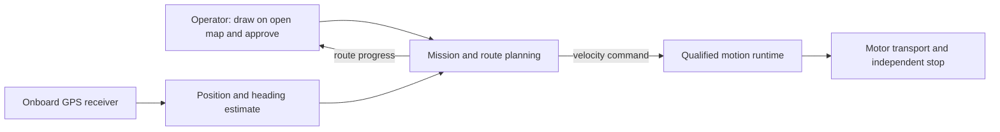

# Hexapod architecture

You move a hexapod through an operator-drawn region and stop at each designated
location with a steady payload deck. GeoData owns survey data collection, the 3D
terrain map and its export outside this repository. You report reached and
unreached stops with the termination reason. The robot runs as a self-contained
autonomous package: it navigates with onboard GPS only. The operator draws the
boundary and exclusions on an open map (OpenStreetMap or USGS imagery) and
approves the route. The boundary, route and robot share one local east-north
frame. No UAV, SLAM or ground map supports navigation.

This document owns requirements and system boundaries. [STATUS](https://cornell-physical-intelligence.github.io/hexapod-cupi/#findings)
contains measured progress from `site/project.json`. Use [GitHub issues](https://github.com/Cornell-Physical-Intelligence/hexapod-cupi/issues)
for assignments and [CONTRIBUTING](CONTRIBUTING.md) for the review workflow.

## 1. Mission requirements

| ID | Required outcome |
| --- | --- |
| R-01 | Accept an operator-drawn survey polygon and explicit exclusions, with a reviewed route before motion. |
| R-02 | Work within a demonstrated ground, slope, load and operating-duration envelope. Retain flat-ground behavior when adding terrain. |
| R-03 | Locate the robot with onboard GPS in the open map's local east-north frame and expose a position and heading error bound. Use plain GPS with no RTK base station or correction service; its error of several metres sets the R-05 margin. A dual-antenna receiver computes heading between its own antennas without external corrections. |
| R-04 | Learn useful omnidirectional locomotion: signed translation, both yaw directions, combinations, transitions and quiet stops. Hold a steady payload deck at each stop. |
| R-05 | Keep the full moving footprint inside the approved region or entry corridor and outside exclusions, including the GPS error bound and stopping uncertainty. |
| R-06 | Support start, pause, resume, abort and hardware emergency stop. Expired control authority or critical sensing failure, including GPS fix loss or an error bound above its limit, must stop mission execution. |
| R-07 | GeoData owns measurement association and coverage credit. This project keeps the ID and plans no work under it. |
| R-08 | GeoData owns the 3D terrain map and survey export. This project keeps the ID and plans no work under it. |
| R-09 | Run control onboard; show stale telemetry and qualify operator-link behavior under loss and reconnection. |
| R-10 | Use the approved 18-RS05 assembly and owned Jetson Orin Nano within measured payload, power, thermal and compute limits. Navigation adds a GPS receiver; the owned Mid-360 and D455 have no navigation role. |
| R-11 | Preserve reproducible releases, model-specific contracts, unchanged historical acceptance gates and failed-attempt evidence. |
| R-12 | Give each work packet an owner, human reviewer and independently reproducible outcome. |

The program lead selected a level, hard-surfaced, obstacle-free course for the first survey.
Agree on dimensions and surface tolerances before its test. Open maps omit small
and recent obstacles, and the robot cannot detect them. The operator draws every
known hazard as an exclusion, and the course stays clear of anything else. Plain
GPS errs by several metres, so the drawn area must stay large enough that stops
remain after the margin. The final terrain
envelope remains open. Retain [DAR.png](docs/DAR.png) as the original mission slide.

GeoData owns survey data collection: acquisition, measurement quality, map
reconstruction and export. The physical robot is unbuilt. Navigation uses GPS
only; the owned Livox Mid-360 and the D455 have no navigation role. GeoData must declare the
deck-stability limits and measurement windows that its acquisition needs; you
hold them at each stop. Both teams must agree on the map origin and boundary
alignment. Navigation needs GPS poses during motion. Navigation sensing and GeoData
acquisition have separate qualification scopes.

You operate one robot with one controlling operator. Multi-robot control,
self-righting, repair and unattended operation remain outside this baseline.

## 2. Accepted physical and control baseline

Use [robot/active_model.json](robot/active_model.json) to select the approved
19-body, 18-joint direct-drive robot with nominal motor corrections totaling
7.466088235 kg. Preserve its exact identities and the mechanical lead's accepted
corrections. Read [UPDATED_CAD_IMPORT](docs/UPDATED_CAD_IMPORT.md) for axes and
joint travel and [MASS_INERTIA](robot/hexapod_mkii_updated_v1/MASS_INERTIA.md) for
link tensors. Combined-pose clearance and hardware calibration remain open.

You train direct-position PPO in simulation with explicit actuator dynamics.
[TRAINING](docs/TRAINING.md) defines the current simulation contract and proposed
paper-reproduction order. A new source allocation needs matching one-robot and
intended-batch standing admission. A historical admission applies to its exact
source and inputs. Retain the 0.040 rad / 20 ms comparison limiter and existing
numerical gates. The program lead must accept gait appearance after the motion tests pass.

Use the [RS05 review](docs/RS05_SPEC_REVIEW.md) to distinguish catalog ratings
from provisional simulation limits. Measure voltage, latency, thermal response
and motor behavior on the planned [single-leg stand](docs/LEG_STAND_HARDWARE.md).
Match the direct-drive fixture in simulation, fit parameters, then validate with
held-out measurements. Single-leg agreement cannot qualify full-body balance.
The hardware runtime needs its own joint mapping and simulation-parity evidence.
Historical simplified and four-bar policies retain their original contracts.

## 3. System boundaries and ownership

GeoData acquisition sits outside this diagram. Its interface to pose and stop
status remains undefined.

| Boundary | Maintained source and remaining implementation |
| --- | --- |
| Model | `robot/` selects the approved asset and portable simulation inputs. |
| Locomotion | `locomotion/` owns simulation, rewards, PPO, evaluation and guarded execution; `priors/` owns optional motion optimization. Hardware runtime and paper-method extensions remain pending. |
| Contracts | `contracts/` owns commands, planar poses and checkpoint identity fields. Full mission and hardware wire formats remain pending. |
| Navigation | `navigation/` holds a waypoint follower example. The route planner and GPS pose estimate remain pending. |
| Mission | `mission/sensors/` retains ray-pattern and transport prototypes. Operator controls and route-progress reporting remain pending. GeoData owns recording, coverage and export. |
| Inspection and publication | `viewer/` provides model inspection; `site/` provides progress and recordings. A mission operator interface remains pending. |

Keep planning, networking, storage and rendering outside the motion loop.
Navigation consumes shared contracts without importing simulation. Give new
production code one maintained home. Verify mission semantics with a declared
motion test double before integrating walking and calibrated hardware; record
the backend used for each result.

## 4. Contracts that require explicit decisions

Producers and consumers must agree on versioned fixtures and invalid, stale or
missing-input behavior before dependent implementation.

| Interface | Required meaning |
| --- | --- |
| Pose | Local east-north frame from the open map's origin, units, acquisition timestamp, map identity, GPS position and heading error bound, and fix-loss behavior. Anatomical forward is −body Y, left +body X, up +body Z; frame conversions must be explicit. |
| Velocity command | Forward/lateral/yaw rate in named coordinates; validity interval and allowed envelope; expired or invalid authority must not continue motion. |
| Policy release | Exact robot, source, observation/action ordering, actuator assumptions, timing, weights and qualification evidence. Reject incompatible releases. |
| Terrain estimate | Not produced: the GPS-only package builds no ground map. Preserve the existing 250 ms optical lease within its experimental lineage. |
| Survey request | Polygon and exclusions in latitude/longitude from the open map, their conversion to the local east-north frame, approved entry corridor and request revision. Route clearance includes moving footprint, GPS error bound and stopping uncertainty. |
| Operator authority | One controlling session, explicit acknowledgements and stopped transitions, stale/replayed request handling and an independent hardware stop. |
| GeoData handoff | Undefined. GeoData owns measurement and export formats. Both teams must decide the stop status and pose that GeoData acquisition needs from this project. |

Implement the fields required by the next agreed increment. Both leads review
shared contracts, including fixtures and migration behavior.

## 5. Physical acceptance inputs

| ID | Decision owner | Measurements needed |
| --- | --- | --- |
| Q-01 | Survey lead + payload owner | Deck roll/pitch, angular and vertical motion at each stop against the limits and measurement windows that GeoData declares. |
| Q-02 | Survey lead + payload owner | Stop spacing and overlap that the mounted sensor needs. GeoData owns the coverage denominator, permitted gaps and reference survey. |
| Q-03 | Survey lead | GPS position and heading error and map alignment against surveyed control points; behavior during fix loss and recovery. |
| Q-04 | Platform lead + mechanical/electrical partners | Loaded mass/COM, joint/motor mapping, bus voltage, actuator response/temperature, stopping distance, permitted terrain and restrained emergency-stop behavior. |
| Q-05 | Both leads; the program lead owns budget | Assembly readiness, cost, power/endurance, full-load compute deadlines, sensor data/storage rates and measured operator-link behavior. |

Bind each qualification profile to values, units, measurement methods, course,
assembly/payload, evidence and acceptance owner. Keep unknown limits open until
measurement or agreement. Synthetic profiles cannot authorize hardware.
Declare limits before experiments; preserve existing gates after a failure.

## 6. Roadmap

| Marker | Required scope |
| --- | --- |
| `walking` | Historical forward gait appearance on the earlier robot; retain its torque failure. |
| `stage2` | Smooth omnidirectional motion, transitions and quiet stops on the approved model; see [#18](https://github.com/Cornell-Physical-Intelligence/hexapod-cupi/issues/18). |
| `stage3` | Terrain walking from the robot's own body sensing while retaining admitted flat behavior; the GPS-only package carries no ground-mapping sensor. Define the first terrain envelope after flat qualification. |
| `mission` | Execute an approved route through the drawn region with controlled stops and readable route progress. [#20](https://github.com/Cornell-Physical-Intelligence/hexapod-cupi/issues/20) covers route rehearsal with simulated GPS and can proceed before walking integration. GeoData owns survey data collection; [#19](https://github.com/Cornell-Physical-Intelligence/hexapod-cupi/issues/19) closed as not planned on 2026-09-18. |

### M1: stationary simulated scan export and reload

GeoData owns survey data collection, and this project schedules no M1 work. The
approved fixture and limits below remain as a record.

The program lead approved this as the first mapping milestone. Reuse the existing
[approximate Mid-360 model](mission/sensors/mid360_pattern.py) in a
sensor-only scene with a fixed sensor, known floor and calibration wall. Export
one scan's points and sensor pose, reopen it independently, and measure geometric
error against the scene. The existing [sensor check](https://github.com/Cornell-Physical-Intelligence/hexapod-cupi/blob/5e65918020dc9ef2d72da8dad0a346016b98728d/isaaclab/phase3_sensor_smoke.py)
checks returns/timing and prints a report; scan export/reload is the missing step.
The wall is a calibration reference, not an obstacle-traversal requirement.

This software milestone can proceed independently of robot standing admission.
Robot-body occlusion, moving acquisition and physical sensing are later scopes.
The program lead approved this fixed scene for both runs. Use local +X left, -Y forward,
+Z up, with distances in metres:

| Fixture item | Frozen setting |
| --- | --- |
| Ground | Flat plane at z = 0. |
| Calibration wall | Axis-aligned cuboid, dimensions (X, Y, Z) = (0.80, 0.08, 0.50), centre (0, -1.00, 0.25). |
| Sensor optical origin | Fixed at (0, 0, 0.25), level; retain the lead's -90-degree yaw so sensor +X points forward along local -Y. |
| Scan | One 20,000-ray scan in each run, retaining the existing field of view and range limits. |
| Seeds | Ray pattern: 360. Sensor noise/transport: 20260824. |

The 0.25 m optical height is a test-fixture choice. Physical mounting remains
separate. These fixed seeds identify this regression fixture; they do not
establish performance across randomized runs.

The program lead approved the following M1 acceptance limits:

| Check | Pass condition |
| --- | --- |
| Save/reopen, both runs | Points, validity flags and sensor pose are preserved exactly. |
| Noise-free geometry | Every expected floor/wall intersection is reproduced within 0.001 m (1 mm). Disable modeled measurement and ray-direction perturbations. |
| Configured-noise geometry | At least 95% of expected floor/wall intersections are returned within 0.07 m (7 cm) of their correct intersections. Missing hits count against this denominator. Report false returns separately. |

Retain the lead's existing noise configuration for the noisy run, including
0.030 m range-noise standard deviation and 0.001 m range quantization. Identify
the two runs separately and preserve raw observations. Freeze the scene and
random seed before execution; do not tune noise or thresholds to pass.

The program lead approved the scope, fixture and limits. [Mapping issue #19](https://github.com/Cornell-Physical-Intelligence/hexapod-cupi/issues/19)
tracked M1 until its closure as not planned on 2026-09-18.
These simulation checks do not establish real sensor or final survey accuracy.
Scope approval establishes no completed capability and does not resume research.

## 7. Team workflow

The program lead owns mission scope, cross-team decisions and milestone acceptance.
Platform and survey leads own their boundaries and shared integration. Assign
an owner and reviewer in each issue; do not infer assignments from old handoffs.
Keep capability issues open until their acceptance demonstration passes.
A failed experiment can close its bounded investigation with preserved evidence.

Use [CONTRIBUTING](CONTRIBUTING.md) for checks and publication. Use the
[reference table](README.md) for specialist procedures. Historical design
drafts retain their original scope in Git and add no current task queue.
