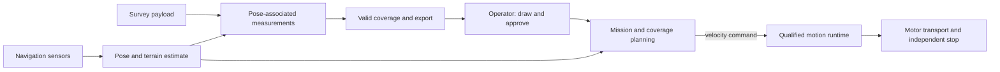

# Hexapod architecture

An operator draws a region. The hexapod surveys it by travelling between
measurement locations, stopping and holding a steady deck for useful sensor or
scientific measurements, then exporting the measurements and an honest account
of coverage and gaps. Stop-and-measure acquisition satisfies the final mission;
useful acquisition while moving is optional. The first completed survey
deliverable is a 3D terrain map in local site coordinates. The operator confirms
the survey boundary in that same local map. Geographic alignment is optional
for this first delivery; the local origin and alignment procedure remain to be defined.
The finished 3D terrain map may be generated after the survey from recorded
measurements and poses. Localization remains available during navigation.
The reconstruction compute location and export representation remain open.

This document owns requirements and system boundaries. [The progress page](https://cornell-physical-intelligence.github.io/hexapod-cupi/#roadmap)
and generated [STATUS.md](STATUS.md) show evidence against these requirements.
Both read [site/project.json](site/project.json). GitHub issues own assignments.
Detailed next steps will be defined with James and the two subleads after the
repository cleanup. Later implementation choices remain open until needed.

## 1. Mission requirements

| ID | Required outcome |
| --- | --- |
| R-01 | Accept an operator-drawn survey polygon and explicit exclusions, with a reviewed route before motion. |
| R-02 | Work within a demonstrated ground, slope, load and operating-duration envelope. Retain flat-ground behavior when adding terrain. |
| R-03 | Locate the robot and approved survey boundary in the same local site map and expose uncertainty. Geographic registration is optional for the first delivery. The baseline has no operational RTK base station. |
| R-04 | Learn useful omnidirectional locomotion: signed translation, both yaw directions, combinations, transitions and quiet stops. Hold a steady payload deck during measurement acquisition. |
| R-05 | Keep the full moving footprint inside the approved region or entry corridor and outside exclusions, including localization and stopping uncertainty. |
| R-06 | Support start, pause, resume, abort and hardware emergency stop. Expired control authority or critical sensing failure must stop mission execution. |
| R-07 | Associate measurements with acquisition time, pose, calibration and quality. Credit coverage only from valid measurements. |
| R-08 | Deliver a 3D terrain map in local site coordinates for the first completed survey. Export complete or partial measurements, covered and missed areas, and failure reasons. |
| R-09 | Run control and recording onboard; show stale telemetry and qualify operator-link behavior under loss and reconnection. |
| R-10 | Use the approved 18-RS05 assembly and owned Jetson Orin Nano within measured payload, power, thermal and compute limits. Mid-360 and D455 are available. |
| R-11 | Preserve reproducible releases, model-specific contracts, unchanged historical acceptance gates and failed-attempt evidence. |
| R-12 | Give each work packet an owner, human reviewer and independently reproducible outcome. |

[DAR.png](DAR.png) retains the original mission slide. Terrestrial LiDAR is the
initial survey payload; Cornell Geo Data owns acquisition and processing with
the survey lead. Navigation sensing and survey acquisition have separate roles.
A travelled path alone does not establish useful coverage. James confirmed
that surveying a drawn region is the final mission and that stopping at
measurement locations satisfies it. Measurement quality and deck-stability
limits during acquisition remain to be defined with the payload owner. Map
representation, accuracy, resolution, local origin and boundary-alignment method
remain open decisions. Local coordinates do not waive accuracy or boundary
registration requirements. Existing
locomotion acceptance gates retain their historical scope and thresholds.

The first survey test uses a level, hard-surfaced, obstacle-free course.
Test-area dimensions and quantitative surface tolerances remain to be defined.
Slopes and obstacle handling are later increments. This initial test setting
does not define the final terrain envelope.

The lead's [terrain/sensing plan](artifacts/project_review_2026-09-04/TERRAIN_AND_SENSING_PLAN_2026-09-09.md)
uses the existing Mid-360 and its IMU for surrounding geometry and navigation
odometry, with D455 forward depth added separately. It proposes LiDAR-inertial
odometry before comparing camera fusion. The [earlier roadmap](artifacts/project_review_2026-09-04/ROADMAP.md)
leaves the specific survey LiDAR unselected and keeps survey acquisition
independent of navigation. James selected the existing **Livox Mid-360 for the
first mapping test**. Development starts in simulation: the physical hexapod is
unbuilt and the Mid-360 is not mounted. The agreed first mapping milestone,
M1 in §6, establishes the simulated capture/export path. Real sensor accuracy
and physical mounting require later measurements. D455 integration is deferred
for this test. This sensor selection applies
to the first test; final survey-payload qualification and any shared navigation
failure behavior require separate evidence and decisions.

The planned first hardware bridge is an instrumented single-leg test stand with
force sensing and an encoder, following the lead's [stand design](artifacts/project_review_2026-09-04/LEG_TEST_STAND.md)
and [hardware reference](docs/LEG_STAND_HARDWARE.md). Match the actual fixture in
simulation, synchronize commands and measured force/position, then fit model
parameters and validate them on separate measurements. Use the approved
direct-drive leg; earlier four-bar assumptions and masses in the historical
stand proposal require reconciliation. Fixture constraints remain part of the
stand model. Single-leg agreement does not establish full-body balance or
six-leg load redistribution. Physical sensor and full-robot tests follow their
actual assembly readiness; the design review does not launch experiments.

A single robot and one controlling operator form the initial system. Multi-robot
coordination, self-righting, autonomous repair and unattended operation require
separate decisions; they are outside the accepted baseline.

## 2. Accepted physical and control baseline

[robot/active_model.json](robot/active_model.json) selects the approved detailed
direct-drive robot: 19 bodies, 18 joints, no external four-bar, with nominal motor
mass corrections totaling 7.466088235 kg. Its exact hashes and source assembly
control model selection. The mechanical lead's accepted corrections stand.

Original viewer-zero travel is femur −120°…+80° and tibia −5°…+180°; coxa zero and
limits are leg-specific. Preserve the rounded-square source toe. Full-pose
clearance, loaded response and manufactured tolerances require their own evidence.
See [the import record](docs/UPDATED_CAD_IMPORT.md) and
[mass ledger](robot/hexapod_mkii_updated_v1/MASS_INERTIA.md).

The accepted strategy is simulation-trained direct-position PPO with explicit
actuator dynamics and admission before training. A canonical runtime must bind
this model's joint order, observations, action processing, timing and actuator
state. Historical C-study, mock and four-bar policies retain their own contracts;
their dimensions and task IDs do not define the new runtime.

The [RS05 review](docs/RS05_SPEC_REVIEW.md) distinguishes 5.5 N·m peak, continuous
stall and rotating ratings. A provisional 1.6 N·m software cap is an experimental
setting. Actual bus voltage, motor inertia, latency, braking and thermal behavior
still require measured hardware profiles. The
[accepted actuation design](artifacts/mkii_updated_2026-09-10/actuation_design_001/README.md)
defines the existing provisional simulation candidate. This architecture neither
changes its parameters nor asserts that it passes admission.

Current pass/fail results belong in the progress record. A model import, one
standing pass, completed training, a kinematic animation and a qualified walking
policy establish different capabilities. Preserve the accepted historical
[forward benchmark](artifacts/length_study_2026-09-09/benchmarks/benchmark_01_c_300/README.md)
with its actual limitations. Stage 2 requires both numerical gates and the
accepted smoothness comparison. Every formal comparison retains its recorded
0.040 rad / 20 ms limiter and exact model/controller lineage.

## 3. System boundaries and ownership

| Boundary | Responsibility | Existing source / implementation status |
| --- | --- | --- |
| Core contracts | Named coordinates, units, commands and versioned model-specific observation/action contracts | [hexapod_core](packages/hexapod_core/). Existing layouts are lineage-specific; stdlib only. |
| Simulation | Model loading, physics, observations, rewards and rollout | [hexapod_env](packages/hexapod_env/). Historical task IDs stay bound to their original models. Canonical admission is separate. |
| Training operations | Compose and supervise bounded runs, persist recoverable results and own the GPU queue | [hexapod_train](packages/hexapod_train/) and [ops](ops/). Existing hardened launchers remain the operational authority. |
| Evaluation | Reproduce measured screens and model-specific acceptance decisions | [hexapod_eval](packages/hexapod_eval/). Existing gates keep their scope; package presence does not establish canonical qualification. |
| Motion runtime | Build observations, execute a policy and bound motor targets on time | [hexapod_runtime](packages/hexapod_runtime/). Existing pure runtime utilities need a canonical binding and parity evidence. |
| Navigation | Turn a qualified pose and route into permitted velocity commands | [hexapod_nav](packages/hexapod_nav/). Current waypoint follower is a protocol example; coverage planning and localization are pending. |
| Mission and operator UI | Boundary review, mission state, authority, progress and operator actions | Pending. The existing [viewer](viewer/) visualizes robot models; it is not a mission operator application. |
| Survey recording | Durable time/pose/quality association, valid coverage and independent export reading | Pending, with payload-owner inputs. |

The motion loop must remain isolated from planning, networking, visualization and
storage delays. Navigation depends on shared commands, not simulator internals.
Control and navigation remain independently testable. New production code must
have one maintained home; immutable artifact copies are replay inputs.

The same mission semantics should be exercised through a labelled test double,
a walking simulation and calibrated hardware. Passing against a test double
establishes software behavior only. Middleware, service topology, exact message
schemas, geometry library and UI implementation are decided when their smallest
needed increment is defined; the previous detailed draft does not freeze them.

## 4. Contracts that require explicit decisions

Before a dependent packet is ready, its producer and consumer agree on a small
versioned fixture and the behavior on invalid, stale or missing input.

| Interface | Required meaning |
| --- | --- |
| Pose | Coordinate frame, units, acquisition timestamp, map/registration identity, uncertainty and reset behavior. Anatomical forward is −body Y, left +body X, up +body Z; frame conversions must be explicit. |
| Velocity command | Forward/lateral/yaw rate in named coordinates; validity interval and allowed envelope; expired or invalid authority must not continue motion. |
| Policy release | Exact robot, source, observation/action ordering, actuator assumptions, timing, weights and qualification evidence. Reject incompatible releases. |
| Terrain estimate | Height/support information, uncertainty, acquisition age and explicit unknown space. Preserve the existing 250 ms optical lease within its experimental lineage. |
| Survey request | Polygon, exclusions, coordinate registration, approved entry corridor, payload/profile and request revision. Route clearance includes moving footprint and stopping uncertainty. |
| Measurement | Acquisition time, pose association, payload/calibration identity, quality and valid footprint. Invalid or duplicated samples cannot inflate coverage. |
| Operator authority | One controlling session, explicit acknowledgements and stopped transitions, stale/replayed request handling and an independent hardware stop. |
| Export | Durable complete or partial result, readable independently, with valid coverage, gaps and failure reasons. |

These are required semantics, not implemented wire formats. Freeze only the
fields needed by an approved next increment. A shared contract change is a
lead-owned integration task with fixtures and migration notes.

## 5. Physical acceptance inputs

| ID | Decision owner | Measurements needed |
| --- | --- | --- |
| Q-01 | Survey lead + payload owner | Useful sample quality against a stationary reference; deck roll/pitch, angular and vertical motion; measurement windows and required useful acquisition rate. |
| Q-02 | Survey lead + payload owner | Actual mounted sensor footprint, overlap, coverage denominator, permitted gaps and independent reference survey. |
| Q-03 | Survey lead | Map alignment, localization drift, heading and time-association error against independent control points; behavior during resets/dropouts. |
| Q-04 | Platform lead + mechanical/electrical partners | Loaded mass/COM, joint/motor mapping, bus voltage, actuator response/temperature, stopping distance, permitted terrain and restrained emergency-stop behavior. |
| Q-05 | Both leads; James owns budget | Assembly readiness, cost, power/endurance, full-load compute deadlines, sensor data/storage rates and measured operator-link behavior. |

A qualification profile binds values, units, measurement methods, course,
assembly/payload, evidence and acceptance owner. Unknown limits stay unknown;
synthetic profiles cannot authorize hardware. Historical numerical proposals
remain in their original source records. The team will decide the smallest
mission envelope and targets before its relevant experiment, then preserve them
for comparison. Never relax a gate to admit an already observed result.

## 6. Roadmap

The four stable markers in [site/project.json](site/project.json) organize the
program. Each will acquire small approved increments as we define them.

| Marker | Meaning | Required scope when defining its next increment |
| --- | --- | --- |
| `walking` | Preserve the first accepted forward benchmark and its limitations. | Historical comparison evidence; it does not qualify the approved detailed robot. |
| `stage2` | Smooth useful omnidirectional motion and quiet standing on the approved model. | Explicit model/admission boundary, motion/stop case, unchanged numerical gates and visual comparison. |
| `stage3` | Qualified terrain and causal perception while retaining admitted flat behavior. | Small declared terrain/sensing envelope, independent references and failure behavior. |
| `mission` | Cover an approved region while collecting useful steady-deck measurements. | Smallest end-to-end scenario, actual backend, containment, data quality, valid coverage and readable partial/full export. |

### M1: stationary simulated scan export and reload

James approved this as the first mapping milestone. Reuse the existing
[approximate Mid-360 model](isaaclab/hexapod_phase3/mid360_pattern.py) in a
sensor-only scene with a fixed sensor, known floor and calibration wall. Export
one scan's points and sensor pose, reopen it independently, and measure geometric
error against the scene. The existing [sensor check](isaaclab/phase3_sensor_smoke.py)
checks returns/timing and prints a report; scan export/reload is the missing step.
The wall is a calibration reference, not an obstacle-traversal requirement.

This software milestone can proceed independently of robot standing admission.
Robot-body occlusion, moving acquisition and physical sensing are later scopes.
James approved this fixed scene for both runs. Use local +X left, -Y forward,
+Z up, with distances in metres:

| Fixture item | Frozen setting |
| --- | --- |
| Ground | Flat plane at z = 0. |
| Calibration wall | Axis-aligned cuboid, dimensions (X, Y, Z) = (0.80, 0.08, 0.50), centre (0, -1.00, 0.25). |
| Sensor optical origin | Fixed at (0, 0, 0.25), level; retain the lead's -90-degree yaw so sensor +X points forward along local -Y. |
| Scan | One 20,000-ray scan in each run, retaining the existing field of view and range limits. |
| Seeds | Ray pattern: 360. Sensor noise/transport: 20260824. |

The 0.25 m optical height is a test-fixture choice. Physical mounting remains
separate. These fixed seeds identify this regression fixture; they do not
establish performance across randomized runs.

James approved the following M1 acceptance limits:

| Check | Pass condition |
| --- | --- |
| Save/reopen, both runs | Points, validity flags and sensor pose are preserved exactly. |
| Noise-free geometry | Every expected floor/wall intersection is reproduced within 0.001 m (1 mm). Disable modeled measurement and ray-direction perturbations. |
| Configured-noise geometry | At least 95% of expected floor/wall intersections are returned within 0.07 m (7 cm) of their correct intersections. Missing hits count against this denominator. Report false returns separately. |

Retain the lead's existing noise configuration for the noisy run, including
0.030 m range-noise standard deviation and 0.001 m range quantization. Identify
the two runs separately and preserve raw observations. Freeze the scene and
random seed before execution; do not tune noise or thresholds to pass.

Scope, fixture and numerical limits are approved. Owner/reviewer and the issue
remain to be assigned before the packet is ready. Implementation must record
the exact source/configuration and runtime used for each result.
These simulation checks do not establish real sensor or final survey accuracy.
Scope approval establishes no completed capability and does not resume research.

Later increments are defined one at a time. Markers with missing definitions show
that fact on Pages. A capability can remain blocked while a research issue closes
with a useful failed result. Acceptance requires an explicit scope and human
review of evidence for that scope.

## 7. Team workflow

James owns mission scope, cross-team decisions and milestone acceptance. The
platform sublead coordinates control, simulation, evaluation and hardware with
two contributors. The survey sublead coordinates perception, mission, UI and data
with three contributors. Mechanical/electrical and Geo Data supply domain inputs.
Assign names and actual availability when selecting work.

For each next increment, James and the relevant lead decide: the smallest useful
observable outcome, what is already established, its blocking question, input
fixture, success/failure evidence and the next decision each result would permit.
Only then create ready contributor packets. Keep one active packet per member;
size it to one or two available work sessions, with investigation timeboxes for
uncertain work. Avoid assumptions of full-time availability.

An issue links its roadmap marker, R/Q IDs, exact baseline, existing code,
package rules, fixture, owner/reviewer, scope boundary and reproduction command.
AI output is reviewed by its human owner. The sublead reproduces the behavior and
relevant failure case, then integrates it. Both leads review shared interfaces;
James reviews changed requirements or milestone acceptance. A merged PR does not
automatically close a capability.

Select stable source and fixture versions for concurrent contributor work. The
research lead's new results become explicit lead-owned integration tasks rather
than requiring everyone to chase each commit. Escalate correctness defects
immediately. At the integration check-in, update the evidence record and select
the next smallest step. Use the [issue templates](.github/ISSUE_TEMPLATE/).

## 8. Verification and evidence

Verify at the boundary changed: contract rejection fixtures, model/runtime
parity, geometry containment, stale-input/stop behavior, recorder interruption
and independent reading. Hardware changes require restrained evidence before
free walking. Simulation quality requires the actual admitted model and unchanged
screens; CPU tests cannot establish physical behavior.

Run the relevant existing test suites and source-lineage checks. Checkpoint and
manifest bytes, published failures and the probe ledger remain immutable. A new
runtime release gets a new identity; archived releases remain reproducible from
their pinned commits. Preserve requested and applied effort, raw rates and
independent angle changes, resets and measurement windows in motion evidence.

Progress has one editable home: `site/project.json`. STATUS is generated and CI
rejects drift. Pages exposes the same marker states, evidence and open questions,
with a build revision and timestamp. Every repository change adds an append-only
site update. A static snapshot does not represent live GPU telemetry.

## 9. Source guide

Read the issue and relevant boundary first. Open specialized sources only when
they are needed for the work; historical handoffs do not override this design.

| Subject | Source |
| --- | --- |
| Physical model | [selector](robot/active_model.json), [import](docs/UPDATED_CAD_IMPORT.md), [mass/inertia](robot/hexapod_mkii_updated_v1/MASS_INERTIA.md) |
| Motor and leg stand | [RS05 review](docs/RS05_SPEC_REVIEW.md), [leg-stand hardware](docs/LEG_STAND_HARDWARE.md) |
| Shared contracts | [core](packages/hexapod_core/), [runtime](packages/hexapod_runtime/) and their package guides; verify lineage before reuse |
| Training/gate history | [TRAINING](docs/TRAINING.md), [source lineages](docs/PIPELINE_LINEAGES.md) |
| Spark operation | [OPERATIONS](docs/OPERATIONS.md), [compute coordination](docs/SPARK_COMPUTE_COORDINATION.md); source preparation here never implies permission to launch a job |
| Paused research and prepared sources | [James handoff](https://github.com/Cornell-Physical-Intelligence/hexapod-cupi/blob/62fd7448264c5ebe051ba2de1d9a72844d6b4c3a/docs/JAMES_HANDOFF.md), including unexecuted canonical PPO proposals; these do not assign the next step |
| Publication | [PROJECT_SITE](docs/PROJECT_SITE.md), [registry](site/project.json) |

Prior full design drafts and handoffs are historical context. They contain
unapproved options and superseded states; they are not an additional task queue.
The cleanup preserves their Git history and immutable evidence while removing
their authority over new development. `configs/source_inventory.json` identifies
owned commands, prototypes and historical tools; `python3 tools/source_inventory.py
list` prints that inventory. Four compatibility entries under `tools/` preserve
the byte-frozen four-bar validator; their implementation lives in `tools/assets/`.
