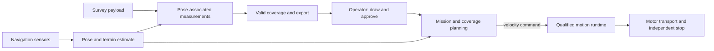

# Hexapod architecture

You survey an operator-drawn region by moving between measurement locations,
stopping with a steady payload deck, and recording measurements for a 3D terrain
map. You export coverage and gaps with complete or partial results. The operator
approves the boundary and route in the same local site coordinates as the robot.
Geographic alignment and measurement while moving remain optional.

This document owns requirements and system boundaries. [STATUS](STATUS.md)
contains measured progress from `site/project.json`. Use [GitHub issues](https://github.com/Cornell-Physical-Intelligence/hexapod-cupi/issues)
for assignments and [CONTRIBUTING](CONTRIBUTING.md) for the review workflow.

## 1. Mission requirements

| ID | Required outcome |
| --- | --- |
| R-01 | Accept an operator-drawn survey polygon and explicit exclusions, with a reviewed route before motion. |
| R-02 | Work within a demonstrated ground, slope, load and operating-duration envelope. Retain flat-ground behavior when adding terrain. |
| R-03 | Locate the robot and approved survey boundary in the same local site map and expose uncertainty. Geographic registration is optional for the first delivery. The baseline has no operational RTK base station. |
| R-04 | Learn useful omnidirectional locomotion: signed translation, both yaw directions, combinations, transitions and quiet stops. Hold a steady payload deck during measurement acquisition. |
| R-05 | Keep the full moving footprint inside the approved region or entry corridor and outside exclusions, including localization and stopping uncertainty. |
| R-06 | Support start, pause, resume, abort and hardware emergency stop. Expired control authority or critical sensing failure must stop mission execution. |
| R-07 | Associate measurements with acquisition time, pose, calibration and quality. Credit coverage only from valid measurements. |
| R-08 | Deliver a 3D terrain map in local site coordinates for the first completed survey. Export complete or partial measurements, covered and missed areas, and failure reasons. |
| R-09 | Run control and recording onboard; show stale telemetry and qualify operator-link behavior under loss and reconnection. |
| R-10 | Use the approved 18-RS05 assembly and owned Jetson Orin Nano within measured payload, power, thermal and compute limits. Mid-360 and D455 are available. |
| R-11 | Preserve reproducible releases, model-specific contracts, unchanged historical acceptance gates and failed-attempt evidence. |
| R-12 | Give each work packet an owner, human reviewer and independently reproducible outcome. |

James selected a level, hard-surfaced, obstacle-free course for the first survey.
Agree on dimensions and surface tolerances before its test. The final terrain
envelope remains open. Retain [DAR.png](DAR.png) as the original mission slide.

James selected the owned Livox Mid-360 for the first simulated mapping test.
The physical robot is unbuilt and the sensor is unmounted. Start with the M1
fixture in §6; defer D455 integration. The survey lead and Geo Data must define
payload quality and deck-stability limits. They must also define map resolution,
accuracy, local origin, boundary alignment and export representation.
Reconstruction can run after acquisition; navigation needs poses during motion.
Navigation sensing and survey acquisition have separate qualification scopes.

You operate one robot with one controlling operator. Multi-robot control,
self-righting, repair and unattended operation remain outside this baseline.

## 2. Accepted physical and control baseline

Use [robot/active_model.json](robot/active_model.json) to select the approved
19-body, 18-joint direct-drive robot with nominal motor corrections totaling
7.466088235 kg. Preserve its exact identities and the mechanical lead's accepted
corrections. Read [UPDATED_CAD_IMPORT](docs/UPDATED_CAD_IMPORT.md) for axes and
joint travel and [MASS_INERTIA](robot/hexapod_mkii_updated_v1/MASS_INERTIA.md) for
link tensors. Combined-pose clearance and hardware calibration remain open.

You train direct-position PPO in simulation with explicit actuator dynamics.
[TRAINING](docs/TRAINING.md) defines the current simulation contract and proposed
paper-reproduction order. A new source allocation needs matching one-robot and
intended-batch standing admission. A historical admission applies to its exact
source and inputs. Retain the 0.040 rad / 20 ms comparison limiter and existing
numerical gates. James must accept gait appearance after the motion tests pass.

Use the [RS05 review](docs/RS05_SPEC_REVIEW.md) to distinguish catalog ratings
from provisional simulation limits. Measure voltage, latency, thermal response
and motor behavior on the planned [single-leg stand](docs/LEG_STAND_HARDWARE.md).
Match the direct-drive fixture in simulation, fit parameters, then validate with
held-out measurements. Single-leg agreement cannot qualify full-body balance.
The hardware runtime needs its own joint mapping and simulation-parity evidence.
Historical simplified and four-bar policies retain their original contracts.

## 3. System boundaries and ownership

| Boundary | Maintained source and remaining implementation |
| --- | --- |
| Model | `robot/` selects the approved asset and portable simulation inputs. |
| Locomotion | `locomotion/` owns simulation, rewards, PPO, evaluation and guarded execution; `priors/` owns optional motion optimization. Hardware runtime and paper-method extensions remain pending. |
| Contracts | `contracts/` owns commands, planar poses and checkpoint identity fields. Full mission and hardware wire formats remain pending. |
| Navigation | `navigation/` holds a waypoint follower example. Planner and localization remain pending. |
| Mission | `mission/sensors/` holds ray-pattern and transport prototypes. Operator controls, recorder, coverage and export remain pending. |
| Inspection and publication | `viewer/` provides model inspection; `site/` provides progress and recordings. A mission operator interface remains pending. |

Keep planning, networking, storage and rendering outside the motion loop.
Navigation consumes shared contracts without importing simulation. Give new
production code one maintained home. Verify mission semantics with a declared
motion test double before integrating walking and calibrated hardware; record
the backend used for each result.

## 4. Contracts that require explicit decisions

Producers and consumers must agree on versioned fixtures and invalid, stale or
missing-input behavior before dependent implementation.

| Interface | Required meaning |
| --- | --- |
| Pose | Coordinate frame, units, acquisition timestamp, map/registration identity, uncertainty and reset behavior. Anatomical forward is −body Y, left +body X, up +body Z; frame conversions must be explicit. |
| Velocity command | Forward/lateral/yaw rate in named coordinates; validity interval and allowed envelope; expired or invalid authority must not continue motion. |
| Policy release | Exact robot, source, observation/action ordering, actuator assumptions, timing, weights and qualification evidence. Reject incompatible releases. |
| Terrain estimate | Height/support information, uncertainty, acquisition age and explicit unknown space. Preserve the existing 250 ms optical lease within its experimental lineage. |
| Survey request | Polygon, exclusions, coordinate registration, approved entry corridor, payload/profile and request revision. Route clearance includes moving footprint and stopping uncertainty. |
| Measurement | Acquisition time, pose association, payload/calibration identity, quality and valid footprint. Invalid or duplicated samples cannot inflate coverage. |
| Operator authority | One controlling session, explicit acknowledgements and stopped transitions, stale/replayed request handling and an independent hardware stop. |
| Export | Durable complete or partial result, readable independently, with valid coverage, gaps and failure reasons. |

Implement the fields required by the next agreed increment. Both leads review
shared contracts, including fixtures and migration behavior.

## 5. Physical acceptance inputs

| ID | Decision owner | Measurements needed |
| --- | --- | --- |
| Q-01 | Survey lead + payload owner | Useful sample quality against a stationary reference; deck roll/pitch, angular and vertical motion; measurement windows and required useful acquisition rate. |
| Q-02 | Survey lead + payload owner | Actual mounted sensor footprint, overlap, coverage denominator, permitted gaps and independent reference survey. |
| Q-03 | Survey lead | Map alignment, localization drift, heading and time-association error against independent control points; behavior during resets/dropouts. |
| Q-04 | Platform lead + mechanical/electrical partners | Loaded mass/COM, joint/motor mapping, bus voltage, actuator response/temperature, stopping distance, permitted terrain and restrained emergency-stop behavior. |
| Q-05 | Both leads; James owns budget | Assembly readiness, cost, power/endurance, full-load compute deadlines, sensor data/storage rates and measured operator-link behavior. |

Bind each qualification profile to values, units, measurement methods, course,
assembly/payload, evidence and acceptance owner. Keep unknown limits open until
measurement or agreement. Synthetic profiles cannot authorize hardware.
Declare limits before experiments; preserve existing gates after a failure.

## 6. Roadmap

| Marker | Required scope |
| --- | --- |
| `walking` | Historical forward gait appearance on the earlier robot; retain its torque failure. |
| `stage2` | Smooth omnidirectional motion, transitions and quiet stops on the approved model; see [#18](https://github.com/Cornell-Physical-Intelligence/hexapod-cupi/issues/18). |
| `stage3` | Terrain and causal perception while retaining admitted flat behavior. Define the first terrain envelope after flat qualification. |
| `mission` | Survey an approved region with valid measurements and readable partial/full export. [#19](https://github.com/Cornell-Physical-Intelligence/hexapod-cupi/issues/19) covers simulated mapping; [#20](https://github.com/Cornell-Physical-Intelligence/hexapod-cupi/issues/20) covers mission rehearsal with ideal poses. Both can proceed before walking integration. |

### M1: stationary simulated scan export and reload

James approved this as the first mapping milestone. Reuse the existing
[approximate Mid-360 model](mission/sensors/mid360_pattern.py) in a
sensor-only scene with a fixed sensor, known floor and calibration wall. Export
one scan's points and sensor pose, reopen it independently, and measure geometric
error against the scene. The existing [sensor check](https://github.com/Cornell-Physical-Intelligence/hexapod-cupi/blob/5e65918020dc9ef2d72da8dad0a346016b98728d/isaaclab/phase3_sensor_smoke.py)
checks returns/timing and prints a report; scan export/reload is the missing step.
The wall is a calibration reference, not an obstacle-traversal requirement.

This software milestone can proceed independently of robot standing admission.
Robot-body occlusion, moving acquisition and physical sensing are later scopes.
James approved this fixed scene for both runs. Use local +X left, -Y forward,
+Z up, with distances in metres:

| Fixture item | Frozen setting |
| --- | --- |
| Ground | Flat plane at z = 0. |
| Calibration wall | Axis-aligned cuboid, dimensions (X, Y, Z) = (0.80, 0.08, 0.50), centre (0, -1.00, 0.25). |
| Sensor optical origin | Fixed at (0, 0, 0.25), level; retain the lead's -90-degree yaw so sensor +X points forward along local -Y. |
| Scan | One 20,000-ray scan in each run, retaining the existing field of view and range limits. |
| Seeds | Ray pattern: 360. Sensor noise/transport: 20260824. |

The 0.25 m optical height is a test-fixture choice. Physical mounting remains
separate. These fixed seeds identify this regression fixture; they do not
establish performance across randomized runs.

James approved the following M1 acceptance limits:

| Check | Pass condition |
| --- | --- |
| Save/reopen, both runs | Points, validity flags and sensor pose are preserved exactly. |
| Noise-free geometry | Every expected floor/wall intersection is reproduced within 0.001 m (1 mm). Disable modeled measurement and ray-direction perturbations. |
| Configured-noise geometry | At least 95% of expected floor/wall intersections are returned within 0.07 m (7 cm) of their correct intersections. Missing hits count against this denominator. Report false returns separately. |

Retain the lead's existing noise configuration for the noisy run, including
0.030 m range-noise standard deviation and 0.001 m range quantization. Identify
the two runs separately and preserve raw observations. Freeze the scene and
random seed before execution; do not tune noise or thresholds to pass.

James approved the scope, fixture and limits. Track M1 under [mapping issue #19](https://github.com/Cornell-Physical-Intelligence/hexapod-cupi/issues/19);
assign its owner and reviewer before native execution. Implementation must record
the exact source/configuration and runtime used for each result.
These simulation checks do not establish real sensor or final survey accuracy.
Scope approval establishes no completed capability and does not resume research.

## 7. Team workflow

James owns mission scope, cross-team decisions and milestone acceptance.
Platform and survey leads own their boundaries and shared integration. Assign
an owner and reviewer in each issue; do not infer assignments from old handoffs.
Keep capability issues open until their acceptance demonstration passes.
A failed experiment can close its bounded investigation with preserved evidence.

Use [CONTRIBUTING](CONTRIBUTING.md) for checks and publication. Use the
[reference index](docs/README.md) for specialist procedures. Historical design
drafts retain their original scope in Git and add no current task queue.
