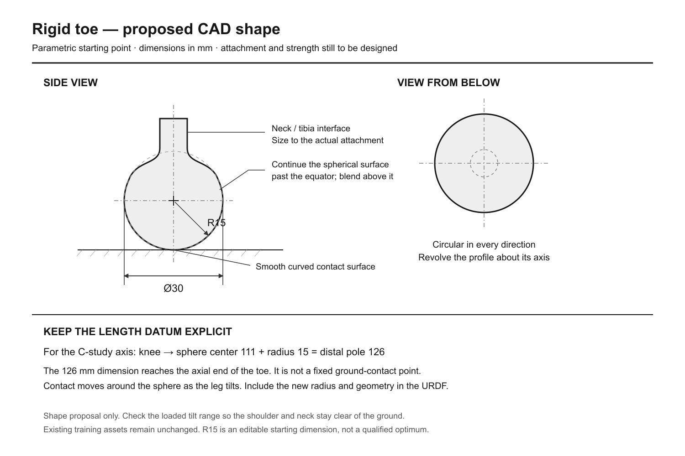

# Rigid toe: provisional CAD sketch

Use a rotationally symmetric rounded toe with a spherical ground-contact surface continuing above its equator into a smooth narrower neck. The editable starting geometry is **30 mm maximum diameter / 15 mm radius**. This is a shape proposal for the user’s current CAD work, not a validated optimum or a manufacturing drawing. The diameter is the toe envelope, not a flat 30 mm contact patch.

The [SVG](toe_sketch.svg) is an editable engineering schematic, and [design.json](design.json) records dimensions and assumptions. The neck is schematic: its dimensions, attachment, wall thickness and strength must follow the actual tibia and material. Preserve spherical curvature through the intended loaded contact-angle range; the illustrated shoulder is not proof against neck/ground contact on steep terrain. Use a replaceable tip if the attachment permits later size/material comparisons.

For a new toe placed on the C-study distal axis, keeping the knee-to-axial-pole datum at126 mm gives a sphere center111 mm from the knee at R15. This is an axial construction, not an assertion that the physical four-bar foot frame or ground contact lies there. The existing126 mm C value terminates at the mock mesh’s distal +Y reference. On flat or sloped ground, contact on the spherical region is center minus radius times the outward terrain normal. Thus the contact point migrates when the leg tilts; the URDF collision geometry, mass/inertia, reset clearance and contact/torque evaluations must use the actual new part before it is adopted. Current training assets remain unchanged.

The inspected production silicone-foot STL spans approximately59.59 ×27.50 ×32.50 mm in its raw mesh axes. Those are bounds of the existing elongated part. Its two R15.682 collision spheres are approximations, not manufacturing dimensions or evidence that a new rigid R15 toe has matching friction/compliance. The suggested30 mm envelope is of similar transverse scale, but this does not establish performance.

Round rigid feet have measured rolling-induced kinematic effects: [Zhu et al., Trajectory Correction and Locomotion Analysis of a Hexapod Walking Robot with Semi-Round Rigid Feet, Sensors2016](https://pubmed.ncbi.nlm.nih.gov/27589766/). That paper supports modeling contact migration; it does not validate this robot’s proposed radius. Our preference for rotational symmetry is an engineering choice for all-direction motion. No gait, torque, terrain or hardware acceptance gate is changed.

The PNG is a raster rendering of the repository-native SVG using Sharp, independently viewed at1500 ×1000. An initial macOS Quick Look preview cropped the SVG and was discarded from publication; the final artifact includes the full drawing. No simulated or physical experiment is depicted.
