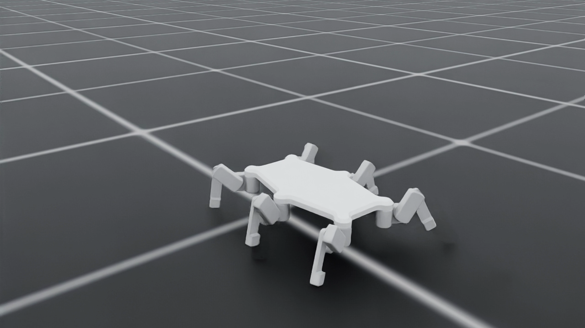

# Benchmark 1 — C forward-walking demo

The user selected this exact policy on 9 September 2026 as the first benchmark for the new approach. Preserve it when continuing research. This is a demo milestone toward **omnidirectional locomotion over terrain using onboard sensors**, supporting autonomous survey coverage.

- C geometry: 72.5 mm femur, 126 mm tibia, coxa unchanged; full six-leg, 19-body, 18-joint model at 8.2608 kg.
- Training: 300 PPO updates / 7,372,800 transitions, campaign `candidate_c_001`, stage `000`.
- Controller: phase-guided stepping reference plus learned joint-position residuals; motor position and velocity targets act through the simulated RS05 constraints. The robot body and contacts remain freely simulated.
- Checkpoint SHA-256: `5ecbe978d659413dc050fec93b0e211a3eadf6ce1c807790d87c14044ff245a2`.

[Watch the selected recording](rollout.mp4). The 12-second recording averages 0.21994 m/s after its 2-second startup for a 0.20 m/s command, with zero falls.

## Matched evaluation

32 environments per speed, 20 seconds each, seed 7057. Motion metrics omit the first 2 seconds; falls are checked throughout. Both speeds had zero non-foot ground contacts. This is a single-seed nominal screen, not a robustness claim.

| Command m/s | Mean speed m/s | Mean absolute error m/s | Tilt RMS degrees | Requested torque >1.6 Nm | Positive mechanical power W | Falls |
|---|---|---|---|---|---|---|
| 0.10 | 0.110 | 0.0149 | 2.78 | 4.44% | 2.30 | 0 |
| 0.20 | 0.220 | 0.0253 | 2.62 | 4.81% | 3.46 | 0 |

Torque percentage is the mean over joints, environments and sampled control steps. It exceeds the current 0.5% gate; actual applied torque remains capped by the actuator model. Positive mechanical power excludes electrical losses and cannot establish battery endurance.

## Preserve and compare

`policy.pt`, `environment.yaml`, `agent.yaml`, the exact URDF, reference, training plan, full evaluation, video/trajectory and run identity records are copied here. `training_source_v7.tar.gz` preserves source and asset files, and all 134 entries in `campaign_source_hashes.json` were independently verified against it. `SHA256SUMS` covers every payload in this directory. These files are read-only and mirrored on Spark under the same benchmark ID. New evaluations belong in new directories.

Future policies must be compared against this controller with identical test conditions and explicit per-metric tradeoffs. Reward increases alone are insufficient. Retain the user-preferred gait as a reference; extending direction, terrain and sensor capability is now the priority over prolonged polishing of this forward-only demo.

## Physical and scope limits

This uses scaled mock geometry with transferred current CAD mass/inertia. C has not yet been rebuilt and fit-checked as production CAD with rigid motors, mounts and the tibia linkage. The actor uses simulator state and phase, with no realistic sensor/estimator pipeline or domain randomization. Forward flat-ground results do not demonstrate lateral/reverse/yaw control, stopping, terrain traversal, thermal endurance or hardware readiness.

The final product and training sequence are specified in [the project roadmap](../../../project_review_2026-09-04/ROADMAP.md). Hardware identification starts with [the single-leg test stand](../../../project_review_2026-09-04/LEG_TEST_STAND.md).
