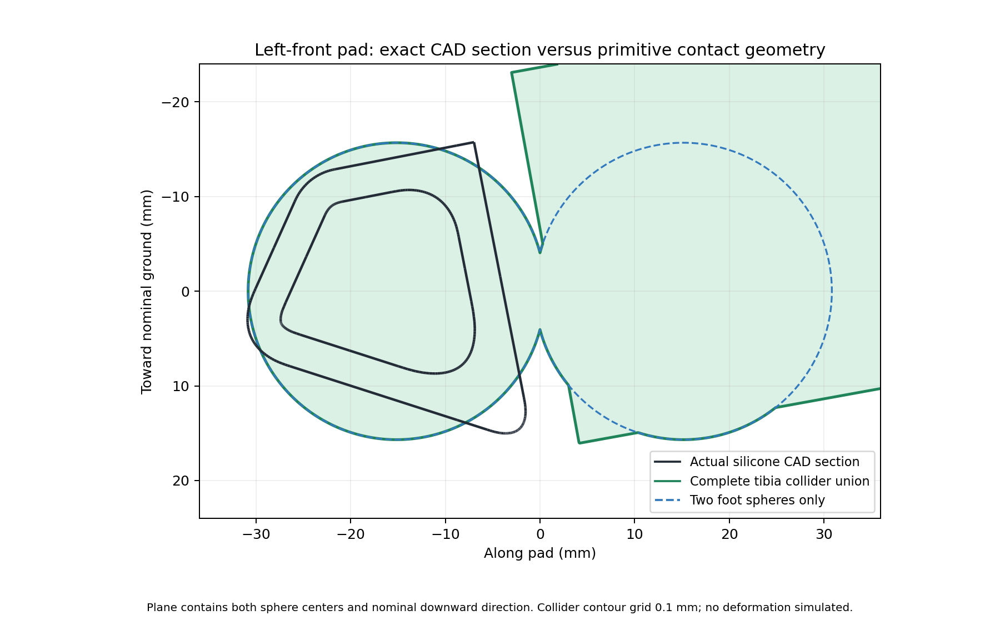

# CAD collider fit audit

**The primitives reproduce the authored URDF, but that does not make them an accurate contact model of the CAD.** This CPU audit finds a material foot-pad mismatch and substantial excess collision volume around several structural links. The current shapes can support a deliberately provisional flat-ground software/solver experiment. They should be refined before claiming accurate foothold contact, body clearance, or rough-terrain behavior.

This audit changes no URDF, USD, task, or motor configuration. It evaluates the physical four-bar asset's **31 links, 171 collision primitives, 1,927 visual instances and 77 unique STL files**. It does not rerun or reinterpret historical physics reports.

## Foot pads: first refinement priority

The importer fits two spheres to each silicone pad's oriented bounding box, using the average of its two smaller dimensions for the diameter. It does not fit the actual rubber surface. Each sphere has radius **15.682 mm**, with centers **30.297 mm** apart. Their union has a narrow waist; it is not a filled capsule. The CAD pad also is not a simple capsule, so blindly adding a connecting cylinder would not establish a correct fit.



This is a cut through the left-front pad, both sphere centers, and the nominal downward direction. Black lines are intersections with actual silicone STL triangles, including its cavity. Green is the complete tibia collision union; blue dashed lines show the two foot spheres alone. The green geometry extending toward the upper leg includes the coarse tibia box. The contour grid is 0.1 mm. No pad deformation is simulated.

Results are effectively identical across all six pads:

| Measurement | Result | Interpretation |
|---|---:|---|
| Largest tested silicone vertex outside the two spheres | 9.77 mm | Real rubber surface exists where neither sphere supplies contact. |
| Largest tested silicone surface point outside **all four** tibia colliders | 6.38 mm | The shaft box does not eliminate the discrepancy. This maximum is at a triangle centroid; vertices alone missed it. |
| Area-weighted centroid samples more than 1 mm outside the complete tibia union | 18.39% of sampled pad surface | Includes internal/overlapping CAD surfaces; this is not an exact exterior-area percentage. |
| Lower 10 mm, downward-facing pad band: largest tested mismatch | 5.04 mm | The discrepancy reaches a nominal contact-relevant region. |
| Same lower band: area-weighted samples more than 1 mm outside | 13.38% | Uses 157 triangle centroids per pad, not a continuous contact-patch proof. |
| Largest sampled directional sphere overhang beyond the silicone CAD convex envelope | 11.55 mm | The spheres also occupy space beyond the actual pad in other directions. |
| Nominal lowest CAD pad point below sphere bottom | 0.224–0.232 mm | Flat standing can look correct while side/edge contact geometry differs substantially. |

In the nominal reset, the actual pad minima are **4.777–4.806 mm above ground**, versus the colliders' **5.001–5.036 mm**. Both are initially clear. That small vertical difference alone is therefore a poor test of pad fidelity.

A separate geometric sweep evaluates 27 combinations per leg of nominal plus −0.30, 0, or +0.30 rad on each active motor. The collider's lowest point ranges from **3.109 mm below** to **0.427 mm above** the actual pad's lowest point. These are static kinematic target combinations, not simulated motion or a continuous workspace bound. They demonstrate that the initial training action range can change the contact-height bias even before introducing rocks or tilted terrain.

## Other links

The following representative left-front results compare each link against **its own** CAD visuals. “Outside” measures distance from tested CAD surface points to the collider union. “Outer-envelope excess” measures how far the collider extends beyond that link's entire CAD convex envelope along one of 202 tested directions. These are different tests; one can be nonzero while the other is zero.

| Link | Largest tested CAD-surface distance outside colliders | Largest sampled outer-envelope excess | Collider producing that excess, zero-based index |
|---|---:|---:|---|
| Body | 6.40 mm | 54.80 mm | 1, bottom enclosure/plate box |
| Coxa | 3.88 mm | 29.08 mm | 1, broad structural box |
| Femur | 11.23 mm | 14.62 mm | 5, motor-envelope cylinder |
| Tibia, including pad | 6.38 mm | 20.29 mm | 0, shaft box |
| Tibia push lever | 5.45 mm | 11.38 mm | 0, lever box |
| Tibia pushrod | 6.99 mm | 4.63 mm | 0, rod box |

The other legs differ by less than about 0.02 mm in these outer-envelope results. Exact per-link results, directions, part names and visual indices are in [report.json](report.json); [links.csv](links.csv) provides a smaller comparison table.

Most of the large non-pad *undercoverage* belongs to deliberately omitted details. Examples include body standoffs, exposed screw heads on the rod/lever, and femur `mirror1.stl`/`cirpattern2.stl` details. Those generic vendor names need a part-category check before labeling them external hazards. The rod itself protrudes only about **0.31 mm** at tested vertices; its 6.99 mm result comes from a screw. The lever itself is about **0.49 mm**, and its cover about **0.59 mm**, versus 5.45 mm at a screw. Small omitted hardware is often a reasonable performance tradeoff, provided protruding contact-critical features are represented deliberately.

The large *outer-envelope excess* comes from enclosing complex structural shapes in broad boxes/cylinders. For example, the coxa's collider bottom is about **24.56 mm below its lowest CAD visual** in the nominal pose; the femur's is about **11.92 mm below**. They remain far from the ground in that pose, but those margins can cause early contact on obstacles or during recovery. Body boxes fill empty corner regions of the footprint. These are per-link statements: another link might occupy part of that excess volume in a particular pose. This audit does not prove whole-robot free space or leg-to-leg collision clearance.

## Recommended refinement sequence

1. **Fit the actual pad exterior first.** Create a separate versioned collision asset using a small convex representation or a few convex pieces fitted to the actual outer sole/toe/sides. Preserve the relevant contact outline and thickness; remove internal cavities only where they cannot be terrain-contact surfaces. Retain simple spheres only if fit measurements justify them. Measure contact-height, normal and patch behavior over the planned motor range, tilted planes, steps and small edges. Then identify silicone friction and load-dependent deformation on the stand. A rigid geometric match alone will not supply compliance.
2. **Tighten structural clearance envelopes.** Replace the broad tibia shaft box with several aligned, close-fitting convex pieces; fit body footprint corners instead of using a large enclosing rectangle. Review the coxa structural box and motor cylinders against the exterior housing. Keep the lever and rod as separate rigid bodies with their existing pin/inertia frames. Do not change dynamics merely to make the render look smoother.
3. **Make omitted details explicit.** Add a small primitive for an exposed screw/cap if it can contact terrain, snag, or constrain another leg. Keep internal gears, cosmetic surfaces and inaccessible small fasteners out of the collision workload. Verify generic vendor part names before treating their protrusions as real exterior geometry.
4. **Requalify the changed contact model.** Recompute reset clearance and contact-region classification; repeat closure/solver convergence, standing, motor-direction and controlled edge-contact tests. Profile the new shape count. A fall is a learning event, while interpenetration or an incorrect contact envelope is a model defect. Keep the current self-collision-disabled baseline explicitly labeled until leg/body interactions receive a separate geometric and live check.

The fitting tolerance should be chosen from allowable foothold and obstacle-clearance error, then frozen before the comparison. This evidence does not adopt a new pass threshold or certify the current collider set for terrain training.

## Reproduce and interpret

From the repository root, with NumPy, SciPy and Matplotlib available:

```sh
python3 artifacts/mkii_fourbar_2026-09-05/collider_fit/audit.py
python3 -m unittest discover -s artifacts/mkii_fourbar_2026-09-05/collider_fit -p 'test_*.py'
```

The recorded run uses NumPy 2.0.2 and SciPy 1.13.1. All mesh vertices and triangle centroids are transformed by their URDF visual origins. Point distances use analytic sphere, oriented-box and finite-cylinder formulas; taking the minimum gives the exact distance to the union **for points outside it**. Positive sampled values therefore establish an actual mismatch at those locations. The reported maxima are lower bounds on worst surface mismatch; an unsampled triangle interior can be worse. Triangle-centroid area weighting is quadrature, not an exact area integral, and includes internal/overlapping part surfaces.

Directional support is analytic for primitives and evaluated on each STL convex hull. A collider support plane beyond the CAD support plane proves excess along that direction. Only the 202 stated directions are checked; concavities, cavities and intervening directions require additional analysis. No unsigned nearest-vertex distance is mislabeled as a signed solid-volume error. Final calculations use explicit finite checks and NumPy `einsum` with floating-point errors raised; this avoids the local BLAS warnings observed during the first draft computation.

Inputs are pinned in the report:

- Linkage URDF SHA-256: `2dae7165852b419f0bd6edbe03f7d398b403f1410c5b6bdc2c287b6834f543a6`.
- Physical kinematics SHA-256: `0ab3acc43d4c6c77c93a996858b8f928a1f157a533c8967c5ac84b77222f7f61`.
- Physical USD SHA-256: `97414285d1b3b187d0f2e69e13c4056e57083d098b35d73dd0fbcff69e33c30c`.
- Every STL and this audit script have separate recorded hashes.

These measurements address collision-shape fit. They do not establish watertight CAD solids, continuous mesh coverage, contact compliance, friction, mass calibration, structural strength or hardware fidelity.
