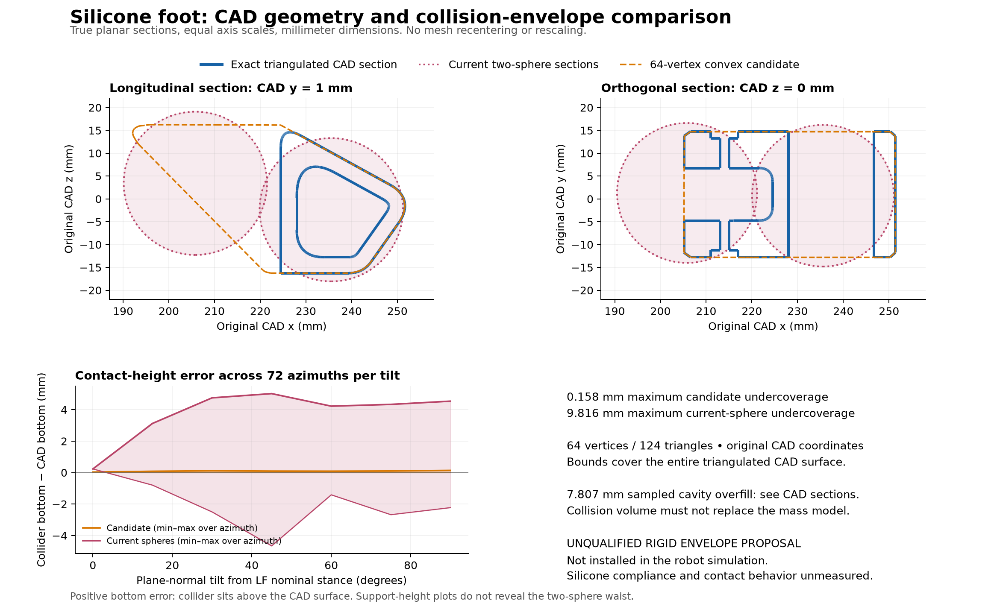

# Continuous pad envelope candidate v1

This is a reviewable **rigid collision proposal**, generated from the existing
silicone-foot CAD. It has not replaced any URDF/USD collider and has not run in
PhysX. The original mass, inertia, motor model, and acceptance gates are untouched.

The 64-vertex hull closely matches the CAD's outer support envelope, but fills
the pad's concave socket/profile. It is suitable for a controlled contact-model
comparison; it is **not yet an accurate general-purpose terrain collider**.



[PDF figure](pad_comparison.pdf) · [Candidate STL](silicone_pad_convex64.stl) ·
[Geometry report](geometry_report.json) · [Verification](verification.json)

## Measured fit

The candidate contains **64 vertices and 124 triangles**, compared with 4,479
unique vertices and 8,974 triangles in the exact source pad mesh. Every
candidate vertex is an unchanged source vertex. The serialized STL is closed,
consistently wound, convex, and remains in the original meter-scale CAD frame.
It is not recentered, rotated or rescaled. Per-leg placement records preserve
the six original URDF visual transforms in `geometry_report.json`.

| Measurement | Current two spheres | 64-vertex convex candidate |
| --- | ---: | ---: |
| Maximum CAD-surface distance outside collider | 9.816 mm | 0.158 mm |
| LF nominal stance bottom above exact CAD bottom | 0.232 mm | 0.031 mm |
| Across all six nominal feet, bottom above CAD | 0.224–0.232 mm | 0.012–0.031 mm |
| Largest support deficit, 5,351 sampled directions | 6.493 mm | 0.158 mm |
| Largest support excess, same sampled directions | 12.807 mm | 0 mm |

The previous vertex-only audit found 9.767 mm for the spheres. The new 9.816 mm
measurement includes intersections between CAD triangle edges and the equal
spheres' Voronoi bisector. That partition covers the complete triangulated
surface; on each clipped polygon the nearest-sphere distance is convex and
attains its maximum at a polygon vertex. It is a stronger calculation, not a
changed pad or sphere geometry.

For the candidate, distance to a closed convex set is convex, so the maximum
over all original mesh vertices also bounds every original CAD triangle and
the entire CAD convex hull. The candidate lies inside that hull. Its resulting
**0.158 mm bound therefore applies to support undercoverage in every direction**,
within floating-point tolerance. The verification additionally checks the
convex projection optimality conditions for all 4,479 source vertices.

Support functions describe first contact with an infinite plane. They do not
detect the spheres' missing waist or the candidate's filled cavities. The
figure's ground-normal sweep rotates the plane normal around the LF nominal
physical stance, using 72 azimuths at each 15° tilt from 0° to 90°. It is not
a full joint-workspace or terrain traversal test. Bottom error means collider
bottom minus CAD bottom: negative values represent an inflated collider.

## The important limitation: concavity overfill

The orthographic sections show an internal/side socket that one convex hull
cannot preserve. Of 3,970 sampled candidate-surface points, the largest distance
to the actual CAD surface is **7.807 mm**. The witness has effectively zero CAD
solid winding number, confirming it lies outside the actual pad solid. The CAD
mesh was separately checked to be closed and consistently wound.

The sampled value is a lower bound on maximum overfill, not a guaranteed
maximum. A conservative 1-Lipschitz/grid-cover bound limits unsigned
candidate-surface deviation to **15.260 mm**; it is deliberately loose and is
not a full-volume or signed-distance certificate. Candidate volume is 33.816
cm³ versus 18.382 cm³ of CAD silicone, illustrating the filled cavity. **Do not
use the collider volume to derive mass or inertia.**

Some cavity volume may already be occupied by the real tibia or its collider,
but this proposal does not assume that. Before adoption, compare the complete
tibia-plus-pad assembly and determine whether terrain can physically enter
the filled regions. If it can, use a small convex decomposition or compound
sole geometry instead of a single hull. More vertices in one convex hull
cannot solve this concavity limitation.

## Vertex budget comparison

The deterministic greedy fitter starts with signed-axis support extrema and
repeatedly adds the CAD hull vertex farthest from the current convex set. It
uses measured Euclidean distance, not a visual fit score.

| Vertices | Triangles | Maximum outward undercoverage |
| ---: | ---: | ---: |
| 16 | 28 | 1.423 mm |
| 24 | 44 | 0.944 mm |
| 32 | 60 | 0.793 mm |
| 48 | 92 | 0.295 mm |
| 64 | 124 | 0.158 mm |

The exported 64-vertex option gives a compact, continuous outer envelope. Its
fidelity and performance after PhysX cooking are untested. Collision changes
require a new versioned asset, recalculated stance/contact checks, fresh solver
qualification and then a controlled training comparison. Silicone stiffness,
damping, hysteresis, friction and wear remain hardware measurements.

## Reproduce without changing repository dependencies

From the repository root, use an isolated dependency environment:

```sh
uv run --no-project --with-requirements artifacts/mkii_fourbar_2026-09-06/pad_collision_candidate_v1/requirements.txt python artifacts/mkii_fourbar_2026-09-06/pad_collision_candidate_v1/build_candidate.py
uv run --no-project --with-requirements artifacts/mkii_fourbar_2026-09-06/pad_collision_candidate_v1/requirements.txt python artifacts/mkii_fourbar_2026-09-06/pad_collision_candidate_v1/test_geometry.py
uv run --no-project --with-requirements artifacts/mkii_fourbar_2026-09-06/pad_collision_candidate_v1/requirements.txt python artifacts/mkii_fourbar_2026-09-06/pad_collision_candidate_v1/verify.py
uv run --no-project --with-requirements artifacts/mkii_fourbar_2026-09-06/pad_collision_candidate_v1/requirements.txt python artifacts/mkii_fourbar_2026-09-06/pad_collision_candidate_v1/plot_comparison.py
```

Run reproduction in a disposable copy to preserve this published evidence.
The four analytic tests cover box projection, a sphere-bisector maximum absent
from original vertices, a tetrahedron projection/support certificate, and
translation invariance. Source STL/URDF/kinematics hashes and exact Python,
NumPy and SciPy versions are recorded in the geometry report; plotting is
pinned separately in `requirements.txt`. `support_samples.npz` stores every
sampled direction and the three support values for independent analysis.
