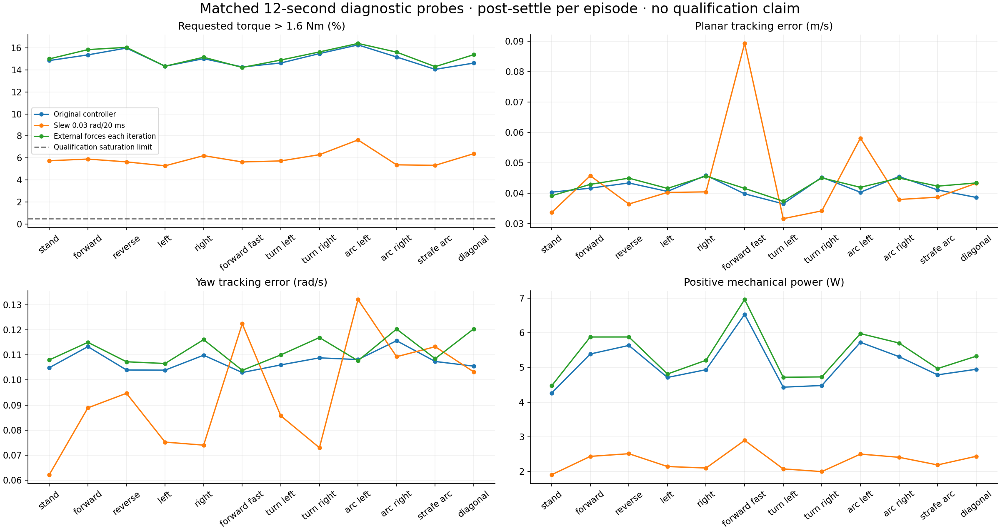
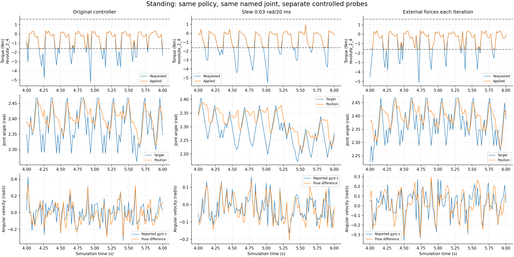

# Omnidirectional PPO motor diagnostics

These short controlled probes diagnose the previous policy; they are not qualification runs.

| Probe | Terminations | Median saturation | Planar error | Yaw error | Positive power |
|---|---:|---:|---:|---:|---:|
| Original controller | 4 | 14.93% | 0.0409 m/s | 0.1067 rad/s | 4.943 W |
| Slew 0.03 rad/20 ms | 0 | 5.74% | 0.0395 m/s | 0.0918 rad/s | 2.301 W |
| External forces each iteration | 4 | 15.26% | 0.0426 m/s | 0.1093 rad/s | 5.267 W |

Raw reports and compressed traces retain runtime joint names, checkpoint hashes, per-episode age, all termination causes and requested versus applied torque.

## Completion requires smooth movement and quiet standing

The accepted forward animation and current straight trial are visual references. Every bearing, reverse/strafe/diagonal, both yaw signs, both arc directions, path bends, reversals and stops require review. Passing a median or a forward clip cannot complete Stage 2.

The JSON contains direction-by-direction joint velocity, target increments, pose excursion and applied torque increments. Quiet-stand acceptance bounds are proposed there for a separate 30-second undisturbed test, plus stop-to-stand and disturbance recovery; this 12-second probe cannot establish those gates.

## 10 September — quiet-priority native successor

[Verified preparation and dispatch snapshot](direct_omni_quiet_priority_preparation_001/README.md) preserve source003/native004, the stronger quiet temporal objective, observational optimizer diagnostics, unchanged contracts, CPU checks and exact guarded smoke003 launch. The dispatch snapshot is not a terminal result or Stage2 pass. Current execution belongs in STATUS.

[Smoke003 terminal evidence](direct_omni_train_smoke_003/README.md) verifies two updates and strict reload, with quiet still0/48. [Pilot dispatch](direct_omni_quiet_priority_pilot_dispatch_001/README.md) records the separately admitted50-update allocation. [All-weather priority](all_weather_priority_001/README.md) preserves the user's authorization and exact shared-note revision at the allocation boundary.
