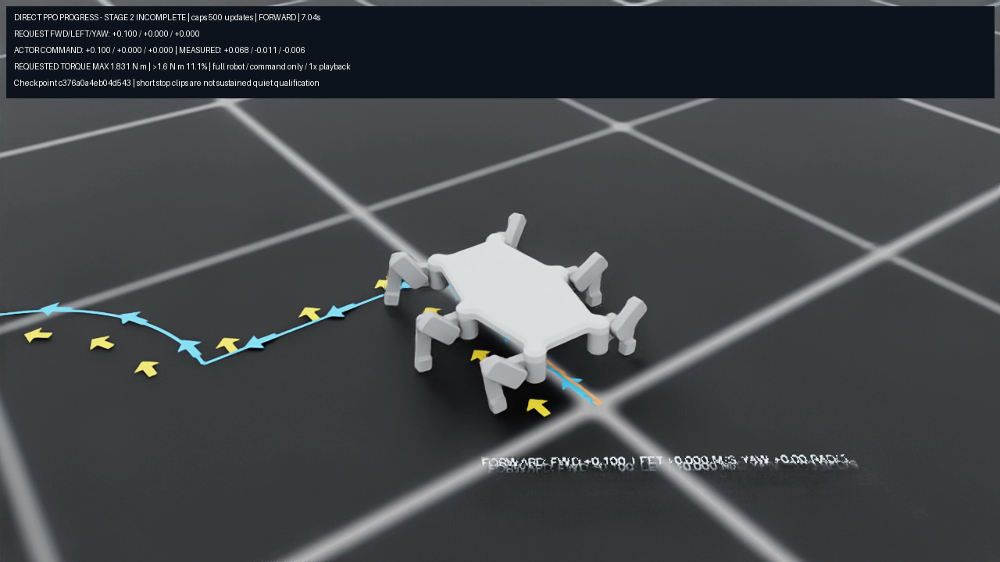

# Historical CAPS500 recording

This is the actual final checkpoint from the completed C-study500-update experiment, recorded at **1× speed**. It is historical simplified-model evidence. The approved detailed motor-mass-corrected CAD now governs all future training; this recording does not depict or qualify that new model.

[Play the38-second video](terminal/run/recording/rollout.mp4). The full robot follows forward, left-strafe and combined forward/left-yaw commands, separated by stop requests. Ground arrows and the trail show commands and actual motion. The ground text has overlapping strokes; the upper overlay remains readable. This is a command-following recording, not a scored path-following or sustained quiet-standing qualification.

The recording contains1,900 physical controls and950 decoded frames at25fps,1280×720. Exact checkpoint `c376a0a4eb04d54396b4fd6171fe173167767463245213cce7c2cc1d3a2877cf` was strictly read back before and after inference. Video SHA256 is `1cd2dab2ac5d4c981f4528017febfed0287ac0cdb9e19e2d34cc52704e7f4745`. The separate [formal500-update result](../direct_omni_extended_caps_002/README.md) still fails all48 quiet trials. No Stage2 completion is claimed.

The native recording and host both completed with exit0. The seal was written before the application's fast shutdown; the host then verified sealed outputs and original inputs after process exit. The [independent terminal audit](terminal/remote_audit.json) verifies the full frozen sources,550 assets, actual selected500-update campaign, checkpoint, both owned container identifiers absent and pause064 restoration. All29 raw files/42,295,739 bytes are included and hash-verified. The owner invocation was `3e88eb521861497cb3bd275b60c3c1b8`.

The first guard attempt refused before any pause/output because an unrelated CUDA process was active. It exited naturally; the unchanged guard then passed. No non-weather process was stopped. Two local transfers encountered ENOSPC; incomplete local files were discarded and only missing files retried after exact redundant temporary publications were removed. Original remote data and every verified local payload remain unchanged. These infrastructure records are preserved separately from the completed recording.

The adapter004 and host003 preparation are retained in [the earlier review bundle](../direct_omni_extended_review_preparation_001/README.md). This wrapper adds the frozen27-file guard, actual root selection/installed-Spark preflight/dispatch, independent setup review and55-file terminal bundle. `verify_bundle.py` checks all local bytes and nested inventories; it does not replay Isaac or represent a live GPU probe. Historical CAPS50's missing post-close receipt remains a separate unchanged failed campaign.
