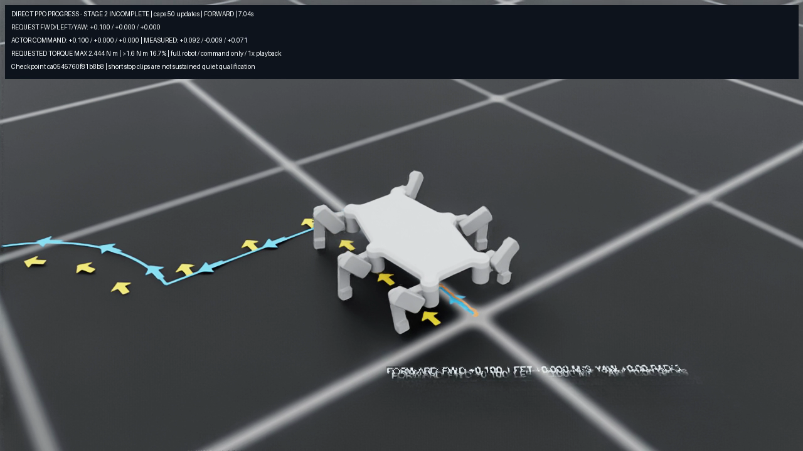

# CAPS50 PPO preview: complete video, failed finalization

[Watch the actual full-robot preview](terminal/run/recording/rollout.mp4): **38 seconds, 950 decoded frames at25fps, 1× playback**. The exact CAPS50 checkpoint is `ca0545760f81b8b8fb0cafde4b1ef89bfa5d8765a8b43b578e451f648a954415`. It translates forward, strafes left, follows a commanded arc and receives stop commands. The recording uses its actual PPO actions, with no ideal-pose feedback or altered playback speed.

The video is complete, but the **host job failed**: the final receipt expected after native app shutdown was absent. Native physics/rendering completed all1,900 controls and exited0; both checkpoint readbacks and the internal source check passed. Independent external verification found the source, selected pilot, assets and inputs unchanged. The failed host receipt is preserved. No replacement success receipt was created, and no rerender is claimed.

This is diagnostic progress, not an accepted omni policy. The matched pilot still fails all48 sustained quiet-stop cases. During the preview, requested torque exceeded1.6N·m, and the controller continues moving during stop segments. Stage2 remains in progress; terrain/perception and the final survey mission remain ahead. Benchmark1 is unchanged and separately identified.

## What is preserved

- [Immutable terminal bundle](terminal/README.md): all28 raw payloads (42,606,350 bytes), full source/input/cleanup audit and journal traceback, complete video/trace, ffprobe evidence and descriptive segment review. Video SHA `b2ccdd62821e58c3d8bfd62150b9272d4d3c47c7d8020dea0df2e8571550547d`.
- [Adapter002](preparation/adapter002/README.md), [host001](preparation/host001/README.md), [guard001](preparation/guard001/README.md) and [root selection](preparation/selection001/README.md): exact frozen prepared runtime and test receipts, copied without edits. The native598-file source and26-file native contract remain referenced by their exact previously published preparation identity; the full remote audit verified those bytes.
- [Later halo restoration receipt](later_halo_restore/restored.json): distinct from ordinary pause058 timer restoration. Root restarted the exact original replay under invocation `9091c23f9a954fa786ca0c7009cb2ab6` at Unix1789059356.8370728, with its own weather-lock startup proof. This is a restart/recompute, not midframe resume; replay completion is unverified. The earlier terminal audit was not rewritten to include this later event.

The representative frame is extracted from the actual video. The full robot and top command/torque caption are legible; 3D ground text overlaps in the render. Arrows and the actual trail remain visible. The caption identifies Stage2 as incomplete.

Run `python3 -B verify_publication.py` from any directory. It verifies the wrapper, all five original nested freezes, the28 raw hashes, video/trace identities, decoded-frame receipt, preserved finalizer failure and separately hashed halo receipt. It imports no simulator or checkpoint. APFS clones avoid copying large local payload extents; no raw weather dataset is included.

This wrapper was prepared only in ignored `tmp/`. Root owns publication at `artifacts/omni_diagnostics_2026-09-09/direct_omni_preview_001`, the central `site/project.json` media entry and an append-only `site/updates` record under `docs/PROJECT_SITE.md`. Keep current checkpoint, actual recording and immutable Benchmark1 separate. No site or Git mutation was performed by this preparation.
