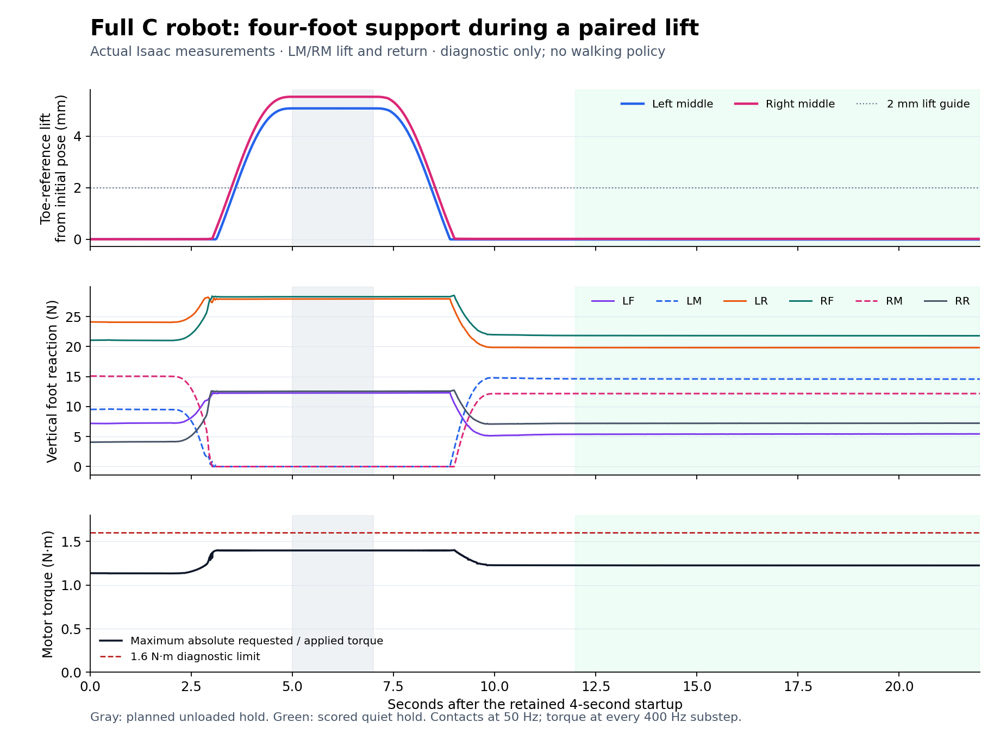

# Actual opposing-middle-leg load transfer

The full C robot lifted both middle feet while its four corner feet retained support, then returned to quiet standing. The fresh32-replica standing prerequisite and the separate1,300-control pair diagnostic both passed their declared checks. This is a measured support-transfer result, not a faster gait, trained policy, Stage2 or terrain qualification.

| Measurement | Actual result |
|---|---:|
| Simultaneous qualified unloaded hold | 2.02s |
| LM / RM lift from last planted sample | 5.082 / 5.513mm |
| Full diagnostic substep requested/applied peak | 1.401372N·m |
| Requested torque margin to1.6N·m | 0.198628N·m |
| Final scored quiet hold | 10.02s |
| Worst-joint quiet rate RMS | 0.009430rad/s |
| Unrecorded resets / nonfoot contacts | 0 / 0 |

The22s diagnostic contains1,100 control records and8,801 physical samples, after the separately preserved4s randomized startup/settling sequence. The original pair scorer replays exactly, all32 preceding standing/quiet verdicts pass independently, and every final post-step check is preserved. Startup demand remains separate from diagnostic torque; neither qualifies hardware startup.

Measured unloaded-hold support forces are asymmetric: LF/RR carry about12.27/12.54N vertically, while LR/RF carry27.93/28.30N. Total vertical reaction81.0386N agrees with the8.26081134kg model's weight. Tangential/normal ratio reaches0.5053; this is nominal simulated friction, not calibrated terrain performance. Ideal static force-allocation results are not forces achieved by this position controller.

The figure plots native toe-reference lift from the initial pose. The scorer uses each foot's last planted sample, whose baselines moved−1.676/+18.091micrometres. Both are preserved; the chart's2mm line is a scale guide. [Figure provenance](figure/README.md) and [independent actual review](result/root_review/README.md) explain the difference. No measurement was replaced to obtain a pass.

[The frozen preparation](preparation/README.md) declares this separate four-corner-support test. It preserves source009 physics, the exact full serial C geometry/inertias and1.6N·m cap, with no body state forcing or origin-reset adapter. Existing five-support wave and Stage2 gates are unchanged. The result supports development of another support sequence; it does not prove continuous paired walking, higher speed, reliable turning or real-world stability.

[The remote audit](result/remote_audit.json) verifies934 source files,550 admitted assets, all38 raw run/restoration payloads and absence of both exact owned containers. Unit hexapod-pair-load-transfer-001-20260910.service completed underpause040; forecasting restoration is recorded. The exact guard and source reconstruction are included. Review scripts retain their original sibling-path assumptions; verify_payload.py is the portable read-only inventory check.
