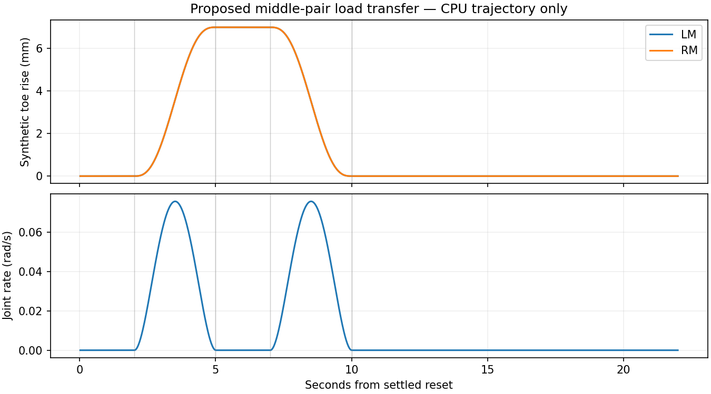

# Proposed middle-pair load-transfer diagnostic001

10 September 2026. **CPU-only proposal. No physical run, source dispatch or gate adoption.** This asks a narrow question: can the current passive position controller transfer the full C robot's load onto its four corner feet, hold it without exceeding 1.6 N·m, and return to measured quiet six-foot support?

The static study identifies LM+RM as the most balanced pair to unload. Its nominal four-corner support margin is 186 mm. Ideal minimum peak motor demand is 1.129 N·m with vertical forces alone, or approximately 0.622 N·m with freely allocated forces and assumed friction coefficient 0.6. Those are optimistic fixed-pose calculations. They do not predict which forces the existing PD controller will produce.

This prototype uses the exact C serial geometry and 8.26081134 kg mass, the current named canonical stance, the source004 measured-state interface and its unchanged 1.6 N·m contract. It does not modify the frozen single-leg wave, its five-support admission rules, Stage2 gates, production CAD, or solver configuration. Later solver experiments require their own exact source binding.



## Bounded experiment proposed for review

After the existing admitted canonical startup and six-support settling, preserve the actual emitted target exactly. The actual deflected joints, toe positions and contact points stay distinct from that target; initial PD preload is not erased.

| Time after settled reset | Requested action |
| --- | --- |
| 0–2 s | Hold all six emitted targets and record baseline forces. |
| 2–5 s | Raise LM and RM targets by 7 mm in world Z using a C2 joint-space quintic. |
| 5–7 s | Hold the raised targets and measure actual load transfer. |
| 7–10 s | Return continuously to the exact initial targets. |
| 10–22 s | Hold targets; allow 2 s settling, then score at least 10 s of measured quiet. |

All twelve corner motor targets remain exactly unchanged. The measured body pose is never written or prescribed. There is no desired forward motion, velocity-goal integrator, force optimizer or PPO actor. An early stop splices a bounded C2 return from the current target position, analytic velocity and acceleration; the executable discrete P/V/A checks can reject an infeasible splice. A safety failure emits no target and requires the host to stop the diagnostic, preserving the failing pre-reset sample.

The endpoint comes from the exact named serial IK; invalid IK is rejected. The resulting joint-space interpolation has approximately 0.100 mm planar toe excursion in the nominal synthetic case, which is reported rather than described as perfectly vertical. No individual joint clipping or silent command derating is permitted.

## Separate proposed criteria

These are **new diagnostic criteria for review, not adopted walking requirements**. Existing wave/Stage2 gates remain intact.

- Begin with all six measured distal contacts and the exact canonical emitted target after startup. Require every corner support throughout unloading, plus a measured projected center-of-mass support margin of at least 50 mm.
- Require actual contiguous loss of both middle contacts, at least two flight samples, and at least 2 mm current measured toe rise. A successful unload must persist for at least 1 s during the hold, with each middle-foot normal force at most 1 N. A timer or predicted foot position cannot establish unloading.
- Reject coxa, femur, tibia-shaft or body ground contact, any termination/truncation, or missing required contact. The source004 contact sensors cover these classifications at 50 Hz. They are not a full mesh-clearance proof and do not observe every collision at every physics substep.
- Proposed body displacement limit: 15 mm; rotation from settled pose: 0.10 rad; corner toe drift: 10 mm; corner slip: 20 mm/s. These conservative diagnostic choices have not been adopted as locomotion gates.
- Preserve requested torque at or below 1.6 N·m and applied torque at or below 1.60001 N·m. The scorer requires complete 400 Hz requested/applied torque evidence as well as the control-rate trace. Source004 already exposes that torque telemetry; it does not provide substep contact classifications.
- During the demonstrated unloaded interval, report the actual six-foot force distribution and per-joint torque demand. The proposed mean vertical force-balance tolerance is 5% of weight. Friction ratios are measured outputs, not proof of a particular terrain friction coefficient or a force allocation commanded by this prototype.
- Confirm return to six contacts within 0.6 s of target return and require three measured contact samples. Then apply the unchanged source004 quiet metrics for at least 10 s after 2 s settling. Reference quiet labels alone never count as physical quiet.

No unloading may simply mean this passive target strategy did not transfer enough load. The controller still performs its bounded return when the other safety conditions remain valid; the scorer fails the proposed unload criterion. This is useful evidence, not a reason to weaken support or clearance requirements.

## Interface and checks

`PairLoadTransfer(runtime_joint_names).reset(snapshot)` requires the source004 single-replica snapshot. `step(snapshot, stop=False, dt=.02)` emits named `[1,18]` `q_ref`, `v_ref`, `a_ref`, `valid` and auditable state. The existing zero-residual physics wrapper can consume those fields through `set_reference_targets(...)`; **this bundle contains no Isaac entrypoint or host launcher that actually does so**. A separately reviewed source/receipt/host is required before any run. That host must call `check_substep_batch(recorder.rows[-8:], control_index, initial_counter=recorder.base_counter, control_row=measured_row)` after each actual step and stop before issuing another target if any interior requested/applied torque exceeds the contract. The final scorer also requires the complete substep trace, exact control/reference target alignment, both torque arrays, sequential counters and 400 Hz timestamps, and equality at every control endpoint.

Snapshots declare raw XYZW plus the checked rotation matrix, actual joint/target states, actual soft limits, measured toe positions/velocities, finite contact points with explicit validity, all contact classes, forces, slip and requested/applied torque. Named runtime order is resolved explicitly. The generator retains the reference allocation of 1.75 rad/s and 6 rad/s² plus a full 0.02 rad joint margin, leaving the existing residual allocation unchanged. These settings are engineering bounds, not measured motor speed limits.

The nominal CPU trajectory needs only 0.07578 rad/s peak reference speed and 0.07777 rad/s² peak acceleration. Minimum soft-limit margin is 0.29994 rad. It returns exactly to its original target and leaves every corner target unchanged. Sixteen tests cover named-order/preload continuity, exact execution by the residual core, early stops, missing return contact, noncanonical reset rejection, support/torque/frame failures, independent measured unloading, substep torque rejection and quiet scoring.

[report.json](report.json) and [reference_schedule.png](reference_schedule.png) use an explicit synthetic fixture. Its body is fixed and its torque is prescribed at 0.7 N·m; neither predicts physics. The scoring helper reports `physics_qualification: false` and leaves provenance verification to a future guarded host. It cannot qualify walking, terrain or hardware.

## Reproduction

From a working copy of this directory:

```sh
PYTHONDONTWRITEBYTECODE=1 python3 -m unittest discover -s . -p 'test_*.py'
PYTHONDONTWRITEBYTECODE=1 python3 run_cpu_proposal.py
```

Dependencies are NumPy, SciPy, PyTorch and Matplotlib. [SOURCE_SHA256.json](SOURCE_SHA256.json) records copied source004 helpers and the exact source from which quiet metrics were extracted. The copied source004 parsing/geometry helper is named `source004_wave_helpers.py` so a future diagnostic adapter cannot accidentally replace the newer walking `wave_reference.py`. No production files, frozen source004 files or earlier static-study evidence were modified.
