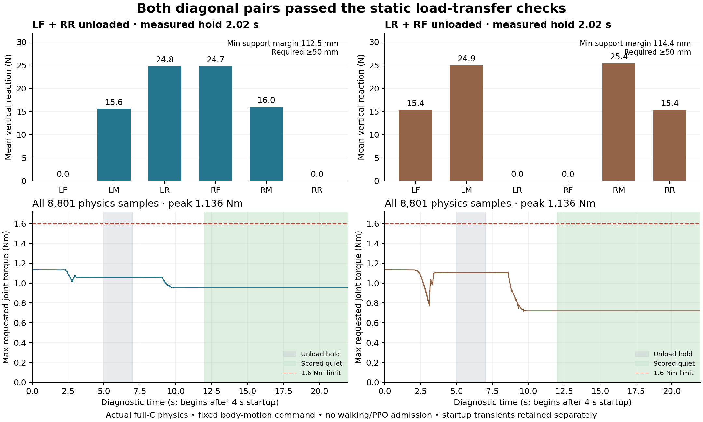

Both declared diagonal pairs passed the separate proposed static-transfer criteria after the fresh32-replica physical and unchanged quiet admission. All56 raw payloads and934 source hashes were verified locally against the remote audit; the remote audit also verified550 admitted assets, all3 owned IDs/names absent and pause047 restoration. This is historical cleanup evidence, not a claim about subsequent ownership.

| Unloaded pair | Actual lifts | Simultaneous unload | Minimum support margin | Quiet | Hold peak requested torque |
|---|---:|---:|---:|---:|---:|
| LF/RR | 5.295/5.781 mm | 2.02 s | 112.521 mm | 10.02 s | 1.05841 Nm |
| LR/RF | 3.821/5.697 mm | 2.02 s | 114.404 mm | 10.02 s | 1.10666 Nm |

Every one of1100 completed post-step measurements per case passed the same proposed body/support/drift/slip rules when independently recomputed from actual pose/joints/contact data. Maximum body displacement was1.122/1.192 mm respectively. Both exact named scorers replayed identically, with no numerical differences. Each diagnostic has8801 physics samples, all eight-substep counters/timestamps and exact joint/pose/torque endpoint equality. Peak requested/applied torque across the full22 diagnostic seconds was1.13637996 Nm for both cases, at the first physics substep (physical4.0025 s); no diagnostic sample exceeded1.6 Nm. Quiet joint RMS was0.0097011/0.0135877 rad/s. No nonfoot contact, reset or lost retained support occurred.

The separate4 s startup traces preserve requested torque peaks63.65962 Nm at the initial pre-control sample, with applied torque clamped to1.6 Nm. Startup is excluded from this diagnostic's measured load-transfer interval and is not hardware-startup qualification. Conversely, no diagnostic torque samples are excluded.

Reported joint-rate fidelity remains unresolved: full22 s diagnostic examples have rate-integral minus actual angle changes of0.21523 rad (LF/RR) and0.30564 rad (LR/RF). The original scorer and gates were not changed or replaced. Contact force/classification coverage is50 Hz;400 Hz covers joints, poses, reported rates and torques.

`plot.py` uses actual sampled force means and complete diagnostic torque arrays. The bars are measured normal loads during the qualified unload interval; they are not force-controller commands. The image was visually inspected.

Together with the independently published middle-pair001 result, this provides static support evidence for all three opposing pairs. It does not prove the moving paired sequence, faster walking, PPO, broad Stage2 or terrain qualification. The next useful physical question is a separately identified contact-aware paired sequence under actual translation, preserving target/torque limits and its own explicit four-support contract.
