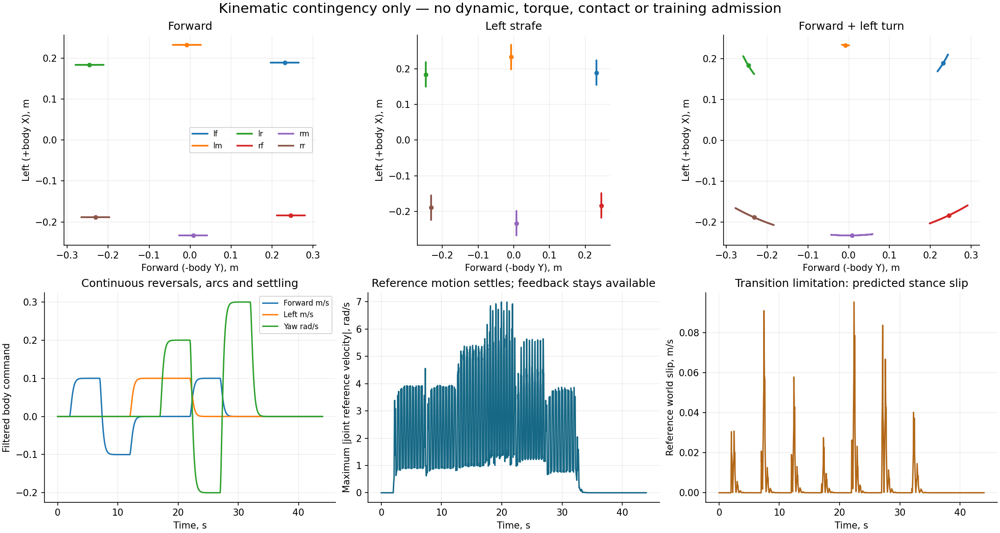

# Body-twist stepping reference: CPU contingency prototype

**This architecture has not been selected.** It is an ignored, isolated alternative to investigate only if the current paired direct-joint PPO experiment warrants a change. Nothing here starts a simulator, drives a motor, edits CAD, changes a task, or loads a learned checkpoint.

The useful finding is that Benchmark 1's horizontal foot path generalizes to body-twist commands with exact planar geometry, but simply reusing its excursion is insufficient: **98 of 245 sampled command combinations violate the C study's kinematic limits**. A shorter excursion passes this point-foot screen but raises cadence and retains major actuation/transition questions. Keep the current PPO experiment and frozen Benchmark 1 unchanged.



## Identity and comparison

`reference.py` reads only the immutable Benchmark 1 C URDF and its reference metadata, checking URDF SHA-256 `e916b1ebbb2720c90f23974bbffa5da120b32d2e5409fe419fb1492b8556746c`. The model has six named serial 3R legs, 72.5/126 mm femur/tibia lengths and the original fixed coxa. The supplied toe points are the benchmark's selected pad-surface points, not a new idealized link-length model. The independent exact URDF FK is used to check the analytic IK. This excludes physical four-bar lever/rod motion and full pad/collider contact.

The exact forward **reference path**, at 0.20 m/s, 1.3 Hz, 65% stance duty and 20 mm lift, agrees with FK of the saved reference table within **0.263 micrometres**. This establishes the geometric special case; it does not reproduce the learned residual, walking video, motor dynamics, or benchmark performance. Benchmark 1's selected checkpoint remains `5ecbe978d659413dc050fec93b0e211a3eadf6ce1c807790d87c14044ff245a2`; its 4.44–4.81% requested saturation already failed the 0.5% gate.

## Equations

The external command remains `c = (v_forward, v_left, omega)`. In the URDF body frame, `v = (v_left, -v_forward)`; positive yaw is about body +Z. Let `p_i^0` be a named foot's neutral horizontal body coordinate, and `J(x,y)=(-y,x)`.

A planted foot, under **constant body twist that the robot actually achieves**, satisfies:

```text
p_dot_i = -v - omega J p_i
p_i(s) = R(-omega s) [p_i^0 - t(s)]
t(s) = [a v_x - b v_y, b v_x + a v_y]
a = s sinc(omega s)
b = s (omega s/2) sinc(omega s/2)^2
sinc(x) = sin(x)/x, with its continuous value at zero
```

This handles translation, arbitrary strafing arcs, and pure yaw without dividing by a turning radius. Each leg has a different instantaneous tangential motion `omega J p_i`; rotating one common forward stride is inadequate for turning. A Taylor branch supplies finite first/second derivatives at zero yaw in the installed Torch version.

For cycle phase `phi_i = (phi + offset_i) mod 1`, stance duty `beta`, and quintic `S(u)=10u^3-15u^4+6u^5`, define virtual time `s_i=g(phi_i)/f`:

```text
stance: g = phi_i - beta/2
swing:  u = (phi_i-beta)/(1-beta)
        g = beta/2 + (1-beta)u - S(u)
lift:   z_i = z_i^0 + h A(c) 64u^3(1-u)^3 during swing; z_i=z_i^0 in stance
```

`g`, its first derivative, and its second derivative match at stance/swing and cycle boundaries. The lift has zero height, velocity and acceleration at both swing boundaries. For a constant command and frequency, `phi_dot=f` gives `s_dot=1` in stance, hence exact inverse-twist no-slip there. For forward-only motion this reduces to Benchmark 1's polynomial shape.

The prototype retains the benchmark's alternating tripod offsets `[0,.5,0,.5,0,.5]` and `beta=.65` as an explicit contingency assumption. It does not claim this support schedule is optimal or appropriate for terrain.

Cadence is smooth and nonsingular:

```text
effective_speed^2 = mean_i ||v + omega J p_i^0||^2
f(c) = sqrt(f_min^2 + (beta effective_speed / nominal_stance_travel)^2)
A(c) = S(clamp(effective_speed / 0.04, 0, 1))
```

The fixed-frequency option exists only to verify the original forward path. Frequency can increase when turning, so shortening excursion is not a free improvement in motor demand.

## Reversals and stopping

The command follows a critically damped second-order filter, integrated exactly for each held requested target:

```text
c_ddot + 2 omega_filter c_dot + omega_filter^2(c-c_target) = 0
omega_filter = 4 rad/s
```

Command value and rate remain continuous when the requested direction reverses or curvature changes. Phase is never reset during reversals. At zero command the horizontal excursion tends to zero and the lift envelope tends to zero; all reference feet return to their neutral points. The internal phase may continue, but its output amplitude is zero. The feedback residual is still added and can respond to balance disturbances; it is never multiplied by the walking amplitude or disabled at standstill.

**A continuous curve is not necessarily a feasible transition.** Recomputing the path from changing commands/cadence moves stance feet relative to their world anchors. The tested 44-second sequence predicts up to **0.0952 m/s of stance-reference world slip**, even assuming perfect body-twist tracking. Its default parameters produce seven invalid leg-step samples and a maximum reference increment of **0.1393 rad per 20 ms**, above the current 0.03/0.06 rad settings. Such a reference must be rejected, not silently clipped and labeled command tracking. The trace records the failure rather than concealing it.

A subsequent transition design would latch world/odom stance anchors, use measured body motion to express them in body coordinates, finish/replan swing with matching endpoint derivatives, and admit the whole requested support/stop sequence before executing it. This needs contact/state-estimation and stop-support handling; it is not implemented here. Return-to-neutral while feet are grounded can itself require slipping or an explicit settling step.

## Kinematic checks and sampled results

Every sample checks exact-URDF FK error, real reachability, named-joint limits with 2.5% range margins, and minimum Jacobian singular value above 2 mm. Joint velocity is checked against the URDF's 50.265 rad/s bound, which is not evidence of loaded motor capability. No out-of-range IK result may be sent to `compose_joint_feedback`; its validity argument is mandatory. Limit projection is used for diagnostics only, and invalid inputs produce no target.

The screen contains 245 commands: stand, four pure turns, and 16 translation bearings at 0.05/0.10/0.20 m/s combined with yaw rates -0.4/-0.2/0/+0.2/+0.4 rad/s. There are 256 phases and six feet per case: **376,320 leg-phase samples per parameter choice**. This is a finite point-foot screen, not a proof over every command, phase or disturbance.

| Nominal stance travel | Lift | Minimum cadence | Kinematically passing commands | Maximum cadence | Maximum reference joint speed |
|---|---|---|---|---|---|
| 100 mm | 20 mm | 0.8 Hz | 147/245 | 1.69 Hz | 13.76 rad/s |
| 60 mm | 20 mm | 0.8 Hz | 245/245 | 2.61 Hz | 14.34 rad/s |
| 60 mm | 10 mm | 0.8 Hz | 245/245 | 2.61 Hz | 12.50 rad/s |
| 40 mm | 10 mm | 0.8 Hz | 245/245 | 3.82 Hz | 12.92 rad/s |
| 60 mm | 10 mm | 1.2 Hz | 245/245 | 2.76 Hz | 12.53 rad/s |

The 60/20 mm case's minimum soft-limit margin is only 0.0126 rad; adding a residual can consume it. Reducing lift improves margin but sacrifices obstacle clearance. No row has been torque-, contact-, collision-, balance-, or terrain-admitted. The continuous transition test used the first row, so the other rows' static-cycle pass must not be relabeled as transition success.

## Comparison with current direct-joint PPO

| Aspect | Current direct-joint PPO | This contingency |
|---|---|---|
| Coordination | Learns foot timing and coordination | Prescribes a periodic alternating-tripod baseline |
| Low-level interface | Named 18 joint offsets about fixed stance | Named 18 residuals about a time-varying IK reference; velocity feedforward optional and unadmitted |
| Quiet standing | Learned behavior remains under investigation | Reference amplitude vanishes, but feedback can still oscillate; quiet balance must still be learned/validated |
| Search burden | Larger, less constrained gait search | Smaller search around an explainable template, at risk of restricting useful solutions |
| Combined motion | Learned from forward/left/yaw requests | Geometrically correct constant-twist stance paths; acceleration/stop transition gaps remain |
| Terrain | Can learn new support timing with suitable observations/rewards | Fixed plane, lift and timing are restrictive; reference must become terrain/contact aware |

The prototype is useful as an independently testable prior or diagnostic comparison. Its workspace/slew/slip failures are reasons not to swap it into the current job without a new, short, explicitly versioned admission experiment.

## Observation, action and checkpoint incompatibilities

The current actor is 315 values: five frames of 63 proprioceptive/command/action values. Its critic adds three privileged linear-velocity values, giving 318. It sees no phase or reference state. Its 18 actions currently mean offsets about fixed default joints, with configured scale 0.50 rad.

A reference baseline changes the **meaning of all actions even if the vector stays length 18**. The composition example uses 0.12 rad, matching the old demo's residual scale, solely to show active feedback at zero command. It is not an approved scale for a new policy. Adding position-reference velocity feedforward would also change the actuator/control contract. Preserve actual 1.6 N·m clipping, source-specific gains, target slew, termination gates and named order independently.

Do not resume the current checkpoint unchanged in this environment. The actor would need explicit reference/filter state, or tested recurrent inference of it. One illustrative explicit schema appends current `(sin(phi),cos(phi), filtered twist[3], filter rate[3], q_ref[18], qdot_ref[18])` to the existing history: **359 actor / 362 critic values**. This is only a schema example, not a selected implementation. It requires new observation normalization, task/runtime identity, reset state, deployment preprocessing and checkpoint lineage. Policy distillation or an intentional transfer initialization can be compared later; neither preserves original checkpoint semantics automatically.

## Terrain and perception applicability

This prototype is flat-ground kinematics with no sensors. Later terrain residual work requires observed/age/uncertainty-aware support cells, reachable touchdown targets, body/foot collision clearance, height/slope-relative references, contact-aware phase transitions, leg-specific swing clearance, and bounded stopping corridors. Unknown map cells cannot become nominal flat footholds. Teacher-only truth must not leak into a deployed student.

A local height map alone cannot establish load-bearing support or represent every overhang; terrain collision and support gates remain separate. The mount study's visibility gaps constrain which next-foot targets can be planned. The current physical four-bar asset needs its own active-motor/closed-linkage adapter; this serial IK cannot be reused for its motor commands.

## Reproduction

From the repository root, with CPU Torch, NumPy, SciPy and Matplotlib available:

```sh
PYTHONDONTWRITEBYTECODE=1 python3 -m unittest discover -s tmp/omni_reference_prototype -p 'test_reference.py' -v
PYTHONDONTWRITEBYTECODE=1 python3 tmp/omni_reference_prototype/run_study.py
PYTHONDONTWRITEBYTECODE=1 python3 tmp/omni_reference_prototype/screen_parameters.py
```

Ten tests cover named frozen identity, exact no-slip constant-twist stance, independent matrix-exponential agreement, original forward-path recovery, C2 phase boundaries, zero-command active feedback, reversal continuity/settling, invalid-target rejection, FK/IK round trips and batching. `report.json`, `parameter_screen.json`, `transition_trace.npz` and `prototype.png` record results and limits. The report includes source/input hashes; outputs remain entirely inside this ignored temporary directory.
