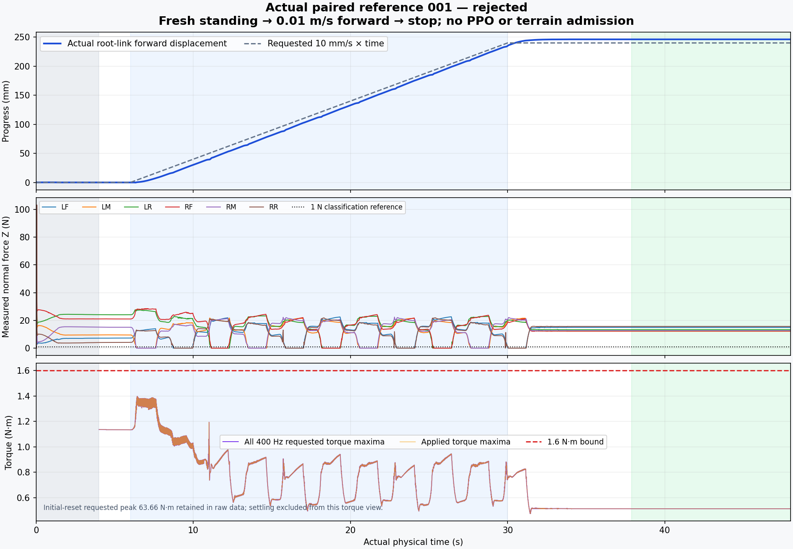

# Actual paired motion 001 — rejected by the retained consistency gate

The robot completed the full 48 s physical screen: **11 moving pairs, 22 independently qualified landings, 234.94 mm forward travel during the 24 s request, and a passing 10.08 s quiet stop**. Poststartup requested torque stayed below **1.39704 N·m** across all 400 Hz samples. Four required supports remained present with at least 101.90 mm measured COM margin; there were no resets, nonfoot contacts or poststartup saturation.

The campaign is nevertheless **rejected**. Actual displacement and integrated simulator link velocity differ by **5.579826 mm** over 6–30 s, exceeding the unchanged 5 mm gate. The correct same-endpoint 400 Hz diagnostic differs by **6.979341 mm** using the frozen helper's reduction. No metric substitution, relaxed gate, walking/PPO admission or native-cause conclusion is made.



`actual_review/README.md` explains the full measured result, source replay, small cross-host numerical differences and the separately retained 63.66 N·m initial-reset computed peak. This is a reference-controller physical trial, not PPO. The faster command is useful measured evidence; it does not complete Stage 2 or terrain qualification.

All **33 raw payload hashes** matched Spark. The audit verifies the exact **946 source files and 550 admitted assets unchanged**, both exact container IDs/names absent, expected unit invocation `aeb33fdfce794cfca50e4227ebfada1d`, and recorded pause050 restoration. These are historical ownership facts, not a claim that shared locks remain free.

The immutable 121-payload preparation and two-payload outer guard are included unchanged. The review independently replays all 2,200 paired states and poststep support/torque checks, with maximum difference 1.6653e−11; all 19,201 substep samples/counters/control endpoints pass. Local and remote gate verdicts agree. Three standing heading values and two paired numeric values differ slightly across hosts, and both reports remain visible.

The first attempt to make the review standalone omitted a transitive import (`omni_diagnostics.py`). Its failed portable log and 31-file review freeze remain intact. `portable_replay/` supplies that exact source-bound dependency; `replay_actual.py` recomputes in a temporary copy without rewriting any frozen review or raw payload. The original complete source-based replay had already succeeded. This packaging correction changes no physical source, metric or verdict.

Verification:

```sh
python3 verify_payload.py
PYTHONDONTWRITEBYTECODE=1 uv run python -B replay_actual.py
```

The portable replay requires NumPy, Torch and SciPy and emits the same rejection. Deeper velocity/position analysis, operator reviews or successor trials must be appended as new artifacts; this terminal bundle remains immutable.
