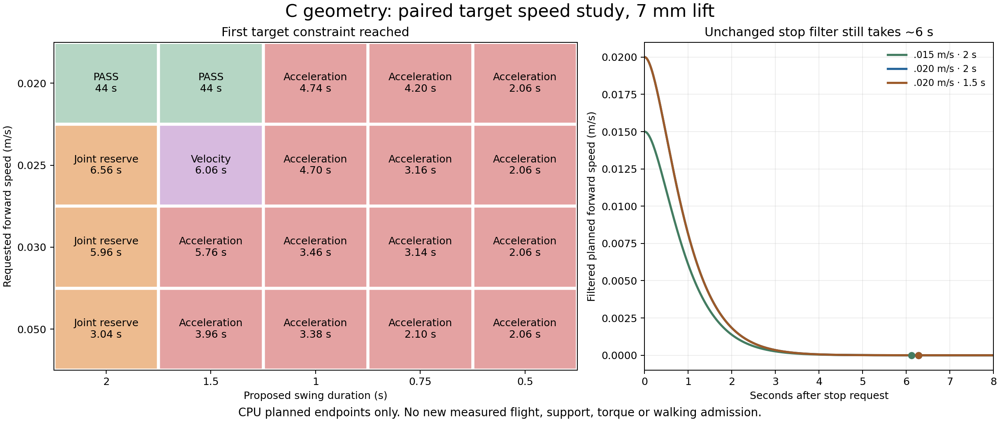

# Faster paired targets: where this template first runs out of room

**A planned 0.02 m/s sequence fits the existing target limits with either a 2.0 s or 1.5 s swing. Every tested 0.025, 0.03 and 0.05 m/s sequence rejects.** Long cycles consume joint reserve; shorter swings increase joint acceleration. This identifies candidates for a later measured experiment, not a physical speed limit of the robot.

The study uses the exact C-study geometry, recorded pair001 startup pose/targets/preload, 95% soft joint limits and unchanged zero-residual core copied from the frozen 43-file paired prototype. It changes only explicit proposed speed and swing timing in its **planned-endpoint oracle**. No actual motion is time-warped, no contact is simulated here, and the contact-aware controller is not altered or run at these new timings. Original five-support wave gates and the separately proposed four-support paired admission remain unchanged.

The declared matrix contains 20 cases: four speeds (0.02, 0.025, 0.03, 0.05 m/s) and five swing durations (2, 1.5, 1, 0.75, 0.5 s), plus the 0.01 and 0.015 m/s baselines. Every case retains 7 mm lift, a 0.3 s handoff hold and horizontal completion at 80% of swing. The cycle and placement horizon are recomputed together: cycle = 3 × (swing + hold); horizon = swing + ½ × (cycle − swing). The schedule is 2 s hold, 24 s requested motion and 18 s stop, sampled at 20 ms. Each case stops at its first violation; the rejected target is saved separately and never emitted.

## Strongest candidates for a later real screen

| Proposed forward request | Swing | Peak reference rate | Peak reference acceleration | Minimum soft-limit margin | Largest planned step |
|---|---:|---:|---:|---:|---:|
| 0.015 m/s | 2.0 s | 1.121 rad/s | 2.646 rad/s² | 0.223 rad | 121 mm |
| 0.020 m/s | 2.0 s | 1.528 rad/s | 3.550 rad/s² | 0.145 rad | 161 mm |
| 0.020 m/s | 1.5 s | 1.484 rad/s | 4.710 rad/s² | 0.222 rad | 121 mm |

The preserved reference limits are 1.75 rad/s, 6 rad/s² and a 0.02 rad reserve inside the soft limits; the full residual-plus-reference limits remain 2 rad/s and 8 rad/s². They are software target budgets, not measured motor speed limits. All three complete 2,200 target knots with zero residual lag. The table's step size includes the initial later-leg placement, which can exceed steady speed × cycle.

After the separate 0.01 m/s physical paired trial is assessed, **0.015 m/s with the existing 2 s timing is the smallest proposed speed intervention**. The two 0.02 m/s candidates then make a useful comparison: 2 s needs less acceleration but longer placement; 1.5 s cuts the maximum planned step by about 40 mm and retains more joint reserve, at the cost of higher acceleration and shorter flight/landing time. Neither is selected for hardware or automatically dispatched. The parent's contact-aware ideal fixture already rejects at 0.015 and 0.02 m/s because it loses a retained contact; these target-only passes do not overrule those failures.

## What fails above that range

At 0.025 m/s and 2 s, the first crossing occurs at 6.56 s during a scheduled stance/hold: RF coxa (`revolute_4`) has only 0.01778 rad soft-limit margin, below the 0.02 reserve. At 0.03 m/s and 2 s the same retained joint crosses at 5.96 s, while LF/RR finish their vertical swing. The limiting joint can therefore be a planted leg waiting for its turn, not the foot being lifted.

Reducing swing to 1.5 s restores spatial reserve but exposes dynamic target constraints: 0.025 m/s exceeds the reference velocity budget; 0.03 m/s reaches 6.290 rad/s² at the LR tibia during the third pair's swing. At 0.05 m/s, 2 s hits the LM tibia joint reserve at 3.04 s; all shorter tested timings reject on acceleration. At 0.02 m/s with a 0.5 s swing, acceleration already reaches 8.319 rad/s² only 60 ms after the first planned lift. Simply increasing cadence has a cost from the 7 mm lift waveform even before long strides develop.

These first crossings have Jacobian singular values around 0.046–0.048 m, far above the existing 0.002 m validity floor. The recorded failures are joint-range or target-rate constraints of this exact schedule, not evidence of a near-singular pose or a measured motor inability. The experiment does not search other pair orderings, neutral footholds, body-pose strategies, lift shapes or horizontal timing fractions. Those are possible future reference changes; none is silently substituted here.

## Stop speed is a separate limitation

The unchanged critically damped command filter takes **6.12–6.28 s** to meet the finite reference-stop thresholds for the candidates above. With filter ω = 2 s⁻¹, its ideal steady-command stop travel is approximately 2v/ω: 15 or 20 mm here. The measured integral of the planned samples matches that result. Shorter swing alone does not shorten this filter tail. Actual physical stopping, settling and map reacquisition must be measured; a 250 ms observation lease cannot establish visibility throughout a six-second stop.

A bounded residual policy around a fixed reference does not automatically raise the reference's speed cap, shorten its cycle or fix this stop filter. Playback speed also supplies no walking-speed evidence. Useful speed requires a new admitted reference/command envelope and independent commanded-versus-achieved measurements.

## Evidence required before treating a faster template as useful

A later physical screen must retain the fresh standing admission and independently measured flight, minimum 2 mm clearance, both-foot landing confirmation, retained-support force/margin, nonfoot-contact, reset, target, stop and quiet checks. Each full 400 Hz requested/applied torque sample must be inspected: the recent RR preload trial exceeded 1.6 N m twice although its 50 Hz gate did not see those peaks. Target feasibility cannot establish torque headroom or efficient load transfer.

Measure achieved forward displacement and sustained body speed after the ramp, compare the original position/velocity consistency metrics, and preserve raw SDK rate and joint-angle-derived interval rate separately. Compare step completion, slip, body attitude, minimum support force, full-rate peak demand and settling on identical runs. Any mechanical-work estimate should use documented 400 Hz joint-angle increments with applied torque and retain the known SDK-rate discrepancy; it is not an electrical efficiency measurement. No energy or hardware qualification is made by this study.

## Reproduction and provenance

[PLAN.json](PLAN.json) fixes the matrix. [CANDIDATES.json](CANDIDATES.json) contains machine-readable candidate parameters. [SUMMARY.json](SUMMARY.json) and [results](results/) retain every parameter map/hash, accepted target sequence, first rejected knot, joint/phase classification, stride, Jacobian and stopping diagnostic. The `.015` and `.02`/2 s arrays are byte-for-byte equal to the parent's existing target oracle outputs. Five CPU tests verify that parity, input hashes, retiming, bounds, rejection/non-emission and planned stopping integrals.

[study.py](study.py) is a new driver; [planned_target_oracle.py](planned_target_oracle.py), all six geometry/controller/core files and the actual startup excerpt are copied unchanged and bound by [PARENT_INPUTS_SHA256.json](PARENT_INPUTS_SHA256.json). The exact parent manifest is `636844a6032642014304408f1021e61478be3aed46642fd67686ed9d2f9a6f55`. Existing result directories cannot be overwritten by the driver. Use a fresh copy without generated results for a new execution. Tests require NumPy, SciPy and CPU PyTorch; the figure uses Matplotlib.

The initial local NumPy API error (`np.trapz` unavailable) is preserved under [history_numpy_api](history_numpy_api/); it occurred before any result target file was written and was fixed using the explicit trapezoidal sum. One diagnostic label was then clarified so a prior stride is not named an active stride during a stance hold; all saved target arrays remained unchanged. Neither correction changes the reference equations or gates.

No GPU launch, CAD change, frozen-owner edit, actor registration, terrain traversal or Stage 2 completion occurred.
