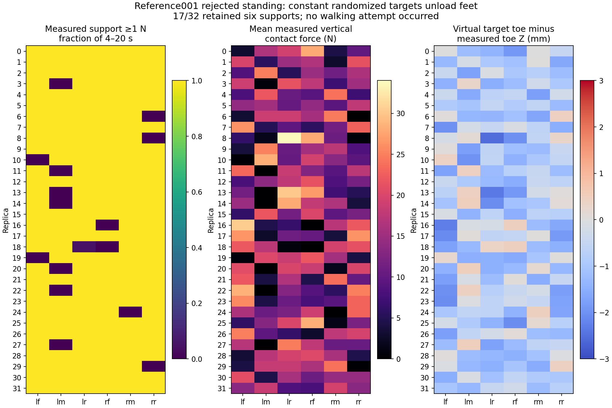

# Reference physics 001: standing rejected; walking not attempted

The full C robot completed the 32-replica, 1,000-control standing screen, but **failed the unchanged six-foot support requirement**. The wave phase and PPO were not launched. This attempt does not admit the reference, complete Stage 2, or qualify terrain.

The original basic standing physics gate passed. There were no terminations, truncations or post-settle nonfoot contacts. Post-settle requested torque peaked at **1.314804 N·m**, with **zero requested saturation**. The stricter reference entry gate found a minimum of four supporting feet: **17/32 replicas** retained six supports throughout the settled window, while **15/32** had persistently underloaded feet. Full gate output is in [the standing state](results/run/standing/state.json).

Measured diagnosis identifies an initialization issue worth testing separately. The reference held each replica's randomized reset target throughout all 20 seconds: the maximum target change was exactly zero, but those targets differed from the named canonical stance by up to ±0.03 rad. Below-threshold contact samples had a median vertical force of zero, so the result cannot be dismissed as boolean contact flicker. Uneven target toe heights are consistent with the unloaded-foot pattern; that association does not prove that returning to nominal alone will pass physics. See [the measured review](physical_review/STANDING_RESULT.md), its per-replica JSON and the figure below.



The smallest justified successor is a bounded transition from the exact emitted reset target to the named canonical stance, followed by settling and the same gates. A separately versioned two-second C2 transition is being prepared. No model, gate, frozen source or result in this attempt has been changed, and no successor result is claimed here.

## What is preserved

- `preparation/` is the complete, unchanged source/CPU bundle prepared before the run. Its 63 payloads and original `BUNDLE_SHA256.json` remain intact; that manifest SHA is `895fa0dd638d284db772188008696d3b4aab34e948c15a8a8ea9e666afa0980f`. Its historical pending-verdict text describes preparation time; this top-level README gives the actual result.
- `results/` contains all 15 remotely hashed raw run/forecast-pause files, plus the independent remote audit and its read-only verification script. This includes the 32-replica trace, rejected admission, full startup/runtime log, contact-data audit, environment, job/campaign states and timer restoration.
- `physical_review/` preserves the sensor review's nine files and owner freeze. `STANDING_RESULT.md` is its actual-result entry. Earlier static-load and touchdown predictions in its original README are explicitly untested analyses; they are not results of the unlaunched wave phase.
- `verified_summary.json` records the terminal verdict and compact measured facts. `SHA256SUMS.json` is the primary publication map for every payload in this wrapper.

The exact source map is `a13f1534f9f802871a2cacbc0be603eae2d80738905381da40691f7cd4beff7c`; all **923 source files** and **550 copied asset files** were verified unchanged after termination. The run used the pinned C runtime and exact source-bound model/PD/limits. The contact log audit found no truncation warning. Root independently verified the owned container absent by both immutable ID and name, and pause 027 restored both previously active forecasting timers. See [the remote audit](results/remote_audit.json) and [restoration receipt](results/forecast_pause/restored.json).

## Reproduction and verification

The compact preparation carries the 14 exact source overlays and complete source/parent maps, rather than another copy of the 909-file velocity003 parent. Its [README](preparation/README.md) gives the source reconstruction contract. Verify against an exact archived velocity003 source with:

```sh
PYTHONDONTWRITEBYTECODE=1 python3 preparation/reconstruct_source.py \
  --parent /absolute/path/to/velocity003-source
```

An optional fresh `--out` reconstructs and checks the exact 923-file source; it does not launch Isaac. Verify all files in this publication wrapper with:

```sh
python3 - <<'PY'
from pathlib import Path
import hashlib, json
root = Path('.')
manifest = json.loads((root / 'SHA256SUMS.json').read_text())
for name, expected in manifest.items():
    assert hashlib.sha256((root / name).read_bytes()).hexdigest() == expected, name
print(f'Verified {len(manifest)} files')
PY
```

The original measured analysis script is preserved with its exact repository-local input paths. Its trace hash is bound in `standing_review.json`; source reconstruction and the raw trace provide all analysis inputs. Re-execution should use a fresh output location and preserve the recorded report and figure. No additional CPU suites were rerun merely for packaging: the recorded preparation contains 20 adapter tests, 12 residual tests, 9 wave tests, 23 synthetic fixture cases and 8 restorer tests. These CPU checks remain separate from the rejected physical admission.
