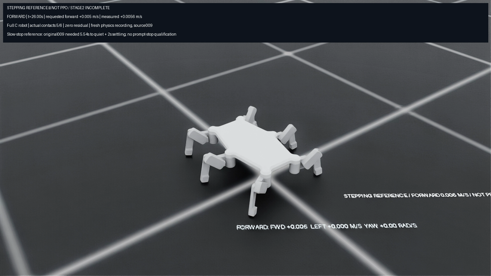
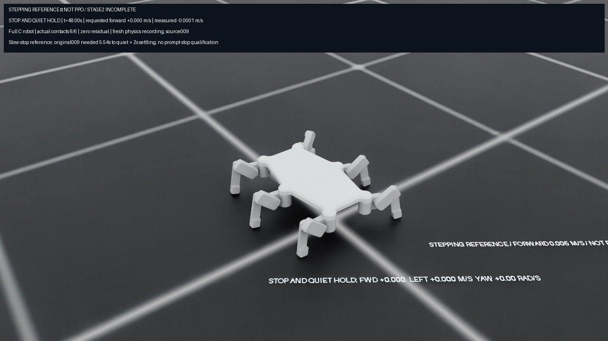

# Native slow-reference progress recording

The full C robot completed a fresh48-second Isaac recording of source009's unchanged zero-residual stepping reference. It passed the complete physical screen, eleven qualified landings across all six legs and the final12.46-second quiet window. This is a reference demonstration, not PPO or completed Stage2. The video visibly labels that scope.

[Watch the native recording](run/recording/rollout.mp4). The sequence includes2seconds canonical-target startup,2seconds settling,24seconds forward at0.005m/s and20seconds stop/quiet. Actual forward progress is115.24mm. The stop request takes5.54seconds to reach reference quiet, followed by2seconds excluded settling. Ground labels and the overlay show commanded motion; the robot is advanced by actual physics, with zero policy residual and no pose forcing.

Root decoded all1200frames at25fps and1280×720, checked frame dimensions and nonblank content, and inspected moving/quiet frames. [The video receipt](run/recording/video.json) binds SHA739e568cab2ddfab660dfb65e2334ff058148092a7299e0fe30d256588ca2e41. Rendering is a fresh execution, not a replayed pose animation. Its raw control trace,400Hz substeps, controller states and control integrals happen to match original009 byte for byte; [the root review](root_review/report.json) records those comparisons.

The [reference009 measurement report](../reference_physics_009/measurement_review/REPORT.md) therefore applies to these exact raw measurements too: original50Hz progress disagreement4.372873mm passes its declared5mm gate, while independent400Hz disagreement5.102579mm exceeds that diagnostic bound. Reported joint-rate bias and startup overload remain unresolved. Quiet eventual stopping, successful rendering and an unchanged original screen pass do not qualify fast stopping, all-direction smoothness, velocity fidelity, terrain or hardware.

The frozen adapter compiles unchanged control/scoring function ASTs and supplies only rendering/capture hooks. Root and independent review passed10adapter tests, sixhost tests and eightouter-restorer tests. Initial workspace-only image tests lacked Pillow; the same unchanged code passed with the existing system Python/Pillow installation. No dependency or physics gate was changed. Original adapter/host/guard/review freezes remain inside this publication. The source is reconstructed by the separately publishedreference009 preparation; all926source files and550admitted assets stayed unchanged.

All26remote result/restoration payloads matched. The exact owned container is absent, the user unit completed, and pause036 restored its previously active forecasting timers. These are terminal historical checks. The remote audit also verifies exact adapter/host/guard inventories and the admitted009 campaign.

