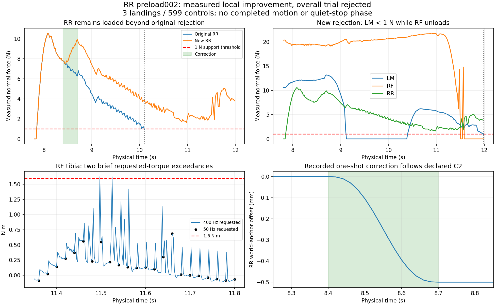

# Actual RR preload002 — local load improved, overall trial rejected

The source/import correction worked and fresh **32 × 1000 standing/quiet passed**, but the left-strafe trial **rejected after 599 of 2400 controls** (11.98 s total). It completed three qualified landings, then LM fell below the unchanged 1 N support threshold while RF was unloading. The actual 400 Hz trace also contains **two requested-torque samples above 1.6 N m**. This is not a completed walking/stop result or Stage2 admission.

The first420 physical rows are byte-equal to original directional002 for measured joints, targets, root positions, normal forces and contact masks. Only after the recorded one-shot RR correction do those trajectories differ. The correction starts at8.40 s, ends at8.70 s and applies exactly−0.5 mm with the declared C2 P/V/A; it arms once at the second confirmed landing. Measured contact anchors are retained and all reference target times and emitted float32 knots are verified.

| Actual measurement | Original directional002 | New RR preload002 |
|---|---:|---:|
| RR normal force at control504 /10.10 s | 0.945591 N | **3.939688 N** |
| Trial controls before rejection | 505 | **599** |
| Confirmed landings | 2 (LF, RR) | **3 (LF, RR, LM)** |
| Final underloaded support | RR while LM swings | **LM0.896118 N while RF unloads** |
| Final RR normal force | 0.945591 N | **3.807647 N** |

RR remains above1 N after the correction finishes (minimum1.647396 N), but that does not establish a satisfactory whole-robot load distribution. At the final row, normal forces are LF26.304861, LM0.896118, LR20.797264, RF0, RM29.138077 and RR3.807647 N. The run has four admitted supports and no non-foot contacts, resets or truncations. There was no stop request or final quiet window; the24 s motion interval was not completed.

## High-rate torque matters

The stored50 Hz physical gate reports a post-settle maximum request of1.534293 N m and zero sampled saturation. Full400 Hz evidence reveals RF tibia (`revolute_2_3`) requests of **1.626537 N m at11.4975 s** and **1.624497 N m at11.525 s**. Applied torque at both is approximately1.6 N m in float32 storage. These occurred during RF unloading, before qualified2 mm flight, and are a separate physical concern from the later support rejection. They are not erased by the coarser sampled gate or called torque-safe.

All **4,793 wave** and **8,001 standing** substep samples have exact control-endpoint parity, counter/index order and2.5 ms timestamp increments. Contact forces were recorded only at50 Hz; no400 Hz force history or actual penetration measurement is invented. SDK joint-rate/angle discrepancies persist: the wave's worst cumulative difference is0.224531 rad for RF tibia over the available7.98 s prefix; standing's worst is0.410397 rad for RM tibia over16 s. No native velocity-fidelity qualification is claimed.

## Independent replay and provenance

The complete stored left-strafe gate is reproduced exactly. Every standing physical metric is reproduced exactly and every replica's quiet verdict remains true. Three tiny quiet heading metrics differ between the local numerical replay and stored results by approximately6.83×10⁻⁶ degrees; both values and differences are retained in [review_final.json](review_final.json). No quiet bound or verdict was changed to reconcile this. The difference is reported rather than asserting bitwise equality of those three derived values.

All raw residual actions, positions, velocities and accelerations are zero; the unchanged core emits the reference. There are no checkpoint payloads or PPO updates. The environment may compute step rewards internally, but they are not used for optimization. The added diagnostic state remains unbound to the old846/849 actor/schema.

The terminal audit matched **33 raw payloads**, **932 source payloads** and **550 admitted asset files**. Both actual owned container names and both recorded IDs are absent. The user unit failed/exit1 with invocation `7f32b909f3b5411a8f4a57d0200519ef`; pause048 restoration is recorded at Unix1789035350.4741075. The remote preflight's predecessor diagonal-unit checks remain raw historical evidence, distinct from this trial's two owned containers. Source manifest is `bfb0bbde27fdfae1f2ddc7797ff12adf184c7cd68a8e637f5fce87f7e0e3cfa3`.

This supports the narrow observation that the RR correction increased RR load and extended this measured trial by94 controls (1.88 s). It does not justify generalizing the correction to every foot, treating the new failure as acceptable, or applying it to the arc case, whose earlier lost support was RM. No next controller change is proposed by this terminal receipt.

[review_actual.py](review_actual.py) accepts explicit raw/source/original-trace/output paths and refuses existing result files. It replays original gates and reference timing without physics. [support_and_torque_detail.json](support_and_torque_detail.json) lists every transition, both torque events and final contact history. [INPUT_SHA256.json](INPUT_SHA256.json) binds the exact evidence. Original raw/source bytes remain immutable; root owns publication and subsequent runtime decisions.
