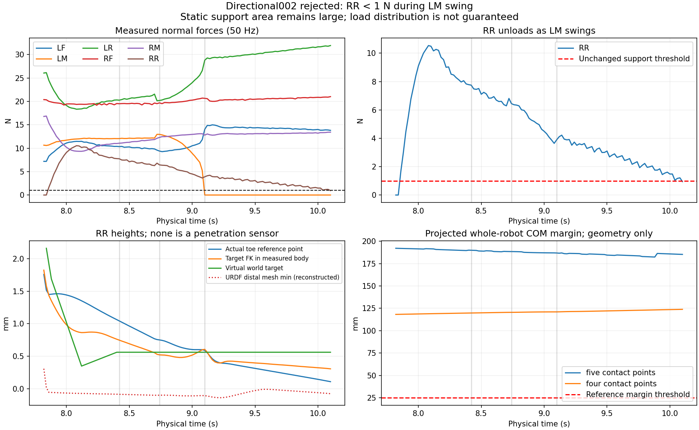

# Directional002: RR support load fades during left strafe

This is a read-only diagnosis of the rejected **0.005 m/s left-strafe** run. It does not change the 1 N contact threshold, the five-support gate, the reference, or the run verdict. The run stopped after 505 controls (10.10 s total), with two confirmed landings (LF and RR) and LM in its first swing. There is no completed motion or quiet-stop result for this case.

All 32 raw payload hashes match the completed remote audit. The audit also records unchanged 930-file source and 550-file admitted assets, absence of both owned container names and recorded IDs, and pause044 restoration. The independent measurements below are regenerated by [diagnose.py](diagnose.py); [report.json](report.json) retains the complete values and reference state. [last100.json](last100.json) contains every measured control row in the final window.

## What actually happened

| Physical point | Time | RR normal force | RR target FK minus measured toe Z |
|---|---:|---:|---:|
| First descending return contact | 7.86 s | 1.646 N | −0.017 mm |
| RR confirmed landing | 8.42 s | 7.746 N | −0.295 mm |
| End of existing contact hold | 8.72 s | 6.807 N | −0.226 mm |
| LM first force-free sample | 9.10 s | 3.894 N | +0.016 mm |
| Last accepted support row | 10.08 s | 1.211 N | +0.193 mm |
| Rejected row | 10.10 s | **0.946 N** | **+0.197 mm** |

RR still has a finite contact point and nonzero reaction at rejection. This is a loss of admitted load, not evidence that the foot detached. Its measured tangential/normal force ratio rises to **0.994**, with reported distal slip **1.89 mm/s** at the final row. LR carries **31.934 N**, while RF/LF/RM carry approximately 21.018/13.811/13.419 N and LM carries zero. The history shows sustained redistribution and declining RR load, rather than a single isolated threshold fluctuation.

The RR landing was physically qualified: 58 consecutive force-free samples, 5.261 mm measured reference-point lift, a measured return, bounded landing blend and stable contact confirmation. The last landing cannot be reclassified as failed merely to explain this later support loss.



## Support and body motion

The full articulated COM is reconstructed from all 19 frozen URDF link masses and COMs (total **8.26081134 kg**), the actual named joint angles and the measured root-link pose. The SDK root quaternion is explicitly XYZW. The stored root COM is only the base-link COM and is not substituted for the whole robot.

At the rejected row, the projected COM margin using the five finite contact points excluding LM is **185.320 mm**. Removing RR as well leaves **123.863 mm** in the four-contact polygon. The latter is a geometry diagnostic only: the run still fails the five-support gate. During the last 100 controls, those geometry margins stay above 182.381 mm and 119.041 mm, respectively. A large polygon does not ensure that passive joint PD distributes weight to every supporting foot.

Over the final 100 controls (endpoints 8.12–10.10 s), the actual root moves +10.258 mm in world X, +0.288 mm in Y and −0.432 mm in Z. Its relative rotation is only approximately −0.0288°, −0.0708°, +0.0762° about world axes. RR's measured toe reference moves +0.348/+0.318/−1.241 mm. The physical contact point moves much less: −0.246/−0.134/−0.112 mm. These channels support continued contact with changing pad orientation and loading, rather than a tipping-boundary event.

## Landing surface, virtual target and preload

The original RR virtual standing plane was −1.033 mm. At descending contact its tracked toe reference is +1.450 mm even though the reconstructed lowest distal collision vertex is near the ground (−0.052 mm). The landing routine carries the old −0.887 mm vertical reference offset into the new endpoint, then latches a **+0.563 mm virtual world anchor**. Stable-contact completion at 8.42 s records a −0.500 mm anchor-to-measured-toe offset using the preceding measured row.

As the body translates and RR joint angles change, the offset of that tracked point above the lowest distal mesh vertex shrinks. It is about 1.126 mm at confirmed landing and 0.184 mm at rejection. The virtual anchor remains fixed at +0.563 mm. Target FK in the *actual* measured body frame ends 0.197 mm above the actual toe; at confirmed landing it was 0.295 mm below it. This is consistent with roughly **0.492 mm loss of downward kinematic preload**. It is a supported mechanism to test, not identification of a Cartesian force controller or proof of a sole native cause. Tangential demands, passive PD and the known SDK rate discrepancy remain relevant.

The source's exact URDF FK matches recorded SDK toe positions within **0.230 µm** across this run. Therefore the geometry reconstruction is well aligned with the actual recorded transforms. However, neither the fixed toe point nor the contact sensor's averaged point is a penetration sensor. At rejection the transformed distal mesh minimum is −0.073 mm, the actual toe reference is +0.111 mm, and the recorded contact point is +0.377 mm. These are different geometric quantities. **Actual solver penetration/separation was not recorded**; the mesh vertex result must not be called a PhysX penetration measurement.

## High-rate evidence and its limit

The final 100 complete control intervals span 8.10–10.10 s and include 801 stored 400 Hz boundary samples. They contain body pose, named joint positions, SDK joint rates and computed/applied torques. **They do not contain 400 Hz contact forces or contact classifications**. Force and current-support conclusions above use the actual 50 Hz rows; no interpolation is represented as measured force.

The maximum requested torque in this high-rate interval is **1.517596 N m**, on LR tibia (`revolute_2_6`) at 10.0975 s, leaving only **0.082404 N m** below 1.6 N m. There are no post-settle saturation, non-foot contact, reset or truncation failures in this run. The final reference was computed from the preceding measured row, where RR still exceeded 1 N; the physical row after emitting it then failed the unchanged support gate. Reference target timestamps and emitted float32 targets match every paired trace row exactly.

## One bounded next experiment

Test a **0.5 mm downward RR stance-anchor correction**, applied with a C2 quintic during the existing **0.3 s contact hold after the first confirmed RR landing**. Keep requested velocity, gait order, swing shape, physical support/flight/landing/torque gates and finite stop behavior unchanged. It should have explicit correction state and target P/V/A; it must not rewrite the measured contact point, relabel flight, silently clip IK, or force body pose. This is a single-case diagnostic to test restoration of the measured preload loss, not a general six-leg controller change or an already adopted criterion.

[candidate_prefix.py](candidate_prefix.py) only computes this target sensitivity against the original desired-body trajectory through the actual rejection. Its 305-knot recorded prefix has all IK solutions valid, a minimum named soft-joint margin of **0.085422 rad**, peak discrete target velocity **0.583159 rad/s** and acceleration **1.303773 rad/s²**, within the existing 1.75/6 reference budgets. Every non-RR joint and every target before correction remain exactly unchanged. Maximum RR target change is 0.010212 rad. The 30 N m/rad proportional gain would change an instantaneous, fixed-measurement PD term by at most 0.306362 N m; **this is not a future torque prediction or physical admission**.

The 0.5 mm amplitude is motivated by the observed 0.492 mm change, not an identified force-control gain. The next physical test must measure whether RR stays above 1 N while LM swings, while preserving five supports, 1.6 N m, all collision checks, real progress, and quiet stop. Other leg loads may redistribute. The recorded LR torque headroom means this cannot be admitted solely from the target calculation. No counterfactual contact continuation, recovered landing, successful traversal or stop has been fabricated here.

## Reproduction

Run from the repository containing the exact referenced temporary source and raw bundle:

```sh
PYTHONDONTWRITEBYTECODE=1 .venv/bin/python tmp/reference_strafe_support_review_001/diagnose.py --output /tmp/new-strafe-review
PYTHONDONTWRITEBYTECODE=1 .venv/bin/python tmp/reference_strafe_support_review_001/candidate_prefix.py --output /tmp/new-strafe-candidate
PYTHONDONTWRITEBYTECODE=1 python3 tmp/reference_strafe_support_review_001/plot.py --analysis /tmp/new-strafe-review --output-image /tmp/new-strafe-review/diagnostic.png
```

All output paths must be fresh; numeric entrypoints refuse existing directories and the plot refuses an existing image. `plot.py` uses the existing image-capable system Python, while numeric scripts use the NumPy/SciPy/Torch analysis environment. Dependency hashes are recorded in [INPUT_SHA256.json](INPUT_SHA256.json). Original source, raw evidence, CAD, gates and main were not edited; no GPU action occurred.
