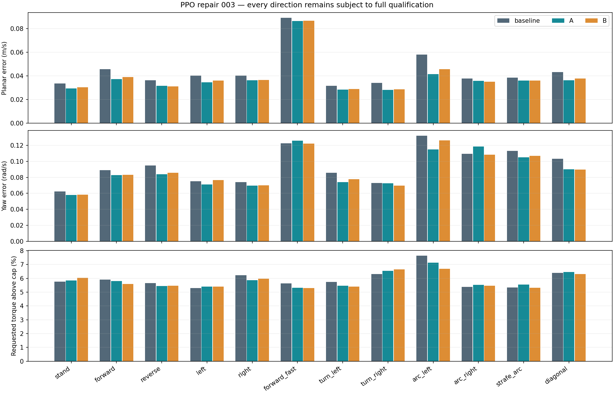
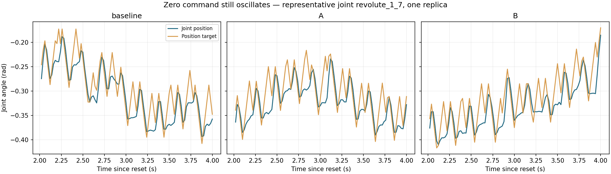

# Two 50-update PPO comparisons

Neither 50-update branch justified continuation. Both gave modest tracking gains, while quiet standing remained far outside the proposed motion limits. The paired run completed successfully; forecasting timers were restored and the owned user service exited. No further GPU experiment was launched.

All results remain unqualified. Columns compare the same 12 scenarios, seed 7057, four replicas per scenario, and the settled nonterminal window from 2–12 seconds. Trace-only metrics below use one recorded replica per scenario. No further GPU work is automatically allocated.

| Metric | Original baseline | A: lower exploration | B: plus raw standing-action cost |
|---|---:|---:|---:|
| terminations | 0 | 0 | 0 |
| truncations | 0 | 0 | 0 |
| saturation | 0.0574444 | 0.0567639 | 0.0553056 |
| planar_error | 0.0395097 | 0.0360645 | 0.03619 |
| yaw_error | 0.0917796 | 0.0833483 | 0.0843128 |
| power | 2.30086 | 2.28223 | 2.2788 |
| stand_joint_velocity_rms | 0.750138 | 0.737403 | 0.740167 |

Per-direction values are planar error in m/s, yaw error in rad/s, and saturation percentage.

| Direction | Baseline planar / yaw / saturation | A | B |
|---|---:|---:|---:|
| stand | 0.0337 / 0.0622 / 5.75% | 0.0295 / 0.0579 / 5.85% | 0.0304 / 0.0584 / 6.03% |
| forward | 0.0458 / 0.0889 / 5.91% | 0.0373 / 0.0827 / 5.80% | 0.0391 / 0.0830 / 5.60% |
| reverse | 0.0365 / 0.0947 / 5.65% | 0.0316 / 0.0840 / 5.44% | 0.0313 / 0.0857 / 5.46% |
| left | 0.0403 / 0.0752 / 5.29% | 0.0346 / 0.0709 / 5.40% | 0.0362 / 0.0765 / 5.41% |
| right | 0.0405 / 0.0740 / 6.22% | 0.0363 / 0.0694 / 5.87% | 0.0366 / 0.0701 / 5.96% |
| forward_fast | 0.0893 / 0.1224 / 5.64% | 0.0865 / 0.1257 / 5.32% | 0.0868 / 0.1223 / 5.29% |
| turn_left | 0.0317 / 0.0857 / 5.74% | 0.0285 / 0.0740 / 5.46% | 0.0289 / 0.0775 / 5.41% |
| turn_right | 0.0342 / 0.0730 / 6.30% | 0.0282 / 0.0726 / 6.55% | 0.0287 / 0.0698 / 6.64% |
| arc_left | 0.0581 / 0.1321 / 7.64% | 0.0416 / 0.1148 / 7.13% | 0.0459 / 0.1264 / 6.69% |
| arc_right | 0.0380 / 0.1093 / 5.38% | 0.0360 / 0.1187 / 5.53% | 0.0351 / 0.1083 / 5.46% |
| strafe_arc | 0.0387 / 0.1133 / 5.34% | 0.0361 / 0.1050 / 5.56% | 0.0362 / 0.1070 / 5.32% |
| diagonal | 0.0433 / 0.1032 / 6.39% | 0.0364 / 0.0901 / 6.47% | 0.0378 / 0.0898 / 6.31% |

Standing physical trace, one replica:

| Metric | Baseline | A | B |
|---|---:|---:|---:|
| samples | 500 | 500 | 500 |
| joint_velocity_rms_rad_s | 0.739492 | 0.741665 | 0.738069 |
| joint_velocity_abs_p95_rad_s | 1.2959 | 1.29987 | 1.2956 |
| joint_fd_velocity_rms_rad_s | 0.864951 | 0.863632 | 0.8614 |
| max_joint_range_rad | 0.274759 | 0.263398 | 0.256227 |
| target_step_rms_rad | 0.0289209 | 0.0288905 | 0.0289135 |
| target_step_abs_p95_rad | 0.03 | 0.03 | 0.03 |
| target_step_at_cap_fraction | 0.898575 | 0.898798 | 0.897684 |
| raw_action_rms | 0.728613 | 0.721825 | 0.716786 |
| raw_action_temporal_std | 0.577076 | 0.573938 | 0.569252 |
| requested_torque_rate_rms_nm_s | 32.3125 | 30.9666 | 31.2774 |
| planar_end_drift_m | 0.168479 | 0.128876 | 0.127819 |
| max_planar_excursion_m | 0.168479 | 0.128876 | 0.127819 |
| heading_range_deg | 2.42177 | 2.27784 | 2.1397 |
| fd_heading_rate_std_rad_s | 0.0717522 | 0.0706574 | 0.0696917 |
| fd_heading_rate_peak_hz | 4.5 | 4.6 | 9.1 |

Standing raw-action mean square (four replicas): baseline=0.530020, A=0.519357, B=0.516076.

Branch A allocation screen: `{"stable": true, "improved": false, "marginal_improvement": true, "continue": false, "direction_regressions": [], "scope": "Compute allocation screen only; all-direction smoothness and full gates still required"}`.

Branch B allocation screen: `{"stable": true, "improved": false, "marginal_improvement": true, "continue": false, "direction_regressions": [], "scope": "Compute allocation screen only; all-direction smoothness and full gates still required"}`.

The standing-action penalty changed the conditional raw-action mean square from 0.51936 in A to 0.51608 in B, approximately 0.6%, while standing requested-torque saturation increased from 5.85% to 6.03%. Target-step P95 stayed at the full 0.03 rad cap; approximately 90% of target steps still hit that cap. Physical joint finite-difference rates remained close to 0.86 rad/s RMS. These traces do not support more reward-only training allocation on this attempt. A single seed and 50 updates cannot prove the direct-joint architecture incapable of learning; they do show that this tested intervention did not fix the measured failure.

Some individual metrics regressed within the short screen's tolerances: standing and right-turn saturation increased in both branches; A's fast-forward and right-arc yaw errors increased; B's left-strafe yaw error increased slightly. The empty `direction_regressions` list means no allocation threshold was crossed, not that every number improved. The full qualification thresholds and visual standard remain unchanged.

The recorded physical-heading-rate spectral peak is one signal's largest FFT bin; B's 9.1 Hz value may be a harmonic or a change in cancellation among legs. It does not establish a doubled gait frequency. The raw joint and target traces are the direct evidence that oscillation persists.

## Recommended next step

Do not extend either checkpoint. Prepare and review a body-twist-conditioned smooth leg reference plus a bounded learned residual, using Benchmark 1's accepted forward motion as the concrete starting point. First establish commanded-direction kinematics, continuous position and velocity targets, attainable feet, static zero-command support, and smooth stopping on the CPU. Preserve the forward/left/yaw command contract so later planning can combine translation, turning and arcs. Then use a short full-robot reference-only smoke over representative bearings, both yaw directions and stop transitions before allocating PPO.

This is a proposed contingency to review, not a selected or validated new controller. Standing must retain actuator feedback and allow disturbance recovery; do not freeze or teleport joints, and do not halt a gait with a swing foot left unsupported. Terrain adaptation must retain room for variable foot clearance and residual corrections. The next GPU experiment requires a measured rationale and fresh admission.

## Provenance

Both A and B baseline metrics are exactly equal to each other and the previous original-checkpoint 0.03-slew baseline. Both sources contain 146 hash entries; their 145 non-plan entries are identical. All 16 frozen legacy runtime files match the verified base. The only A-to-B plan difference is the raw-standing-action cost weight, zero versus −2.0. See [the exact plan diff](sources/plan_a_to_b.patch), [the base-to-A changes](sources/original_to_a.patch), [all identity checks](provenance_checks.json), and [campaign results](repair_pair.json).

A checkpoint: `b87df2b9536460fe67db840784d41c43c1d4ad08339ceacb6aab4959f3757f8f`. B checkpoint: `7e6bb4b40bb56fb0bd547f71352098ef8aecafe3e447cb0a329a1206eefbcfd1`. Both local checkpoint files match their training state and evaluation report SHA256. Learned action standard deviations finished at means 0.097237 and 0.097195 respectively; initial 0.10 exploration was applied after loading and verified. The saved normalizers were preserved before training, then learned normally during the 50 updates.

The final forecasting restoration receipt is [restored.json](forecast_pause_012/restored.json). Both previously active timers were confirmed active, the user unit inactive/dead, and the GPU process query empty before GPU ownership was released. The independent recovery timer remains an idempotent fallback.

Root is separately adding future-launch checks for identical non-plan source hashes and nonfinite applied-torque maxima. Those later code changes were not present in the immutable pair003 source; the completed reports were checked explicitly here and contain finite torque values under the unchanged applied cap.
