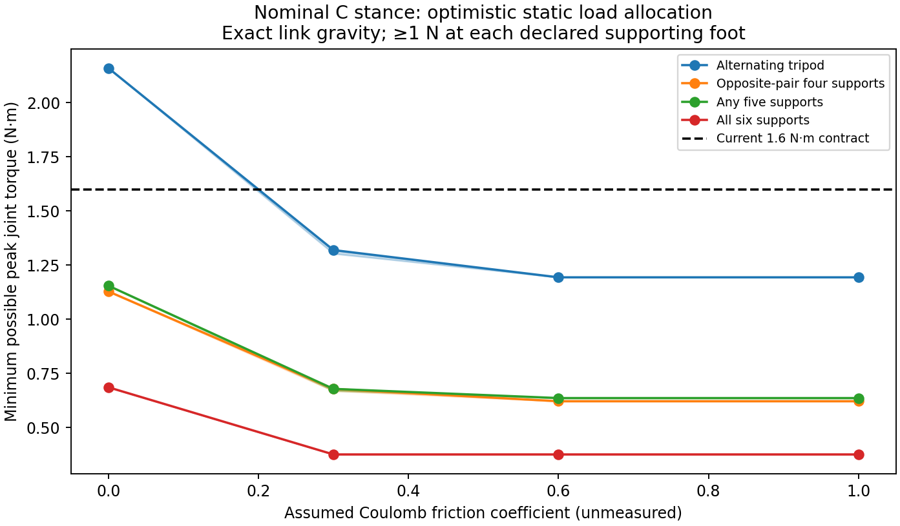

# C stance: what static loads say about faster gaits

10 September 2026. **The nominal alternating tripod has conditional static torque headroom.** A balanced four-foot support pattern has substantially more reserve and provides a useful intermediate test of the actual position controller. Neither result qualifies a walking gait.

This self-contained bundle preserves the original study unchanged in [frozen_study](frozen_study/README.md). It uses the user-selected C serial study: 72.5 mm femur, 126 mm tibia, unchanged coxa, 8.26081134 kg, and the existing 1.6 N·m motor contract. It is separate from the production four-bar CAD and has not been validated for manufacture.



## Fixed-pose results

The values below are ideal static minimum peak motor demands. They include every link's mass, center of mass and downstream leg gravity. The optimization can allocate contact forces freely; the passive position controller may not realize those forces.

| Supporting feet | Vertical forces only | Friction coefficient 0.3 | Friction coefficient 0.6 |
| --- | ---: | ---: | ---: |
| Alternating tripod | 2.159 N·m | 1.303–1.320 N·m | 1.194 N·m |
| Balanced four-foot sets | 1.129 N·m | 0.670–0.679 N·m | 0.622 N·m |
| Worst of the six five-foot sets | 1.155 N·m | 0.679 N·m feasible witness | 0.637 N·m |
| All six feet | 0.686 N·m | 0.376 N·m | 0.376 N·m |

The frictional tripod solutions leave about 17.5–25.4% static reserve below 1.6 N·m. Horizontal forces are essential to this result: the vertical-only solution exceeds the limit. The friction coefficients are scenarios, not measured properties. These calculations neither establish dynamic feasibility nor rule out a different posture or dynamic gait.

The strongest first load-transfer diagnostic is to unload **LM and RM**, retaining the four corner feet. That pattern has a nominal projected support margin of 186 mm and an ideal peak demand of 1.129 N·m with vertical forces alone, or 0.622 N·m with coefficient 0.6. The other opposing pairs are LF+RR and LR+RF, with support margins of approximately 115–116 mm. Any proposed physical test must measure actual forces, body deflection, foot slip and requested torque; the static force witness cannot stand in for those measurements.

## Evidence and limits

- [Full machine-readable solutions](frozen_study/report.json): 336 linear programs, covering all 42 support subsets of sizes 3–6 and four friction assumptions with inner/outer friction-cone bounds.
- [Compact numerical results](frozen_study/summary.json) and [ideal friction thresholds](frozen_study/friction_thresholds.json).
- [Frozen methods and limitations](frozen_study/README.md), [tests](frozen_study/test_static_patterns.py), and [source identity](frozen_study/SOURCE_SHA256.json).
- [Original freeze manifest](frozen_study/FREEZE_SHA256.json). The wrapper adds readable context; every frozen study file is byte-identical to its source.

Each declared support must carry at least 1 N in this analysis. That is a study convention, not a changed simulator gate. The outer 16-facet friction polygon supplies an optimistic lower bound; the inner polygon supplies a force witness satisfying the circular Coulomb cone. Dynamic inertia, compliance, actual force control, thermal limits and the final sensor payload are outside this fixed-pose study.

## Reproduce without modifying frozen evidence

Run from this bundle's directory, after copying the study into a separate working directory. Python requires NumPy, SciPy, PyTorch and Matplotlib.

```sh
cp -R frozen_study reproduced_study
PYTHONDONTWRITEBYTECODE=1 python3 -m unittest discover -s reproduced_study -p 'test_*.py'
PYTHONDONTWRITEBYTECODE=1 python3 reproduced_study/static_patterns.py
PYTHONDONTWRITEBYTECODE=1 python3 reproduced_study/summarize.py
```

The copied scripts resolve geometry inputs relative to themselves. The next proposed experiment is bounded load transfer under the unchanged current actuator contract, followed by a complete return to measured quiet support. No new gait, policy, speed requirement or physical gate is adopted by this bundle.
