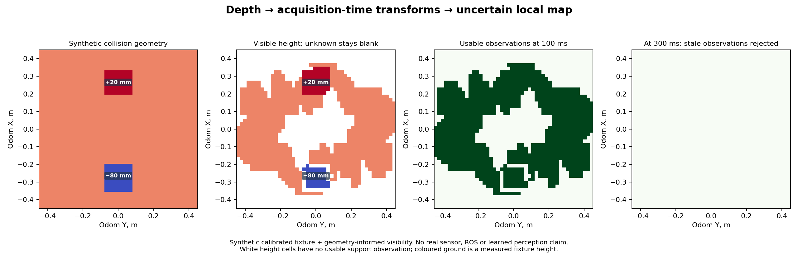

# CPU perception replay and terrain-observation interface

The depth-to-map path now executes without Isaac or a GPU. It preserves a synthetic 20 mm step and 80 mm pit, retains unobserved cells as unknown, and rejects all observations once they exceed the existing 250 ms age limit. Fourteen targeted tests pass. This is an integration fixture, not real-sensor calibration, a ROS node, a localization estimator or trained perception.



The fixture uses six proposed D405 views from the [CAD mount study](../sensor_mount_study_2026-09-09/README.md). Each view's coherent visibility pattern comes from nearby exact-ray samples on the flat production CAD, projected onto the synthetic scene. That transfers realistic holes in coverage without claiming a new exact pixel-level rendering of the robot over the step and pit. The expanded brackets and final C assembly remain unverified.

The 1.2 m × 1.2 m raster has 20 mm cells. Of its 3,600 cells, 1,031 are usable at 100 ms. None of its never-observed cells becomes usable. At 300 ms, all observations expire. Thirty interior cells on each obstacle are observed: their mean heights remain +0.020 m and −0.080 m. These are exact synthetic inputs, not measured camera accuracy. Height-map visibility is not proof of terrain strength or traversability.

## Executable interfaces

`tools/perception_replay.py` defines these components:

| Component | Input and behavior |
|---|---|
| `CameraCalibration` | Identified rectified depth intrinsics, exact resolution, optical-Z limits, depth scale and rigid body-from-optical transform. Camera axes are +X right, +Y down and +Z depth. The optical origin is not the housing centre. Unrectified or unidentified calibration is rejected. |
| `DepthFrame` | Acquisition and receipt timestamps, explicit valid and moving-robot masks, noise estimate, optional row acquisition times and nearest-robot-depth buffer. Global-shutter fixtures use one exposure timestamp; row offsets are an explicit generic interface, not a D455 rolling-shutter claim. |
| `PoseTimeline` | Continuous local `odom`-from-body samples and uncertainty, interpolated in translation and rotation at acquisition time. No extrapolation; gaps above 100 ms are rejected. The camera/point-cloud clock must already be calibrated into the same timebase. |
| `unproject_depth` | Rejects invalid, behind-camera, too-near/far and masked pixels. Optical Z is converted to XYZ before the sensor/body/world transforms. Measurement and pose uncertainty propagate to world-height variance. |
| `calibrated_point_cloud` | Future LiDAR seam: sensor-frame XYZ, per-return acquisition times, validity and robot masks, calibrated extrinsics and noise. It applies the pose for each timestamp. No Mid-360 packet parser, scan model or driver exists here. |
| `LocalHeightMap` | Fixed continuous-odom grid with height, variance, acquisition time, source and observed flag. New observations replace older cell evidence; out-of-order frames cannot refresh it. Missing cells are never filled. Within-cell height spread and simultaneous view disagreement increase uncertainty. |
| `local_patch` | Gravity-aligned robot-centred patch: rows are forward, columns left, and terrain height is relative to the body plate's world Z. Heading comes from the project's −Y-forward body convention. It uses the existing four-channel terrain contract. |

The four channels are normalized relative height, usable mask, normalized age and normalized standard deviation, as defined in `tools/terrain_readiness.py`. Zero-valued padding accompanies mask zero; it is never an observed flat plane. The raw world map and body patch are saved separately in the fixture artifacts.

A depth return behind a predicted robot surface is excluded; the pipeline does not pretend the camera sees through a leg. Missing robot-depth information is rejected when supplied as unknown, and an explicit robot-mask verification flag is required. The tests exercise masks changing between acquisitions. The next adapter must produce those masks from the current calibrated C geometry and joint state at the sensor acquisition time, including timing and calibration uncertainty.

## Verification and limits

Tests cover optical projection/extrinsics, capture-time motion compensation, rotational pose interpolation, per-row/per-point timing, frame/clock mismatch, no pose extrapolation, invalid depth and robot returns, changing robot masks, stale/future observations, out-of-order updates, step/pit preservation, simultaneous contradictory views, uncertainty and body-patch axes.

The map conservatively rejects mixed-height cells when their variance exceeds the existing confidence limit. It keeps 3D obstacle/overhang occupancy as a separate outstanding product: a single height per cell cannot represent every vertical structure. There is no spatial hole filling, learned completion, semantic material estimate, planner connection or actor injection.

Before using real D455/D405 or Mid-360 data, supply measured selected-mode intrinsics, extrinsics and acquisition clocks; verified moving-robot masks; pose covariance; and measured depth/noise/latency distributions. Replay real bags and compare to independent geometry, then profile the full Jetson pipeline. Do not label these synthetic results as physical sensor performance or let an unqualified terrain actor consume them.

The roadmap separation remains intact: pose estimation and mapping produce an uncertainty/age-aware terrain interface, the terrain student consumes only deployable observations, and navigation enforces support and stopping limits. This fixture exercises that interface while PPO training continues separately.

## Reproduce

```sh
python3 -m unittest discover -s robot/tests -p 'test_perception_replay.py'
python3 tools/perception_replay.py
```

NumPy, SciPy and Matplotlib are used on CPU. The demonstration reads the completed sensor-mount study; the tests do not need it. Outputs are `report.json`, `local_map_fixture.npz`, `student_patch_fixture.npz` and `perception_replay.png`. Source and visibility-study hashes are recorded in the report.
