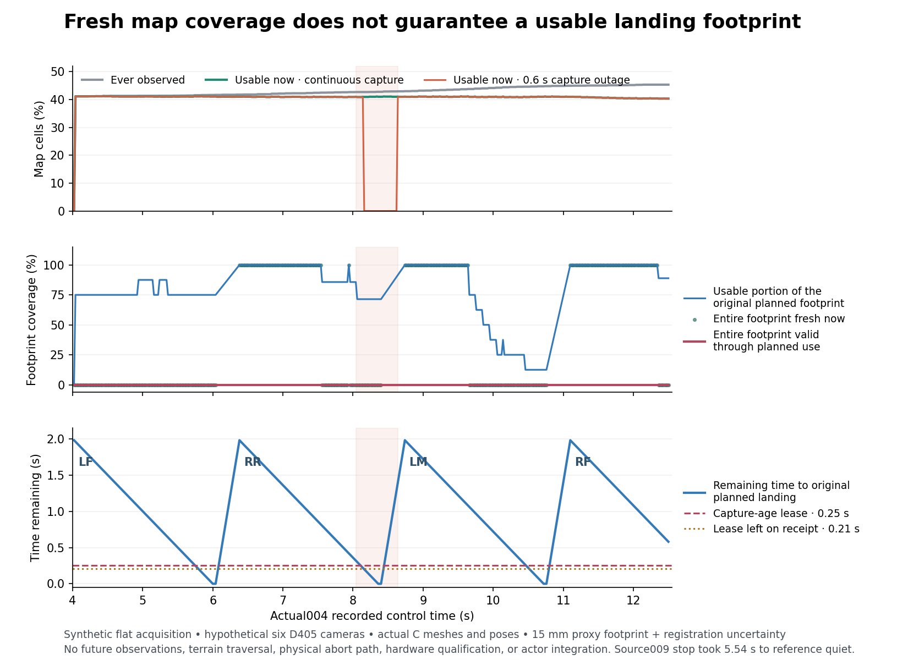

# New-footprint evidence lease prototype

This CPU prototype checks whether a proposed new foothold has complete, current sensor evidence and separately eligible support geometry. It emits evidence decisions only. It does not control a robot, manufacture a stopping trajectory, extend the 250 ms lease, or qualify hardware, terrain traversal, or Stage2.

The replay uses actual004's recorded body/joint motion on a synthetic flat scene, the frozen proposed six-camera D405 rig, and the existing exact visual-mesh stereo visibility cache. It does not place that flat-ground trajectory on terrain. All 426 valid reference rows are uniquely matched to recorded control timestamps; 377 queries concern four active proposed steps: LF, RR, LM, and RF. The underlying actual004 run ended during RF, so this excerpt does not cover every leg or a completed walk.

## Result

| Capture / uncertainty case | Entire footprint fresh now | Existing evidence valid through planned use | Missing latest-frame query times |
|---|---:|---:|---:|
| Continuous six-camera capture | 169 / 377 | 0 / 377 | 0 |
| Omit the 5.5 s capture | 169 / 377 | 0 / 377 | 5 |
| Omit captures from 8.0 to 8.6 s | 169 / 377 | 0 / 377 | 19 |
| Added registration drift | 156 / 377 | 0 / 377 | 0 |

These are whole-footprint decisions, not the fraction of its cells seen. The continuous case has approximately 40.8% of the fixed map usable on average at active-foot query times. That global percentage cannot certify a specific landing region. The LF original endpoint never has complete fresh coverage in this excerpt. RR, LM, and RF have complete fresh coverage during approximately 58.8%, 45.1%, and 88.7% of their queried intervals respectively, but no whole region remains valid through its original planned use time. RF's nominal landing lies beyond the recorded trace; the checker predicts only expiry of existing evidence, not future motion or sensing.

The missed-frame case is explicitly detected and does not renew map timestamps. It happens not to change these already-blocked footprint verdicts. The longer outage makes all map observations stale by 8.16 s while the ever-observed mask remains populated. New successful observations can later restore usability. Added vertical/planar registration drift reduces current whole-footprint coverage; this is a sensitivity case, not an estimate of a real sensor's drift.



A new 40 ms-latency frame has at most 210 ms left on the 250 ms capture-age lease. The planned swing lasts 2 seconds. The separately admitted009 reference took 5.54 seconds from stop request to reference quiet, then excluded 2 more seconds before quiet scoring. That recorded stop latency is context; this prototype neither extrapolates actual004 nor derives a safe abort from009. An executable, physically admitted decision/commit/abort interface is still needed before this checker could influence a robot.

## Interfaces and semantics

`FootprintEvidenceLedger.ingest` accepts timestamped calibrated world points with sensor identity, calibration identity, acquisition clock, capture time, receipt time, and explicit optical / stereo mesh-clear / camera-origin ambiguity masks. Wrong frames, future data, stale insertion, duplicate or reordered acquisitions, and points inconsistent with declared visibility fail closed. An empty received frame can update sensor health, but cannot refresh old cells. Capture time remains the basis for age.

`query` accepts an explicit original planned world footprint and intended use time, registration uncertainty, and independent support geometry masks. It returns:

- `blocked`: the entire required footprint is not usable and eligible now.
- `fresh_now_only`: the entire footprint is usable and eligible now, but existing evidence cannot cover the requested use time.
- `lease_covers_requested_use_time`: the existing complete evidence survives the requested use time under the stated uncertainty and geometry assumptions. This is an evidence status, not permission to execute a movement.

The footprint is a **15 mm radius proxy**, not a measured contact-patch model. The raster conservatively includes cells intersecting that proxy plus a three-sigma planar registration allowance. Unknown cells remain unobserved with invalid height. Observed pits retain their negative height and remain ineligible support. Outside-course, outside-map, stale, and high-uncertainty cells cannot be filled from flat defaults. Support eligibility is explicitly intersected with observation usability; teacher fixture geometry never counts as a sensor observation.

`PlantedContact` accepts only current, frame-matched measured contact point/validity. A finite load-bearing contact can describe support at that measured point. It cannot fill terrain cells, certify an adjacent foot disk, or validate the new swing endpoint. Missing contact points remain invalid. Actual004 raw contact points and distal flags are copied separately and time-aligned; the distal flag is a local contact indication, not a measured force-distribution or support-margin guarantee. No toe reference point is substituted for a missing contact location.

All planned endpoints come from the original scalar swing state known at the matching time. The replay does not replace them with later measured touchdown locations or a later corrected landing target. It uses `max(now, original planned end)` during the post-end support wait, explicitly retaining the original end timestamp. No future observations are assumed even when a synthetic periodic capture schedule predicts one. Missing-frame health and current map usability remain separate.

## Sensor, geometry, and time limits

The cached profile is the frozen hypothetical D405 proposal: 848 × 480, nominal 84° × 58° FOV, inferred intrinsics, 18 mm stereo baseline, 70 mm minimum optical Z, and 500 mm maximum optical Z. The profile's primary specification basis is the frozen [D400 datasheet, revision 020](https://www.realsenseai.com/download/21345/?tmstv=1780360410), tables 3-49 / 4-11 and section 4.4. Actual selected device calibration is not available. The generic point-cloud Euclidean range guard is additional; it does not replace the cache's optical-depth or FOV checks.

Both stereo ray segments are checked against the actual included C simulation visual triangles at recorded joint angles. Optical-range/FOV exclusions, mesh occlusion, and ambiguous camera origins remain invalid observations. Camera housings, cables, brackets, reflections, texture, stereo failures, exposure, and real device noise are not simulated. The mounts are hashed production-anchor proposals treated as hypothetical C placements, not manufactured or measured hardware. Six cameras are not recommended for purchase by this study.

The sparse flat scene is sampled at 20 mm cell centers over a fixed 1.2 m square. It is not a depth-image renderer. Ideal flat support masks are explicitly marked `teacher_fixture_only`; the replay does not implement a learned or real-sensor traversability classifier. The same existing `LocalHeightMap` and `terrain_channels` contracts provide observed, height, variance, capture age, and usable state. The 250 ms / 15 mm standard-deviation criteria are unchanged.

Acquisitions occur on the existing 10 Hz subset of actual004 timestamps. Receipt is exactly two recorded controls later, or 40 ms. Decisions are evaluated at actual 50 Hz control times. Raw quaternion data use XYZW and are checked against explicit rotation matrices. Simulator poses are used with synthetic 1 mm position and 0.001 rad rotation uncertainty; points use 3 mm isotropic noise. The baseline adds a 1 mm planar footprint registration allowance. The drift sensitivity adds 4 mm vertical uncertainty, 80 mm/s vertical sigma growth, and 4 mm/s planar sigma growth. These assumptions are unqualified and visible in each machine-readable case.

## Files and verification

- [footprint_checker.py](footprint_checker.py): reusable receipt, footprint, uncertainty, geometry, and measured-contact interface.
- [replay_checker.py](replay_checker.py): actual004 causal acquisition replay; uses only frozen inputs and writes report outputs.
- [summary.json](summary.json): compact machine-readable result and assumptions.
- [report.json](report.json): every query, reason count, sensor-health state, measured-contact receipt, and all-control map timeline.
- [INPUTS_SHA256.json](INPUTS_SHA256.json): original frozen replay, raw trace, raw reference-state, excerpt, and copied runtime identities.
- [prepare_inputs.py](prepare_inputs.py): reproducible excerpt extraction from the existing local immutable source evidence; validates exact original endpoints/times.
- [tests.log](tests.log): 16 passing CPU tests.

```sh
PYTHONDONTWRITEBYTECODE=1 python3 tmp/sequential_footprint_reacquisition_001/replay_checker.py
PYTHONDONTWRITEBYTECODE=1 python3 -m unittest discover \
  -s tmp/sequential_footprint_reacquisition_001 -p 'test_*.py'
PYTHONDONTWRITEBYTECODE=1 python3 tmp/sequential_footprint_reacquisition_001/make_figure.py
```

Tests include missing latest frames, stale acquisition and exact expiry, occluded landing cells, occlusion without timestamp refresh, registration drift, noncausal future data, wrong frames/clocks, observed pits that cannot support, outside-course geometry, contact/map separation, float32 contact serialization, and actual endpoint/time correspondence. No GPU, actor integration, source adoption, hardware purchase, or physical qualification occurred. The next useful work is a measured contact-patch/registration model, denser boundary visibility checks, and an explicit physically validated supervisor transition; lease relaxation is not a substitute.
