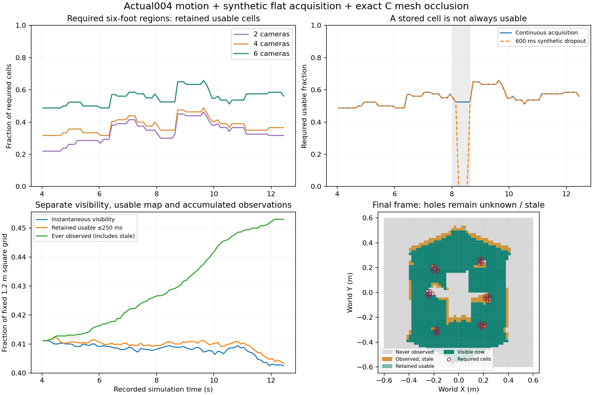

# Sequential map coverage from the actual004 motion

10 September 2026. **Synthetic flat-scene sensor acquisition replay, using recorded robot motion.** This separates instantaneous visibility, observations retained in a map, and cells still usable under the existing 250 ms age limit. It qualifies neither terrain walking nor real sensors.

The six-camera hypothesis observed 45.3% of the fixed map at least once by the end. Typical usable coverage was only 41.0%, almost the same as instantaneous visibility. On the proposed six-foot support regions, mean usable coverage was 55.3%; the active upcoming foot region averaged 82.1%. Accumulated observations therefore cannot be described as complete, currently usable terrain knowledge.



## Measured input versus synthetic acquisition

The motion is the audited actual004 failed wave: recorded full-C joint positions, root position and explicit XYZW rotation from the successful standing state through the three completed steps and RF swing. We sample 85 actual frames at 10 Hz, from 4.00–12.40 s. A synthetic 40 ms acquisition-to-receipt delay uses the recorded body and planned-footprint state at 4.04–12.44 s. No body pose is prescribed to physics, no motion is extrapolated, and no flat motion is transplanted onto terrain.

Occlusion uses the exact C **simulation** visual geometry: 19 links and their four unique STL meshes, copied from frozen source004. Both stereo-to-ground segments must clear included triangles. Camera origins inside a mesh bound remain ambiguous and unusable. This is not the detailed production four-bar geometry. Camera housings, brackets, harnesses and payload meshes are absent, and the cameras' mass was not added to the recorded dynamics.

The mounts are the existing hashed `D405_out0.12_z0.14_p90` proposal: cameras positioned 120 mm outboard of production-derived anchors, 140 mm above the body plate and facing down. The 2/4/6-camera subsets are inherited from that earlier study, not newly optimized for C. Their coordinates are reused as hypothetical placements; mechanical fit and the production-to-C lineage mismatch remain unresolved.

[inputs/mounts.json](inputs/mounts.json), [SOURCE_SHA256.json](SOURCE_SHA256.json) and the copied assets preserve these exact identities. The earlier production-CAD 78% sampled visibility figure used different geometry, targets and poses and is not directly comparable with this replay.

## Optical assumptions and validity

Every candidate point must first pass the frozen D405 profile: **848 × 480 pixels, 70 mm minimum optical-axis depth, 500 mm maximum, 18 mm stereo baseline**, and valid projection into both imagers. The nominal depth field of view is 84° × 58° at its stated reference distance. Individual pinhole intrinsics are inferred from the frozen D400 datasheet formula; they are not measured device calibration. The original primary-source basis is recorded in the report and linked to the [D400 datasheet](https://www.realsenseai.com/download/21345/?tmstv=1780360410).

Only then are moving-robot triangle occlusion and camera-origin ambiguity checked. Clear line of sight alone is never an observation outside the optical envelope. The observed ground samples lie at optical depths of 265.5–272.3 mm in this high-mounted hypothesis, so the nominal 70 mm near limit is not the limiting factor in this replay.

The scene is a flat Z=0 plane sampled at 20 mm grid-cell centres over a fixed 1.2 m square. This is sparse synthetic acquisition, not a complete depth-image renderer or stereo-matching model. Texture, lighting, sunlight, dirt, multipath and device dropouts are not predicted. The registration provider is recorded simulator pose with **assumed** 1 mm position and 0.001 rad orientation uncertainty; point noise is **assumed** isotropic 3 mm. Those are unqualified fixture values, not camera accuracy claims.

## Separate coverage quantities

| Frozen camera subset | Mean instantaneous fixed-grid visibility | Mean retained usable map | Final ever-observed map | Mean usable six-foot regions | Mean usable active upcoming foot region |
| --- | ---: | ---: | ---: | ---: | ---: |
| 2: LM, RM | 17.9% | 18.0% | 21.0% | 33.7% | 50.2% |
| 4: LF, LM, RM, RR | 33.8% | 34.0% | 38.3% | 37.9% | 63.9% |
| 6: all sectors | 40.8% | 41.0% | 45.3% | 55.3% | 82.1% |

These ratios use explicit denominators. The fixed grid includes areas far outside the immediate feet; it is not a claim that 59% of useful nearby terrain is missing. The foot-region denominator is different: all six 15 mm-radius proposed foot disks, conservatively enlarged when rasterized to intersecting cells. For the active swing, its original planned endpoint replaces the current airborne foot centre. Other feet use their current measured positions. No frame has every cell of all six regions usable.

For the six-camera rig, the nominal stereo envelope covers all sampled required foot-region cells. Included body/leg occlusion accounts for the remaining instantaneous geometric loss. Many currently planted foot cells are naturally occluded by the robot. Contact-state evidence is distinct from camera terrain evidence: this result does not imply that every planted foot must remain visually observable, nor that extra cameras alone solve the problem. A future supervisor must explicitly distinguish measured planted support from sensor-supported **new** footholds. This replay does not manufacture contact-derived height samples or compute support eligibility.

## Lease, dropout and stopping horizon

The same `LocalHeightMap` and terrain-channel contract retain height, uncertainty, acquisition time and an observed flag. Unknown cells remain unknown; stale observations stay in history but their usable mask becomes zero. The mask is not filled with zero-height support.

A synthetic complete acquisition outage from capture time 8.0 to 8.6 s causes required-region usable coverage to reach zero, although the ever-observed map remains populated. Continuous acquisition recovers it when frames resume. The 40 ms assumed receipt latency already consumes part of the 250 ms age budget.

The report also queries the **same required world cells** at future-use horizons of 0, 0.1, 0.25, 0.5, 3 and 6 s, assuming no reacquisition. Every horizon of at least 0.25 s becomes stale. This is an age-lease stress test, **not** a computed stopping envelope or evidence that a robot cannot stop safely. A multi-second step/stop plan requires an explicit reacquisition or validated uncertainty-retention/contact-support model; a current usable mask cannot silently certify it. Merely extending the lease is not justified by this replay.

## Bounded sensitivity and next useful check

[sensitivity.json](sensitivity.json) distinguishes nominal optical bounds from synthetic conservative assumptions. Raising the effective minimum depth to 0.26 m leaves this particular high-mounted view unchanged; raising it to 0.30 m rejects every point. Cropping each image to a central 90% or 80% reduces mean instantaneous required-region visibility from 54.4% to 49.6% or 44.9%, respectively. A different camera's baseline/intrinsics cannot be inferred from this threshold experiment.

Assumed point uncertainty of 15 or 20 mm, after adding the assumed pose uncertainty, fails the existing 15 mm usable-map uncertainty bound. The 3 and 10 mm fixtures remain below it. None of these sensitivities measures real sensor performance.

The next useful perception work is to connect explicit planted-contact support and proposed new-footprint requirements to a trajectory-aware uncertainty/reacquisition contract, then validate actual calibration and mounting geometry. These results do not recommend buying six cameras, exclude purchases beyond the owned Mid-360/D455, or admit a terrain student. The full robot's physical walking gates remain separate.

## Reproduce and inspect

All necessary input excerpts, exact visual meshes and reusable CPU helpers are included. Copy the frozen directory before regenerating outputs. Dependencies are pinned in [requirements.txt](requirements.txt).

```sh
python3 -m venv .venv
.venv/bin/python -m pip install -r requirements.txt
PYTHONDONTWRITEBYTECODE=1 .venv/bin/python -m unittest discover -s . -p 'test_*.py'
PYTHONDONTWRITEBYTECODE=1 .venv/bin/python replay.py
PYTHONDONTWRITEBYTECODE=1 .venv/bin/python sensitivity_and_figure.py
```

The visibility cache is reused only when the motion excerpt, mount input, code, helpers and mesh identities match its receipt. Five tests check near/far depth and stereo rejection, explicit XYZW agreement, actual triangle self-occlusion/origin ambiguity, stale/future/unknown map behavior, and outside-map footprint rejection. [report.json](report.json) contains every frame and case; [visibility.npz](visibility.npz) and [map_masks.npz](map_masks.npz) preserve the separate masks. No GPU, robot connection, ROS adapter, main-branch edit or hardware purchase occurred.
