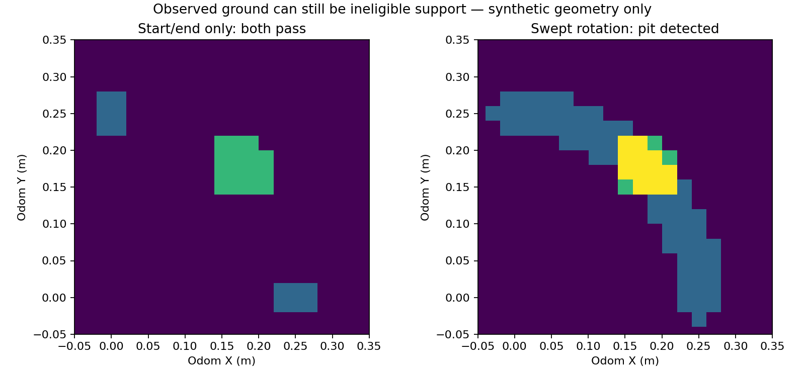

# Synthetic support-envelope supervisor

This CPU prototype distinguishes visible ground, current usable map data and eligible support throughout a requested motion. Eleven independently replayed tests pass. It rejects a pit that endpoint-only checks miss, unknown regions, stale or uncertain data, mismatched frames, and evidence that will expire before use.

It has no admitted gait or braking predictor, actor integration, real-sensor evidence or terrain traversal result. A zero-twist output requests a supported stop; it does not prove that the stop is feasible. The original frozen preparation is preserved in [prototype/README.md](prototype/README.md).



Blue marks required support cells, green the pit, and yellow their intersection. The diagram uses synthetic geometry. The short flat demonstration passes its map check; a 500 ms stopping envelope fails the existing 250 ms data lease. This exposes a map-persistence and stopping-duration contract that must be resolved before integration.

Run the portable, hash-checked replay from the repository root:

```sh
PYTHONDONTWRITEBYTECODE=1 uv run python artifacts/perception_readiness_2026-09-09/support_supervisor_001/replay.py
```

The replay supplies repository import paths without modifying the frozen prototype. It verifies the original payload map and reused production sources first. It runs tests only and does not overwrite the original report or image.
