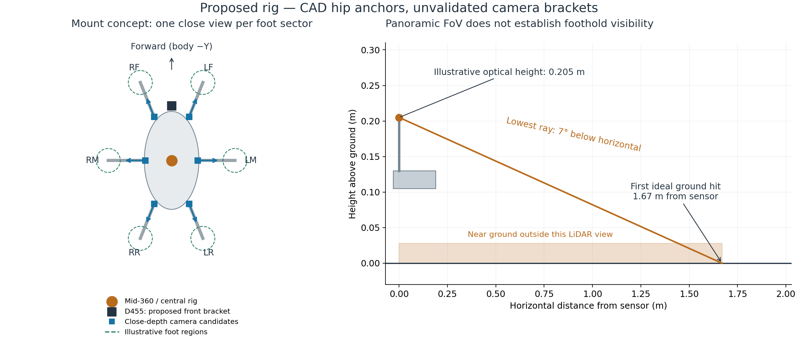
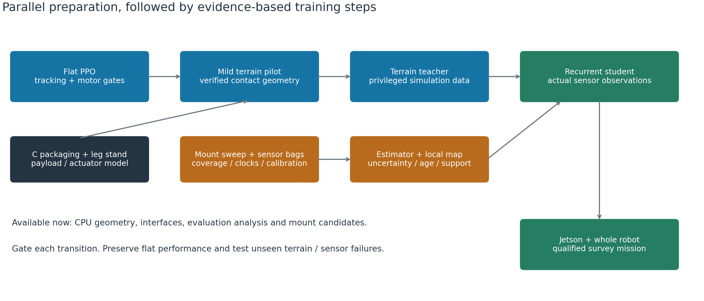
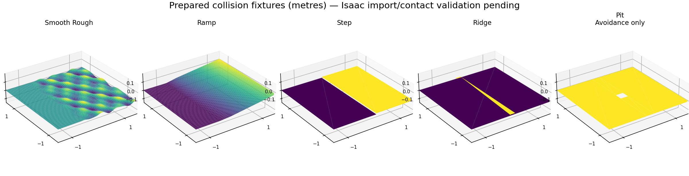

# From the flat PPO demo to a terrain survey robot

Prepared 9 September 2026. This is a proposed implementation and verification plan, not a claim of completed terrain autonomy. The user confirmed that a Livox Mid-360 and RealSense D455 are available and that additional purchases are allowed. Cost is not the limiting assumption; mass, actuator margin, visibility, timing and reliability remain engineering constraints.

**Recommendation:** keep the forward/left/yaw command interface, retain PPO for locomotion, and develop terrain learning alongside a calibrated perception pipeline. Use a privileged terrain teacher followed by a recurrent student that consumes proprioception and an uncertainty-aware local terrain map. Put localization, coverage planning and a motion supervisor above the gait. Build close-ground visibility around the robot; a forward camera and panoramic LiDAR do not by themselves establish safe omnidirectional stepping.

The final mission remains the one in [ROADMAP.md](ROADMAP.md): locally registered operator boundary, verified entry, zigzag coverage, obstacle handling, and an honest record of completed, missed and unreachable survey area. Navigation must work without an operational RTK base station and must remain independent of survey-payload sensing.

## 1. What must be resolved before terrain becomes the next training milestone

The current C study uses 72.5 mm femurs, 126 mm tibias, fixed coxae and 8.2608 kg transferred CAD mass/inertia. It is a scaled mock geometry study. Its motor packaging, rigid linkage fit, structural clearance and final manufactured CAD have not been established. The production CAD and study model must not be treated as interchangeable.

The completed `omni_flat_002` campaign ended at 22:55 UTC on 9 September, after 1,425 resumed PPO updates. Its final stage still passed 0/154 static command gates and 0/14 transition gates. The median scenario had 14.3% requested motor saturation; actual applied torque remained clipped at 1.6 N·m. A visually convincing closed-loop path can coexist with poor open-loop velocity tracking and excessive motor demand. A separate short diagnostic campaign now compares the unchanged controller, target slew reduced from 0.06 to 0.03 rad per 20 ms, and a PhysX external-force iteration setting, each with an exact-plan standing admission. Terrain and perception development proceed in parallel; full terrain qualification remains a subsequent milestone.

Before promoting a gait, diagnose each failure category: commanded versus achieved velocity, both yaw signs, worst-joint requested/applied torque, duration of saturation, body contacts, slip, stops and termination reason. Do not classify every safety termination as a physical fall. If torque and tracking plateau, compare a small number of explicit hypotheses—command range, action scale/slew, servo gains, and reward tradeoff—under identical evaluation. Do not make the score green by weakening limits or simply running longer.

Reconcile the full bill of materials before payload training: current CAD items, motors, battery, Jetson/carrier/cooling, wiring, regulators, sensor bodies, brackets and survey payload. Weigh the assembled states and record COM/inertia. The Phase 3 prototype's 6.3 kg accounting and its sensor transforms are historical placeholders, not the mass model for the current robot.

## 2. Sensor selection and purchase sequence

| Function | Recommended initial choice | Selection test |
|---|---|---|
| Surrounding geometry and primary navigation odometry | Existing Mid-360 with its IMU | Real bags: feature-poor ground, walls, vegetation, yawing, vibration, time alignment and dropped scans |
| Forward imagery and look-ahead depth | Existing D455; compare several depth resolutions | Ground visibility and height accuracy at the actual low deck height, with outdoor illumination and moving legs |
| Close terrain around the feet | Evaluate D405 against D435/D435i, starting with one of each; reserve six body-mounted camera positions | Measured usable depth over each foot workspace, full-direction stopping envelope, darkness/glare, optical dirt, bandwidth and payload cost |
| Fast attitude/rate and independent runtime health | Initially evaluate the Mid-360 IMU and available D455 IMU; provide a chassis IMU mounting point and timestamped interface | Bias, vibration, clipping, delay and dropout tests determine whether a dedicated body IMU is required |
| Joint state and actuator health | All 18 encoders plus available motor current/torque estimate, voltage, temperature and fault telemetry | Calibration against independent load/position instruments; no assumption that reported torque equals measured output torque |
| Electrical endurance | Calibrated supply current/voltage logger and temperature instrumentation | Battery energy per metre, regulator peaks, thermal settling and brownouts |
| Optional global reference | Ordinary GNSS if useful for coarse anchoring | Never use metre-uncertain position as a precise boundary fence; local map registration remains necessary |

**Procurement recommendation:** obtain one D405 and one D435-family evaluation camera, adjustable mounts, suitable powered data connections, a synchronization/calibration target and stand instrumentation first. These purchases answer a specific sensor-selection question. Do not place a six-camera production order before measuring usable coverage and loaded timing. If both candidates fail, broaden the search to synchronized short-baseline stereo or another close-range depth technology using the same acceptance tests; existing ownership will not decide the result.

The D405 is the leading close-foot candidate: the current family datasheet lists 58 g, 84° × 58° HD depth FoV and 1.482 W at its specified maximum mode. D435-family nominal mass is 75 g. D455 minimum optical-axis depth is mode-dependent: 0.52 m at 1280×720, 0.35 m at 848×480 and 0.26 m at 640×360. D435-family values at those modes are 0.28/0.195/0.15 m. These are data-availability limits, not guaranteed outdoor accuracy. Intrinsics and valid image boundaries must be measured for the selected mode. [RealSense family datasheet, tables 3-49, 3-52–54, 4-11 and 7-10](https://www.realsenseai.com/download/21345/?tmstv=1780360410).

Screen three rigs on the same sensor replay and dynamics cases: available Mid-360+D455, then two/four close-depth views, then six. Six views, one per foot sector, are the starting concept for unrestricted local rough-ground movement. Fewer views are acceptable only if their measured coverage plus bounded map memory passes the same tests. Four nominal camera FoVs cannot simply be added to claim a complete panorama: perspective, close-range invalid bands and legs can leave holes.

Six nominal 58 g cameras add 0.348 kg before brackets/cables. The existing two sensors total 0.381 kg, giving a 0.729 kg sensor-body subtotal for this concept. If none of these bodies is already included in 8.2608 kg, the subtotal becomes 8.9898 kg before the rest of the payload reconciliation. This arithmetic is not a final robot weight. The close cameras alone add about 8.9 W at the cited operating mode; seven simultaneous camera streams also need a measured USB/controller budget. The best rig is the smallest one that passes coverage and reliability, not the rig with the most sensors.

A different LiDAR is a valid comparison, but not an automatic cure. For example, Unitree advertises L2 with a 360° × 96° mode and short blind distance. Vertical orientation, chassis obstruction, update density and near-ground accuracy still need testing; a panoramic FoV is not equivalent to seeing every foothold. I would first compare a borrowed/evaluation unit, rather than replacing a working localization sensor without evidence. [Unitree L2 specifications](https://www.unitree.com/L2/).

## 3. Mount design and geometry checks

*Concept only: the hip anchor positions come from the production assembly report. Camera brackets and foot targets are proposals, not finished CAD or verified coverage. The side calculation ignores occlusion and uses an illustrative current-study plate height.*

**Mid-360:** use a short, stiff central bracket on the chassis, with its optical window above blocking deck hardware. Sweep height and offset rather than defaulting to a tall mast. Keep a rigid, calibrated transform to the body; separately soft-mounting the LiDAR and IMU introduces time-varying extrinsics. A common isolated sensor plate is an option only if its motion relative to the body is modeled/measured. Keep sensor wiring away from moving linkages, support cables on the chassis and preserve thermal airflow.

The manufacturer's FoV is −7° to +52° vertically. With an optical origin 0.205 m above level ground, the lowest ideal ray first intersects ground about 1.67 m away. Body tilt changes this; body/leg occlusion can make it worse. The 0.1 m minimum range does not mean ground 0.1 m away is visible. Manufacturer notes also qualify the precision of very close and low-reflectivity returns. [Mid-360 specifications](https://www.livoxtech.com/mid-360/specs).

Do not solve that blind zone by casually inverting the LiDAR on this low robot. Livox's manual calls for at least 0.5 m between an inverted mounting surface and the ground. Its mounting guidance also specifies airflow and a thermally conductive base; incorporate those requirements in the bracket design. Its startup supply demand can exceed normal running power. A custom low inverted installation would need explicit manufacturer guidance and validation. [Mid-360 manual, mounting and power sections](https://terra-1-g.djicdn.com/851d20f7b9f64838a34cd02351370894/Livox/Livox_Mid-360_User_Manual_EN.pdf).

**D455:** fit a rigid adjustable bracket near the physical forward edge, aimed initially 15–30° downward. Body forward is −Y and left is +X. The prototype uses `(0, −0.105, +0.045)` relative to the plate; that is not a validated production nose mount. Production front hip anchors are near Y=−0.200 m, which makes copying the old sensor position especially questionable. Select the final optical centre from chassis/payload CAD and a visibility sweep. Preserve the camera's internal optical-frame calibration.

**Latest CAD screen:** the first hip-anchor six-camera proposal failed the declared visibility sample: exact moving-CAD rays leave only 16.1% visible on average. Expanding the search outward/upward improves this to 78.1%, with only 48.1% in the worst case and sector. These are production-CAD visibility samples, not final C reachability or measured real depth. See `artifacts/sensor_mount_study_2026-09-09/README.md`. The concept below remains a search starting point, not an accepted mounting layout.

**Close-depth cameras:** place proposed brackets on the rigid body near the six hip sectors, looking outward and approximately 35–60° down toward the upcoming contact regions. Sweep 40–100 mm above the plate as an initial bracket design space, then reject positions that interfere with linkage travel, ground clearance, cables or survey payload. Do not mount them on moving femurs/tibias merely to improve one still image. Aim for overlapping views of reachable support terrain, not the tops of the feet.

**IMU:** reserve a rigid location near the chassis centre, away from high-current wiring and flexible plates. Characterize the built-in units before adding a third. If a dedicated body IMU is selected, require hardware timestamps or an accurately measured acquisition clock, accessible raw gyro/acceleration, appropriate vibration bandwidth, and demonstrated latency. Do not independently fuse multiple correlated IMUs as though they provide independent absolute heading. Correct lever-arm effects when using an offset IMU for body acceleration.

Run the mount search against the final detailed C CAD as well as the study model. Use recorded gait poses and full permitted joint sweeps, several plate heights, ±10° roll/pitch, all travel bearings, simultaneous turning and the actual survey payload. Ray intersections must include moving legs, body, cables/guards where material, and scene geometry. A terrain-only ray caster will falsely report terrain through the robot.

For each mount, publish: per-leg valid terrain coverage; blind angular sectors; height error against reference geometry; maximum map age at planned support locations; obstacle/drop-off detection distance; link/cable clearance; added mass/COM; and full-system latency. Minimize worst-sector failure, not average point count. A required support region that lacks a recent observation remains unknown, even if other legs have excellent coverage.

CAD deliverables are a measured sensor-frame table, removable keyed brackets, harness routing, swept-clearance images and regenerated mass/inertia. Change importer inputs and regenerate URDF/USD; never hand-edit generated URDFs or merely add visual sensor meshes without their dynamics.

## 4. Estimation, mapping and onboard interfaces

Use LiDAR-inertial odometry as the first measured baseline, then compare FAST-LIVO2 camera/LiDAR/IMU fusion on the same bags. Include sparse open ground, repeated fences, texture-poor surfaces, sun/shade transitions, grass, fast body oscillation and partial sensor loss. Evaluate translation/yaw drift, repeat-pass alignment, failures, uncertainty/degeneracy indication, compute, memory and latency. An estimator reporting smooth motion is insufficient without independent trajectory reference.

FAST-LIVO2 directly addresses the requested sensor fusion. Its resource-constrained follow-up is relevant to the Orin Nano, but its published ARM results are not a benchmark of our complete onboard stack. Pin the selected implementation and ROS integration; upstream FAST-LIVO2's documented build is catkin-based. [FAST-LIVO2 paper](https://arxiv.org/html/2408.14035v2), [resource-constrained follow-up](https://arxiv.org/abs/2501.13876), [upstream build](https://github.com/hku-mars/FAST-LIVO2).

Calibrate camera intrinsics, stereo/RGB transforms, camera-to-LiDAR, IMU-to-LiDAR, sensor-rig-to-body, encoder zero/sign and motor/linkage mapping. Record acquisition time and receipt time separately. Use PTP/hardware synchronization where supported, and measure residual offsets and jitter. Do not assume USB arrival time is exposure time. Deskew LiDAR scans using acquisition timing and the motion estimate. Recheck calibration under warm operation and after removing/refitting brackets.

Keep continuous `odom` for local control; map corrections change `map→odom`, not the physical pose of the controller target. Convert explicitly between the project's −Y-forward body frame and standard forward/left/up navigation coordinates. Verify this adapter with pure forward, lateral and yaw tests before closing the loop.

Maintain two map products: a robot-centred support/elevation map and local 3D obstacle occupancy. Start with a proposed 2 m × 2 m local support patch at 2 cm cells, plus a smaller finer-resolution foot patch if calibrated measurement error supports it. Test 1/2/4 cm resolution against mapping error and compute. Cell size is not sensor accuracy. Every cell carries elevation, variance/confidence, observed/unknown status, age and support/obstacle evidence. Never fill an unobserved drop with a nominal flat plane. Thin obstacles and overhangs require the 3D layer.

Elevation Mapping CuPy and its associated research are implementation references for local layered mapping. A learned traversability score may supplement geometric support tests after validation; it must not turn unknown ground into confirmed support. [Authors' mapping implementation and paper links](https://github.com/leggedrobotics/elevation_mapping_cupy).

Proposed timing budgets: locomotion at 50 Hz; raw IMU at 200 Hz or higher if genuinely delivered; LiDAR near its measured scan rate; cameras initially 15–30 Hz; fused local map 10–20 Hz; local planner 10–20 Hz. Measure the entire sensor-to-command delay on the Jetson, including sensor processing and transport. Keep the policy plus I/O within its 20 ms deadline with measured headroom; map/planner work must not block it. Reduce images, map extent and planner samples before adding a more power-hungry computer. Upgrade compute only if the optimized full-stack benchmark requires it.

## 5. Terrain simulation and training sequence

Use two simulation modes. Fast physics training uses procedural collision geometry and controlled observation models. Smaller integrated trials render the actual sensor rig, run the real estimator/map/follower, and expose failures that perfect geometric observations conceal. Profile capacity on the Spark; do not assume hundreds of RGB-D rigs will run at the same throughput as the current proprioceptive task.

Isaac Lab supplies height-field, mesh and imported-USD terrain paths. Pin the installed API when implementing; its current public docs are an interface reference, not proof that every feature is present in the Spark build. [Isaac Lab terrain documentation](https://isaac-sim.github.io/IsaacLab/main/source/api/lab/isaaclab.terrains.html).

| Phase | Proposed terrain/commands | What advances the phase |
|---|---|---|
| A: flat qualification | Existing full-direction commands, gentle/tight arcs, reversals, stops, payload/latency cases | Existing gates pass; measured feasible velocity/turn/load envelope; no hidden direction-specific failure |
| B: mild continuous terrain | 0–5° slopes/cross-slopes, 0–20 mm smooth irregularity and small isolated steps; initially 0.05–0.12 m/s | Stable support and torque reserve in every bearing, including downhill stops |
| C: bounded rough terrain | Progress toward 5–10°, 20–50 mm rocks/steps, ridges and mixed traction; both ascent and descent | Held-out traversals and stops pass; difficulty limited by actual clearance, linkage and actuator capability |
| D: perception-limited routes | Occlusions, narrow corridors, negative obstacles, vegetation, changing light and stale/dropout observations | System stops or replans outside its qualified support envelope; it does not need to cross every obstacle |
| E: survey mission | Locally registered boundary, zigzags, turnarounds, exclusions and blocked segments | Coverage ledger, route tracking, boundary containment and payload data-quality requirements pass |

Those numbers are starting experimental ranges, not promised hardware capabilities. Randomize obstacle dimensions relative to measured foot size, reach and belly clearance. Do not copy ANYmal stair dimensions onto this smaller robot. Include terrain orientation relative to the body, ascent/descent and lateral stepping; a curriculum built only around walking forward up a ramp would undermine the current motion contract.

Use height fields for continuous uneven ground, and explicit triangle meshes for sharp ledges, holes and overhangs. Keep render and collision geometry aligned. Do not convexify terrain in a way that seals pits or bridges gaps. Audit contact offsets, timestep and mesh resolution on the smallest features. Static rocks are a useful first test; loose stones require rigid objects, and mud/grass/deformable soil require separate calibrated models or explicit limitations. Friction randomization alone is not a soil simulator.

Collect representative site scans and photographs for held-out environments. Preserve actual measured geometry and scale, clean artifacts without filling unknown support, and create matching collision/visual assets. Split train and test by terrain layout/site as well as random seed. A photorealistic texture pasted onto a flat collision plane is not terrain validation.

**Teacher:** train with PPO on the same body-twist contract. Give it privileged terrain/contact/dynamics information only where explicitly documented. Use terrain-relative clearance and attainable support-plane/body objectives rather than retaining a fixed world-height reward. Preserve speed/yaw tracking, smooth targets, slip/contact costs and motor/thermal constraints. Do not reward progress into terrain that navigation should have classified as unsupported.

**Student:** distill the teacher into a recurrent policy using the real observation contract: IMU/encoder/action history, commands, estimated motion if that estimate is actually provided, and terrain samples with age/validity. A small map encoder plus GRU is the first candidate; compare it with the current five-frame feed-forward history under identical conditions. Train imitation on student-visited states with fresh teacher labels, then controlled PPO fine-tuning with a privileged critic if necessary. Reset recurrent state correctly between episodes. Do not leak true friction, true contacts or perfect velocity into the deployed actor.

**Sensor adaptation:** first corrupt geometric observations using measured spatially correlated error, occlusion, pose drift and delay. Then train/evaluate through simulated actual sensor views and the deployed map interface. Include rolling acquisition, out-of-order delivery, whole-scan loss, contiguous missing patches, range/angle dependence and camera exposure failures; independent pixel noise alone is inadequate. Audit the simulator's LiDAR model for the device's scan pattern, timestamps and moving-body effects. Match optical-axis depth versus radial range explicitly.

**Hardware adaptation:** fit the actuator/contact model to the [single-leg stand measurements](LEG_TEST_STAND.md), then randomize plausible uncertainty in strength, delay, backlash, zero, friction, compliance, voltage and payload COM. Use a simpler analytic actuator model when it matches held-out measurements; add a learned actuator surrogate only if residual error justifies it. A rail-constrained leg cannot prove full-body balance or lateral traction. Full-body tests remain necessary.

Teacher/student perceptive locomotion is supported by Miki et al.; its elevation-map interface allows sensor processing to change without making the gait consume a particular camera's raw pixels. The paper also explicitly discusses failure near occluded cliffs, so uncertainty-aware support handling is an additional requirement here. [Miki et al., Science Robotics 2022](https://arxiv.org/html/2201.08117).

## 6. Papers and exactly what we will use

| Reference | Adopt/test | Do not assume |
|---|---|---|
| [Ren et al., SUPER, Science Robotics 2025](https://mech.hku.hk/safety-assured-high-speed-navigation-for-mavs-a-paper-in-science-robotics/) | Maintain an executable conservative stopping/retreat option while replanning toward the mission target | Aerial free-space safety or flight dynamics transfer to a walking robot |
| [Zheng et al., FAST-LIVO2](https://arxiv.org/html/2408.14035v2) | Compare fused visual/LiDAR/IMU odometry with LIO on our recorded data | Successful integration, calibration or adequate Orin throughput already exists |
| [Miki et al., perceptive locomotion, 2022](https://arxiv.org/html/2201.08117) | Privileged teacher, recurrent student, local elevation observations, degraded-perception tests | Quadruped results establish hexapod torque margin or safe handling of unobserved holes |
| [Kumar et al., RMA, RSS 2021](https://arxiv.org/abs/2107.04034) | Ablate a history-based adaptation latent for changing dynamics/payload | Runtime adaptation can infer terrain the sensors never observed or exceed actuator limits |
| [Rudin et al., CoRL 2021/PMLR 2022](https://proceedings.mlr.press/v164/rudin22a.html) | Parallel PPO and terrain curriculum; measure throughput before scaling | Their training times predict this robot's wall clock |
| [Tan et al., RSS 2018](https://roboticsproceedings.org/rss14/p10.pdf) | System identification, actuator dynamics, latency and realistic randomization | Ideal simulator position servos reproduce RS05 dynamics |
| [Miki et al., elevation mapping, IROS 2022; authors' code](https://github.com/leggedrobotics/elevation_mapping_cupy) | Local map representation and efficient terrain processing | A height map alone represents overhangs, every negative obstacle or material strength |

SUPER is the “super drone” reference identified in the project notes. Its transferable idea is planning with a fallback in verified space. Our fallback needs verified **support**, clearance, traction, acceptable body motion and a reachable stable stopping stance. Preserve the idea, then re-establish the conditions for a legged platform. Do not port its flight optimizer wholesale. Its repository documents ROS 1 as the main supported platform and a world-frame point-cloud assumption, both integration issues to audit. [SUPER source and integration notes](https://github.com/hku-mars/SUPER).

## 7. Planning and the practical meaning of seeing far enough

Keep position and body heading independently plannable. A survey swath can translate laterally with fixed sensor heading; a turnaround can use an arc or a turn in place. The local controller requests `(v_forward, v_left, yaw_rate)` within the empirically measured gait envelope. Nav2 MPPI's Omni model is a reasonable candidate, with a motion model adapted to measured gait delay and acceleration. It has not been deployed on this hexapod. [Nav2 MPPI documentation](https://docs.nav2.org/jazzy/configuration_and_development/configuration_guide/controller_plugins/mppi_controller/configuring_mppic/).

Use a support-aware motion supervisor independent of the learned gait. Candidate motion must stay within observed traversable terrain through its stopping horizon. For intuition, a straight-line lower-order estimate is `d_stop = v × total_delay + v²/(2 × measured_deceleration)`. Add pose/map uncertainty and the swept body/foot envelope; validate arcs with full trajectory geometry. For example, 0.20 m/s, 0.20 s delay and 0.25 m/s² deceleration give 0.12 m of body travel before additional margins. These are illustrative assumptions, not measured braking performance.

Allow high-confidence terrain observations to persist behind the camera only while their age, pose uncertainty and scene stability remain acceptable. Unknown or stale support triggers a slower observation manoeuvre, a different body heading, retreat to verified support or a controlled stop. A turn-in-place also sweeps the legs and needs support. If unrestricted rough-ground strafing cannot be observed with the chosen rig, either add sensing or constrain those commands explicitly; do not silently rely on blind gait robustness.

## 8. Evidence that will maximize the chance of success

Use staged experiment allocation: fast unit/asset checks, short runtime pilots, small candidate comparisons, then multiple training seeds for finalists. Train three independent seeds for architecture choices when feasible and compare at equal environment transitions as well as wall clock. Keep training and final test terrain families separate. Retain all failure clips and per-condition results; a best-seed montage cannot establish reliability.

| Gate | Proposed initial acceptance evidence |
|---|---|
| Physical model | Positive-definite inertias; correct frames/joints; measured payload ledger; collision and foot geometry; full standing admission; held-out leg-stand replay |
| Flat motion | All existing command/transition gates; longer stop/reversal trials; per-joint motor demand and energy; independent seeds |
| Sensor rig | Every requested support corridor observed or explicitly blocked; per-sector coverage, detection lead distance and height error; no hidden body/leg returns; timestamps and dropout detected |
| Terrain locomotion | ≥95% traversal success in every declared terrain/direction family across ≥100 held-out episodes per family, with confidence intervals; no hard-limit violation; unchanged flat qualification |
| Sensor student | Within 5 percentage points of the matched teacher's traversal success, plus explicitly passing stale-map/dropout/negative-obstacle response tests; thresholds fixed before the final test |
| Onboard runtime | Entire observation-to-command timing measured under simultaneous sensing, mapping, planning and logging; no missed policy deadlines in a sustained test; deterministic watchdog response |
| Mission | Proposed initial target: ≤5 cm P95 cross-track error on a small locally referenced course, zero boundary violations, complete accounting of reachable/missed/excluded area; tighten from survey requirements |

These are proposed engineering gates, not achieved results or a safety certificate. Report Wilson/binomial intervals for independent episodes. Zero failures in 100 trials still permits roughly a 3% upper failure-rate bound at 95% confidence; critical boundary/drop-off cases need stronger targeted evidence. Avoid averaging away a weak direction or a dangerous but rare condition.

Energy and steadiness are release criteria, not just reward terms: report battery Wh/m and positive mechanical work separately, actuator saturation duration, temperature trend, body roll/pitch and angular rate, payload acceleration, speed variability, slip, path error and intervention frequency. Stop-and-scan modes may improve survey quality when continuous gait motion is too disruptive. The survey team must set the final allowable pose error, sensor motion and coverage spacing.

Build an ablation ladder: proprioception only; ideal terrain; delayed/noisy terrain; actual simulated LiDAR; depth; fused maps. If ideal terrain fails, improve mechanics/control before adding cameras. If ideal succeeds and rendered sensing fails, fix mounts/estimation/observation training. If sensor replay passes but onboard control fails, investigate timing/actuation. This isolates causes instead of compensating for every failure with another reward term.

## 9. Concrete next deliverables and order

1. **Current campaign review:** matched checkpoints, full failure breakdown and labeled path video; select the best feasible motion envelope, not merely the latest model.
2. **Within the next 1–2 engineering days:** a versioned sensor/actuator observation contract, full mass ledger template, exact terrain test catalogue, and automated mount-study inputs. This is a work estimate, conditional on the unresolved measurements.
3. **In parallel with flat-policy repair:** detailed C packaging/linkage review; camera evaluation purchases; adjustable rig and calibration bags; procedural mild-terrain assets and collision checks. CPU design/bag work should not displace useful Spark training.
4. **Once flat and physical-model gates pass:** a short mild-terrain PPO pilot, followed by teacher comparison. Record useful failures immediately. Only scale after the pilot exercises reset, reward, contacts, evaluation and checkpoint resume correctly.
5. **Once sensing coverage/timing is characterized:** student distillation, realistic corruption and integrated sensor trials, then Jetson bag replay and hardware-in-the-loop timing.
6. **When the assembled robot is ready:** supported stand/whole-body tests, short flat runs, bounded mild-terrain tests, then a small local coverage mission. Human operators own physical setup and powered testing; software work can progress before assembly.

The deliverable after each stage is a reproducible report: code/asset/calibration hashes, configuration, checkpoint, test seeds, per-condition metrics, failure causes and videos. Only then enlarge terrain difficulty, payload or speed. The next useful research advance is a measured, deployable terrain interface and verified actuator/visibility envelope—not an unsupported promise that one larger policy will navigate everything.

## 10. Executable preparation completed on 9 September

The local preparation now contains 30 deterministic collision fixtures across smooth rough ground, ramps, steps, ridges and negative obstacles. Twenty seeds belong to the training split and ten to a held-out split. The negative obstacles are for avoidance checks; their openings are not sealed by an underlying plane. NPZ geometry, USD collision meshes, a catalog, an explicit payload ledger and a four-channel height/validity/age/uncertainty observation contract are saved under `artifacts/terrain_readiness_2026-09-09/`.

Three parallel agents are developing and checking: pre-reset PPO motor/velocity diagnostics; real Isaac collision, ray-caster and contact validation plus a conservative terrain adapter; and 2/4/6-camera mount screening against production visual CAD and moving joints. These are executable preparation tasks, not evidence that terrain walking, sensor fusion or final C mechanical packaging has passed. Sensor mount results must be repeated on the final detailed C CAD and measured with real cameras.

The user has now made Stage 2 quality explicit: every direction, both turns, combined arcs and path transitions must be as smooth as the liked forward animation, with a quiet static stance after stopping. The completion contract is saved under `artifacts/omni_flat_2026-09-09/STAGE2_COMPLETION_CONTRACT.json`. A new bounded PPO repair follows measured diagnostic evidence: slower target changes reduced requested saturation and power, while a separate solver flag did not help. Quiet-standing rewards and per-direction regression checks are now implemented; no Stage 2 completion is claimed.
