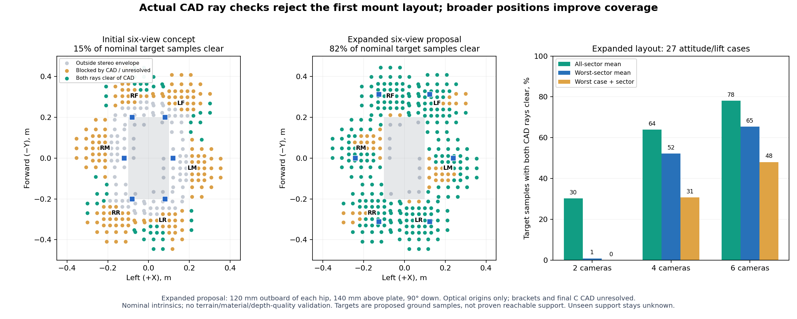

# Close-ground sensor mount pre-screen

**The initial hip-anchor camera concept does not provide enough near-foot visibility.** Actual triangle-ray checks against the detailed production CAD found only 16.1% of the proposed ground targets visible to six cameras in the sampled stance/lift cases. A broader position search improves that to 78.1%, but still leaves substantial holes. Neither layout is ready to manufacture or qualifies unrestricted terrain walking.

This is a CPU geometry study, completed while Spark remains available for PPO. It uses the **production serial CAD**, not a finalized detailed 72.5/126 mm C assembly. It does not edit the robot, change its mass model, or assert that the proposed camera housings/brackets fit. The current study policy's geometry remains a separate asset.



## What was measured

- All 19 links, 18 named joints, 1,927 visual instances and 77 actual STL files from the production URDF. Source hashes are saved.
- 312 proposed ground targets across all six foot sectors: nearby points around each nominal production foot, plus a wider look-ahead band. Their reachability and braking relevance remain unverified; they are a visibility probe, not a final support envelope.
- 243 camera/mode candidates. The original 108 proposals are expanded by resolution and proposed front-edge D455 views.
- A bounding-volume screen over 27 plate-height/roll/pitch combinations and nine joint poses. The plate heights are 114/124/134 mm, roll and pitch are −10/0/+10°. Three poses represent neutral or illustrative tripod lift; six joint-stop stress poses are reported separately and are not dynamically feasible gait claims.
- Exact triangle intersections for the two six-camera finalists at 124 mm plate height, nine attitudes and three stance/lift samples. **Both left and right stereo rays** must clear the CAD. A camera origin within a part bound remains ambiguous rather than being accepted by a fragile mesh-inside test.
- A second search of 48 uniform D405 layouts: 0/40/80/120 mm outboard offset, 70/100/140 mm above the plate, and 45/60/75/90° downward aim. Nominal stance screens the 48; the best three then receive the 27-case exact check. Every 2/4/6-sector subset is compared within those finalists. Mixed placement/angle/model rigs are not an exhaustive global search.

## What the comparison says

The initial six-view D405 proposal uses optical origins over the hip anchors, 100 mm above the plate, aimed 45° down. Its nominal stereo envelope includes about 64% of the proposed target samples; self-occlusion reduces the exact sampled result to 16.1%. The middle sectors average only 5.6%, and some sector/case combinations see none. The D435 640×360 finalist is similarly blocked. Changing camera type alone does not solve this placement problem.

The best expanded **geometric proposal** is 120 mm outboard of each hip anchor, 140 mm above the plate, aimed vertically down. Its nominal optical height is 264 mm above level ground. It sits at the tested height/outboard boundaries: this search has not found a global optimum, and a further height/offset sweep remains useful once packaging constraints are supplied. This position may need an impractical bracket, collide during unsampled motion, or interfere with the survey payload. It is a direction for CAD evaluation, not a recommended finished mount.

| Expanded layout | Mean target visibility | Worst-sector mean | Worst case and sector |
|---|---:|---:|---:|
| Best two sectors | 30.2% | 0.9% | 0% |
| Best four sectors | 63.9% | 52.2% | 30.8% |
| All six sectors | 78.1% | 65.4% | 48.1% |

For the six-view expanded proposal, next-foot targets average 81.1% and look-ahead targets 75.5%. These percentages concern the declared geometric sample set and optical assumptions, not the fraction of safe real footsteps or traversable terrain. Do not purchase six production cameras on this result alone. An evaluation D405, adjustable bracket and measured valid-depth images are the next discriminating experiment.

The existing D455 remains useful for look-ahead sensing. In the tested front mounts, its two higher-resolution modes include none of these close-foot targets; 640×360 reaches about 1.2% across body states. This does not mean it sees no ground: `report.json` gives the bounded ground footprints. It cannot be substituted for a verified near-foot rig.

## Optical assumptions and remaining uncertainty

Coordinates are explicit: body forward −Y, left +X, up +Z; camera optical +X image-right, +Y image-down, +Z optical depth. Candidate translations denote the **left-imager depth origin**, not the housing centre or tripod screw. Minimum depth is applied to optical Z, not radial range.

Nominal camera parameters and mode-dependent minimum depths come from the [RealSense D400 family datasheet, revision 020](https://www.realsenseai.com/download/21345/?tmstv=1780360410). The tool estimates pinhole intrinsics from the stated depth FoV/reference range and models stereo overlap at each point, including the invalid left band. These are **inferred nominal intrinsics**, not factory calibration. `--intrinsics` accepts measured rectified profiles. Central-80%-image results and a 5 mm flat-ground footprint raster are also saved. Nominal FoV, min-Z and unobstructed rays do not guarantee useful outdoor depth.

The bound screen deliberately reports potential occlusion, not exact triangle hits. The exact refinement resolves that uncertainty only for its sampled finalists. Neither models depth matching, lighting, dirt, sensor body/bracket/harness/payload occlusion, actual terrain occlusion, full continuous joint sweeps, final C CAD, timestamps, camera interference, USB load or material support strength. Ground targets remain flat, fixed geometric probes while the body tilts; the pose cases are not a simulated gait rollout.

The existing Mid-360 is not counted as seeing these targets. Its mounting/FoV constraints remain in the [terrain and sensing plan](../project_review_2026-09-04/TERRAIN_AND_SENSING_PLAN_2026-09-09.md). The proposed below-body or inverted workaround has not been validated.

## Map interface and next executable steps

`map_contract_replay.json` passes the best expanded rig's nominal visibility mask through the existing `terrain_channels` / `support_region_observed` contract. It uses a synthetic flat-height fixture indexed by sector and target, **not a spatial map or actual sensor replay**. Missing rays are never usable support. At 300 ms, the observations fail the existing 250 ms age threshold; absent streams and future timestamps likewise remain unusable. An unseen cell's numeric zero is padding, not a flat-ground observation.

Next, replace the target probes with actual C reachable/stopping corridors and recorded full-robot pose traces. Sweep nonuniform positions and camera aim, include final sensor housings, rigid brackets and harness paths, then check the real depth masks against the same support cells. Replay those masks with measured latency, pose drift and dropouts through the unchanged map interface. Keep unobserved support unknown; slow, observe, replan or stop until a measured rig/map combination meets the declared motion envelope.

## Reproduce

From the repository root, NumPy and Matplotlib are sufficient for the first screen. Exact rays additionally use Trimesh 4.12.2 and Rtree 1.4.1 in an isolated environment.

```sh
python3 tools/screen_sensor_mounts.py
python3 -m venv --system-site-packages tmp/sensor-mount-venv
tmp/sensor-mount-venv/bin/python -m pip install trimesh==4.12.2 rtree==1.4.1
tmp/sensor-mount-venv/bin/python tools/screen_sensor_mounts.py --exact-finalists
tmp/sensor-mount-venv/bin/python tools/screen_sensor_mounts.py --expand-exact-mounts
tmp/sensor-mount-venv/bin/python -m unittest discover -s robot/tests -p 'test_sensor_mounts.py'
```

Seven tests cover frame conversion, joint rotation, segment endpoints/parallel rays, exact triangle hits, optical versus radial min-Z, stereo invalid bands, resolution changes, and unavailable/stale/future map observations. The exact test skips cleanly when its optional dependencies are absent.

Machine-readable evidence: `report.json`, `profiles.json`, `mesh_provenance.json`, `visibility_masks.npz`, `exact_finalists.json`, `expanded_exact_mounts.json`, exact-mask NPZs and `map_contract_replay.json`. No Spark/GPU workload is launched by these utilities.
