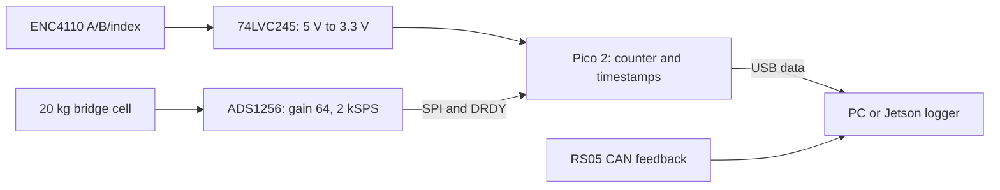

# Single-leg stand instrumentation BOM — 8 September 2026

**Build around the Phidgets ENC4110 linear encoder, an Amazon 20 kg bridge load cell, a Waveshare ADS1256 ADC, and a Raspberry Pi Pico 2 USB logger. No proprietary hub is required.** The encoder was the earlier recommendation; the user's linked KTC-150mm potentiometer is the comparison candidate, not the selected part.

This is a component-level design and procurement BOM, not a commissioned instrument. It covers force and carriage-position acquisition for the existing vertical-rail stand design. Firmware, assembly and calibration remain to be done. The actual rail stroke, fixture dimensions and existing motor-power/CAN equipment have not been supplied; the mechanical integration and motor-system prerequisites below therefore remain explicit. No purchase has been made. Simulation and training remain paused pending the revised single-leg URDF.

## Preferred daily setup: one USB cable

The user prefers computer-powered sensing with no separate power adapter. **Adopt a USB-powered sensor box as the intended daily setup and defer buying the bench supply.** USB supplies both energy and data; the leg motors still require their own power system. Retain the Pico, bridge ADC and encoder level converter. After one-time wiring, firmware installation and calibration, the intended workflow is plug in USB, open the logger and record force/position.

The exact existing combination is not yet qualified for that workflow. Pico VBUS exposes the incoming USB voltage, not a regulated precision 5 V rail. Encoder current consumption was not established from the published listing, and the selected cell's seller specifies a 5 V minimum excitation. Verify total startup/running current, loaded rail voltage and force noise on the actual host/cable. Design within the host's granted USB current, including enumeration and suspend behavior; a USB-C connector alone does not establish a higher power allowance. Use suitable USB-fed regulation/filtering if required, and recheck its output tolerance against both sensor and ADC requirements. A nominal 5 V converter is not automatically sufficient. Do not power the 5 V encoder from a 3.3 V GPIO or return regulated output into USB VBUS. [Pico 2 power architecture](https://datasheets.raspberrypi.com/pico/pico-2-datasheet.pdf).

The dedicated-supply wiring below remains a commissioning/fallback configuration. The $183.23 subtotal excludes any subsequently selected USB power-conditioning/protection parts. No final USB conditioner or complete power budget is claimed yet; using a lab supply to characterize the assembly does not mean one is required for daily use.

## Why retain the encoder

| Property | Selected ENC4110 | User-linked KTC-150mm potentiometer |
| --- | --- | --- |
| Measurement | Incremental digital quadrature, plus index | Listing describes a rod potentiometer; absolute analog position if confirmed as a plain three-wire device |
| Travel | 300 mm | Selected variant is 150 mm |
| Published performance | 5 µm/pulse resolution; maximum speed 1 m/s | Listing's “Measurement Accuracy 1” has no units; usable accuracy and speed specifications were not found |
| Startup | Needs a unique home reference; repeated index marks alone are insufficient | Normally retains absolute position through power cycling |
| Readout | Generic counter/MCU, with suitable input voltage conversion | Excitation and high-impedance analog acquisition; calibration required |
| Observed price | $90 | $42.20 |

The preference is based on documented behavior and digital position acquisition. Encoder resolution is not a guarantee of installed accuracy. For a generic counter, verify distance per count over a measured stroke; do not blindly apply an extra quadrature multiplier. A potentiometer can be perfectly adequate for slower carriage measurements, but this particular listing does not support a claim that it meets our dynamics-measurement target. [ENC4110 specifications](https://www.phidgets.com/?prodid=1106), [encoder guide](https://www.phidgets.com/docs/Linear_Encoder_Guide), [user's exact Amazon variant](https://www.amazon.com/dp/B0DLGVRCWM?th=1).

## Purchase BOM

Prices and availability observed on **8 September 2026**. Amazon delivery estimates below were shown for **Ithaca 14850**, without a completed checkout. Shipping, tax and import charges are additional; inventory is not reserved. Quantities are for one stand.

| Qty | Part and order link | Line cost, USD | Purpose / observed availability |
| --- | --- | ---: | --- |
| 1 | [Phidgets ENC4110_0, 300 mm encoder](https://www.phidgets.com/?prodid=1106) | 90.00 | Position; 7 available. Includes mounting accessories and a DB9 adapter cable. Confirm usable stand travel plus end clearance fits. |
| 1 kit | [Wishiot 2sets **20kg + HX711**, B0CRDG24R8](https://www.amazon.com/dp/B0CRDG24R8) | 11.99 | Two 20 kg cells, use one and retain a spare. In stock, ships Amazon, sold WISHIOT. Prime estimate Sep 11; non-Prime Sep 13 subject to order threshold. |
| 1 | [Waveshare **WAV_11010**, ADS1256 AD/DA board, B083WN119J](https://www.amazon.com/dp/B083WN119J) | 43.19 | Fast bridge ADC with onboard gain and reference. In stock, ships Amazon, sold UeeKKoo; Sep 13, fastest Sep 12. Do not substitute an unidentified ADS1256 board without rechecking its circuit. |
| 1 | [Raspberry Pi Pico 2 with headers, Adafruit 6328](https://www.adafruit.com/product/6328) | 7.50 | Common acquisition clock, SPI and quadrature counting, USB output. Only 1 available at the check. |
| 1 | [Terminal PiCowbell, assembled, Adafruit 5907](https://www.adafruit.com/product/5907) | 12.50 | Pico carrier with screw terminals; in stock. |
| 1 | [74LVC245, Adafruit 735](https://www.adafruit.com/product/735) | 1.50 | Convert encoder 5 V signals to Pico 3.3 V; in stock. |
| 1 | [DB9 female screw-terminal adapter, Adafruit 3122](https://www.adafruit.com/product/3122) | 2.95 | Mates with the male encoder plug shown in the manufacturer's product photo; in stock. This is not an RS-232 interface. |
| 1 | [USB A–micro-B data cable, Adafruit 592](https://www.adafruit.com/product/592) | 2.95 | Pico-to-PC/Jetson USB data and Pico power; in stock. Use an existing USB-C adapter if the host only has USB-C. |
| 1 | [Half-size Perma-Proto board, Adafruit 1609](https://www.adafruit.com/product/1609) | 4.50 | Soldered level-converter circuit; in stock. |
| 1 | [10-conductor 26 AWG ribbon wire, 1 m, Adafruit 6182](https://www.adafruit.com/product/6182) | 2.50 | Short internal wiring; in stock. Keep analog signal leads separate from digital lines. |
| 1 pack | [20 female/male jumpers, 150 mm, Adafruit 1954](https://www.adafruit.com/product/1954) | 1.95 | ADC header connections; in stock. Secure the finished stationary harness. |
| 10 | [100 nF X7R capacitors, K104K15X7RF5TL2](https://www.digikey.com/en/products/detail/vishay-beyschlag-draloric-bc-components/K104K15X7RF5TL2/286538) | 1.70 | Decoupling and spares; in stock. Use equivalent lab stock if available. |
| 0 or 1 | [KORAD KD3005D regulated bench supply, B00FPU6G4E](https://www.amazon.com/dp/B00FPU6G4E) | 109.99 | Defer purchase: USB-only operation is preferred. Optional commissioning/fallback supply; use lab stock first. Observed in stock, ships/sold SRA Soldering Products; Sep 10 estimate. Set nominal 5.00 V for the dedicated-supply configuration. |

**Listed electronics subtotal: $183.23; $293.22 including the optional supply.** If Pico 2 with headers sells out, use [bare Pico 2, 6006](https://www.adafruit.com/product/6006) at $6.25 plus [standard breakaway headers, 4151](https://www.adafruit.com/product/4151) at $4.95 per pack; both were in stock. Solder two 20-pin strips. This substitution adds $3.70 to the listed total.

Complete the assembly with the following ordinary shop-stock items. These are specification/quantity allowances rather than checkout-verified product listings; exact fixture-dependent sizes cannot be finalized from the available stand description.

| Qty | Required item | Selection / allowance |
| --- | --- | --- |
| 1 pair | Insulated 4 mm banana-to-wire power leads, red/black | About 1 m, 22 AWG or larger; terminate securely at the stationary distribution point. Do not assume the supply includes them. |
| 1 set | Power distribution terminals, ferrules, heat-shrink and strain relief | Separate 5 V, 3.3 V and ground connections. Budget $15–25 together with power leads if not in lab stock. |
| 1 | Electronics enclosure and insulated board standoffs | Fit Pico carrier, ADC and converter without exposed conductors touching the case; budget $15–25. |
| 1 set | Shielded twisted-pair extension, only if sensor leads are too short | Four conductors plus shield for the bridge; keep the millivolt signal pair twisted, short and away from motor/CAN power. Budget $5–10. |
| 1 | Unique home microswitch and adjustable mounting flag | Dry-contact switch into a pulled-up 3.3 V GPIO; software debounce and slow homing. Budget $3–10. A marked manual datum can serve during initial static commissioning. |
| 1 set | Cell fixed-end block, spacers and foot-contact plate | Machine in the team shop to the delivered cell's hole pattern. A beam cell needs clearance to flex; do not clamp both ends rigidly to ground. |
| 1 set | Encoder brackets, rail end stops/catch and cell overload stops | Adapt the included scale brackets to the actual stand. Neither the encoder nor the cell is the rail's structural stop. |
| 1 set | Known reference masses and an independent position reference | Use lab masses plus a checked scale, and a caliper/dial indicator or measured stroke reference. Needed for calibration. |
| 1 | DMM; oscilloscope/logic analyzer available for commissioning | Lab tools, not assumed to be included in the electronics subtotal. Check rails, noise, encoder transitions and sample timing. |

Allow roughly **$40–70 for basic wiring, enclosure and home switch**, beyond the electronics subtotal. Machined fixtures, calibration tools, shipping and the motor system are not included in that estimate. This list does not imply a final cost for the entire powered stand.

Phidgets' published US express service is 1–3 business days, with weekday same-day dispatch before its cutoff; check the actual checkout and import charges. Adafruit/DigiKey stock was verified, but address-specific arrival dates were not. The rejected Amazon potentiometer currently shows **Sep 17–29**, making it the slower position-sensor procurement route. [Phidgets shipping policy](https://www.phidgets.com/docs/Terms_and_Conditions).

## Connection plan

The CAN records enter through the motor team's CAN interface; this ADC board and Pico BOM do not themselves provide a CAN transceiver or motor drive. Motor encoder feedback supplements the rail encoder and foot force. The rail measurement covers carriage translation only, not passive-linkage motion or full leg pose.

### Power and encoder

- Power the Pico from its USB data cable. Provide the ADC board's **3.3 V header rail** from Pico 3.3 V and its **5 V analog rail** from the instrumentation supply. Join instrumentation grounds. Do not connect the external supply to Pico VBUS or backfeed the host USB port.
- Set the instrumentation supply to nominal **5.00 V**. Measure at the connected encoder, ADC and bridge, including motor-on conditions. A panel reading or USB label does not prove the terminal voltage. The cell seller specifies 5–10 V excitation; resolve a below-spec terminal reading before characterizing it. Set current limiting for the measured instrumentation demand and lock the setting. Do not share this output with the motor power bus.
- Encoder DB9 wiring: **2 ground, 4 shield, 6 A, 7 +5 V, 8 B, 9 index**; 1/3/5 unused. Terminate the shield deliberately at the stationary instrumentation end.
- Power the 74LVC245 at **3.3 V**, with a 100 nF capacitor at its supply pins. For A-to-B conversion, connect DIR high and active-low OE low; feed encoder A/B/index into three A-side inputs and use corresponding B-side outputs to the Pico. Tie unused inputs to defined levels. Do not feed 5 V signals directly into Pico or Jetson GPIO.
- Use a PIO quadrature counter and a unique home reference. One possible non-overlapping Pico assignment is GP10/11 for encoder A/B, GP12 for index and GP13 for the home switch. An official [PIO quadrature example](https://github.com/raspberrypi/pico-examples/tree/master/pio/quadrature_encoder) is a starting point, not finished stand firmware.

The KD3005D is an adjustable linear supply; its setting resolution and ripple do not make its indicated voltage exact. Calibrate force at the measured excitation and log drift. [KORAD specifications](https://www.koradtechnology.com/product/84.html), [74LVC245 part](https://www.adafruit.com/product/735).

### Force ADC

Wire the selected Wishiot cell according to its own supplied pinout, confirming colors before energizing: seller lists **red E+, black E−, green signal+, white signal−**. Connect E+ to the instrumentation 5 V rail, E− to analog ground, signal+ to **AD2**, and signal− to **AD3**. Select the AD2–AD3 differential pair; AINCOM is not the negative bridge input. These colors differ from the earlier VPG recommendation.

Use a fixed differential channel, buffer enabled, PGA **64**, and native **2,000 samples/s** continuous conversion. The seller's nominal 1 mV/V cell gives about 5 mV full-scale differential output at 5 V excitation, around 2.5 V common mode. That fits the ADS1256's buffered common-mode limits and ±78.125 mV range at this gain. The ADC's reference is the onboard **2.5 V** device; the board's VREF jumper concerns the DAC, not a selectable 5 V ADC reference. Remove demonstration connections if present; unused DAC/test circuits must not drive the force inputs. [Waveshare schematic](https://files.waveshare.com/upload/2/29/High-Precision-AD-DA-board.pdf), [board documentation](https://www.waveshare.com/wiki/High-Precision_AD/DA_Board), [TI ADS1256 datasheet](https://www.ti.com/lit/ds/symlink/ads1256.pdf).

An implementable Pico SPI0 assignment is GP18 SCLK, GP19 MOSI, GP16 MISO, GP17 CS, GP20 DRDY and GP21 reset; connect the ADC's named pins using its drawing, not Raspberry Pi header numbering guessed from the Pico. Use 3.3 V SPI. Confirm that ADC SYNC/PDWN is held inactive HIGH during normal acquisition by the board's pull-up or an explicit connection, and keep the unused DAC deselected at CS1 according to its supply configuration. The two boards connect by wires; the Pi HAT is not mechanically stacked onto the Pico.

Timestamp each ADC DRDY and record the encoder count from the same MCU timebase. Include sequence numbers, raw ADC codes, raw encoder counts, configuration and dropped-sample counters. Buffer data before USB transmission. Characterize interrupt/counter-read skew and the ADC filter delay; USB arrival times alone are inadequate. Equal timestamps do not eliminate the ADC's filter delay, and this clock does not automatically synchronize the separate CAN adapter.

**The logger firmware is not implemented or hardware-tested yet.** The assembly is viable with ordinary embedded development; it is not a plug-and-play laboratory DAQ. The ADC is not ratiometric to bridge excitation in this wiring, so use a stable supply, measure excitation and calibrate the complete chain. If measured supply variation materially affects force accuracy, add excitation monitoring or revise to a ratiometric bridge front end before identification.

The bundled **HX711 is optional for static bring-up only**: its internal-clock rates are 10/80 samples/s. Do not use it to claim the 2 kSPS dynamics capability, and do not connect its excitation supply in parallel with this ADC circuit. [HX711 manufacturer datasheet](https://cdn.sparkfun.com/datasheets/Sensors/ForceFlex/hx711_english.pdf).

## Mechanical measurement limits and commissioning

The Wishiot listing describes a YZC-133 aluminum beam, **80 × 12.7 × 12.7 mm**, rated 20 kg (approximately **196 N**). We have not found a traceable manufacturer qualification for its allowable platform dimensions, eccentric loading, impact response or fatigue life. Do not inherit another manufacturer's TAL220/VPG ratings because the shape looks similar. Use a small stiff contact plate and qualify its actual loaded footprint. For broad off-center stepping, the previously researched [VPG 0042 20 kg alternative](https://www.newark.com/tedea-huntleigh/00042-020k-g3-00x/load-cell-20kgf-15vdc-500mm-cable/dp/81AK5019) has a published platform specification; it is an optional upgrade, not part of this Amazon BOM.

The user expects under 10 kg-equivalent per leg. A 20 kg cell gives headroom for tare and unknown peaks; it is not a demonstrated impact safety factor. Taring does not restore mechanical capacity. The modeled 8.26 kg robot's ideal equal three-foot static share is about **27 N per foot**. Carriage mass, ballast, acceleration, contact position and impacts determine the real stand loads. Internal four-bar rod force is not ground reaction force. A 50 kg range is not justified by the current load case.

Before dynamics fitting: calibrate force across the intended range and foot positions in increasing/decreasing order; check repeatability, hysteresis and motor-on noise. Verify encoder scale/direction and repeat homing over the full planned stroke. Characterize rail friction, moving mass, plate/cell frequency response and recorded timing. Select measurement tolerances before accepting the data. Two thousand samples/s is an acquisition rate, not a promise of 1 kHz mechanical bandwidth or 24 effective bits.

The fixture needs a rigid rail support, carriage catch and independent end stops. Keep cable forces and guides from bypassing the force measurement. This single-axis force cell measures normal force only; the constrained rig cannot establish free-body balance, lateral strength or six-leg load redistribution. Use existing video for first geometry checks, then a calibrated global-shutter camera or passive-joint sensor if measuring linkage flex/backlash. Vision is supplementary to force and direct carriage position.

## Powered-stand prerequisites outside this sensing BOM

The stand also requires its three RS05 motors and fixtures, a suitable motor supply/battery with a plan for regenerative energy, power protection and an accessible stop, the correct XT30 2+2 power/CAN harness, a CAN adapter supporting the motor protocol, correct bus termination, and a host running the motor controller and logger. Availability and ratings of these items have not been confirmed. The 5 V instrumentation supply above is not the motor supply. Choosing motor power, connector wire gauges or final rail/plate hardware requires the actual stand load case and electrical inventory; those cannot honestly be marked finalized from this conversation.

Keep the [leg-stand test sequence](../artifacts/project_review_2026-09-04/LEG_TEST_STAND.md) and [CAD-engineer handoff](CAD_ENGINEER_HANDOFF.md) alongside this BOM. Measurements should update a versioned dynamics model with held-out validation; buying the sensors does not establish a measured 1:1 simulation.
