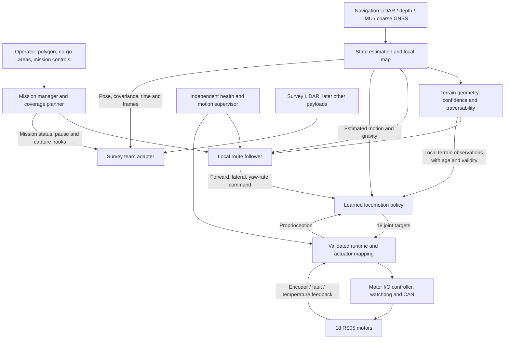

# Hexapod autonomy: development plan

Accelerated simulation-first execution plan, 4 September 2026. **Target: integrated simulation demonstration in four weeks; candidate ready to begin hardware transfer in six weeks.** The CAD is complete, single-leg testing is upcoming, and remaining parts will be ordered after that test. A physical field demonstration therefore has a separate target: approximately **2–3 weeks after the complete robot is ready**, provided the simulation and hardware gates pass. This is a conditional estimate, not a promised procurement date. Codex leads implementation/experiment work using the available Spark; human teams supply physical testing. Existing project documents are evidence, not binding rules. Hard deadline, team ownership, field site and final survey tolerances still need confirmation.

**Execution state: offline step 1 implemented.** The user subsequently authorized asset/reset/frame/runtime repairs and an animated CAD inspection. CPU checks pass for the corrected serial conversion; physical linkage fidelity and live G0 acceptance remain open. No training or automatic restart is queued. See [step 1](MKII_STEP1.md), [the prepared run sequence](NEXT_RUNS.md) and [current status](../STATUS.md).

This is the living plan. Confirmed user direction, measured findings, proposed targets and unresolved inputs have different status; section 9 records that distinction and how new context changes the plan. [The dated audit bundle](../artifacts/project_review_2026-09-04/README.md) preserves the evidence behind this revision.

## 1. The result we are building

An operator draws a bounded region, places the robot near it, and starts a mission. The robot registers that region to its local map, enters by a verified corridor, follows a zigzag coverage route, handles traversable irregular ground, avoids excluded areas, and reports completed, missed and unreachable coverage. It carries a stable, timestamped survey platform. Terrestrial LiDAR is the first survey payload; the survey team owns its sensing and data products.

The autonomy team owns **accurate route execution on a qualified range of terrain**, using an omnidirectional learned locomotion policy. Navigation sensing is independent of survey sensing. There is no operational RTK base station. The existing Jetson Orin Nano is the deployment target. The existing 18-actuator CAD design is the mechanical starting point, with parallel weight, strength, fit and endurance verification.

“Any terrain” is a research direction, not a release criterion. A robust system also knows when an obstacle, slope, uncertainty or fault exceeds its validated capability. We will qualify increasingly difficult terrain and make those limits enforceable by navigation and the runtime. No learned controller can make mechanical torque, clearance, visibility or traction limits disappear.

## 2. Architecture decisions

### Navigation and localization

Use a conventional, testable coverage planner and local controller above the learned gait. RL initially learns body velocity tracking and terrain traversal; it does not also need to discover polygon coverage, GNSS fusion and mission logic.

Adopt a **vision + LiDAR + IMU navigation architecture**, with leg kinematics/contact estimates assisting where validated. Standard GNSS is optional for coarse global anchoring and georeferencing; local autonomous motion must work without it. Magnetometer data is optional after motor-current interference testing, not the primary heading solution. Keep a continuous `odom` frame for control and a separately corrected global/map transform. A GNSS or loop-closure correction must not teleport a moving target in the controller.

**No RTK does not remove map registration.** Accurate relative zigzags and accurate placement on a satellite map are different requirements. A metres-uncertain global polygon cannot safely define a centimetre-precise fence. For the first mission, let the operator confirm the boundary in the robot's local map, using recognizable features or locally established corners. Satellite-map execution is enabled only when its registration uncertainty fits the boundary margin. This is a user-visible ConOps decision, not an implementation detail to hide.

Evaluate a pinned ROS 2-compatible LIO implementation on the Jetson using real bags before selecting it. [FAST-LIO](https://github.com/hku-mars/FAST_LIO) is a useful reference, but its upstream integration is not automatically a drop-in ROS 2 deployment. Verify the chosen port, sensor timestamps, extrinsics, dependency versions and compute load. Use [opennav_coverage](https://github.com/open-navigation/opennav_coverage)/Fields2Cover as a candidate planning component, not an assumption that complete coverage is already present in the repo or in every Nav2 install.

### What to take from HKU's SUPER work

The likely reference is HKU MaRS's **SUPER: Safety-assured High-speed Navigation for MAVs** (Science Robotics, 2025). Its planning framework maintains a trajectory in known free space alongside one that can consider unknown space. Its released stack includes local mapping and corridor tools; it is a flight-navigation system, not a hexapod gait controller. [HKU paper summary](https://mech.hku.hk/safety-assured-high-speed-navigation-for-mavs-a-paper-in-science-robotics/), [authors' code](https://github.com/hku-mars/SUPER).

My recommendation is to adapt the principle: maintain a conservative, executable stopping/retreat option inside recently verified traversable ground while replanning toward the next survey segment. For this robot, collision-free space must also have ground support, feasible slope/step height, foot and body clearance, traction margin, and a reachable stable terminal stance. A drone's free-space corridor can pass over a hole; a ground robot's route cannot. Any claimed safety property must be re-established with measured gait latency/stopping and map uncertainty.

Evaluate SUPER's mapping ideas separately from its flight optimizer. Its repository currently identifies ROS 1 as the primary supported platform and warns that its ROS 2 port may be unstable; it also documents a world-frame point-cloud assumption. Put a tested frame adapter around any reused component. Do not make porting an entire aerial stack a prerequisite for the first zigzag demo. [SUPER integration notes](https://github.com/hku-mars/SUPER).

For the requested visual/LiDAR fusion, **FAST-LIVO2** from the same research group is the more direct estimator candidate: it fuses images, LiDAR and IMU. Its paper emphasizes calibrated sensor transforms and synchronization. The upstream repository uses a ROS 1/catkin build, so select and validate a maintained ROS 2 integration explicitly. [FAST-LIVO2 paper](https://arxiv.org/html/2408.14035v2), [implementation](https://github.com/hku-mars/FAST-LIVO2). Their [resource-constrained follow-up](https://arxiv.org/abs/2501.13876) is relevant to the Orin Nano budget, but its reported hardware results are not our Jetson benchmark.

In P0, compare LiDAR-inertial localization against camera/LiDAR/IMU fusion on the **same** real bags and Jetson. Include open flat ground with weak geometric features, repetitive vegetation, shadows/glare, low texture, body vibration, obscured lenses and partial sensor dropout. Select by independent trajectory error, uncertainty/degeneracy detection and full-system CPU/memory/latency. Cameras can add texture and close-range terrain information; they do not guarantee depth everywhere or rescue every degenerate scene. Initial vision does not require a large vision-language model.

### Learned locomotion

Train a new, correctly versioned CAD-asset policy from scratch after the import defect is fixed. Preserve previous experiments for comparison. Do not require alternating tripod phases, a gait clock, predetermined footfall timing or scripted swing trajectories in the new policy.

Progress through standing, smooth command transitions, forward/reverse/lateral/yaw and combined commands, then slopes and irregular contact geometry. A privileged teacher can use simulator terrain/contact truth; a deployed student must use only estimated states and sensor observations that really exist on the robot. Compare a proprioceptive baseline with terrain-aware and recurrent policies. Keep the best validated simpler controller until added perception demonstrates a benefit under realistic errors. The [perceptive locomotion research by Miki et al.](https://arxiv.org/abs/2201.08117) motivates this training structure; it does not establish performance for this hexapod.

Reward body velocity/yaw tracking, efficient and bounded actuation, controlled body motion, sensible clearance, reduced slip and avoidance of harmful contacts. Penalize action discontinuities and limit violations. Measure each component so standing still, shuffling, excessive knee loading, or slow failure cannot earn an apparently good score. Terrain-relative clearance and slope-aware body objectives must allow feasible motion; rigidly forcing a flat deck on every slope can defeat traversal. Payload stability requirements enter as a measured envelope, not arbitrary escalating reward weights.

Train and evaluate with measured or bounded actuator dynamics, latency/jitter, encoder/IMU errors, friction, restitution, pushes, motor strength, voltage/thermal derating, payload mass/COM, dropped/stale terrain observations and occlusion. Randomization ranges must match plausible hardware and field conditions. Include direction changes and stopping, not just long straight runs. Test unseen terrains and seeds; do not tune on the release suite.

### Terrain sensing

Run four sensor experiments early: ideal terrain observations as an upper bound, Mid-360 alone, near-ground depth views, and a fused local map. Keep timing/noise/occlusion comparable and score traversal, mapping error, coverage of the reachable foot workspace, and Jetson cost. Downselect on evidence rather than buying every candidate.

Maintain local 3D obstacle geometry alongside a ground-support/elevation representation; an obstacle-free voxel is not proof of safe foothold support. Test negative obstacles, overhangs and vegetation separately. Camera-based terrain semantics can flag ambiguous vegetation/materials, but a classifier must not override missing geometric support. Start with a calibrated wide-view navigation camera and evaluate the additional near-ground depth views the actual mount requires; a single forward camera cannot justify blind reverse or lateral stepping.

The Mid-360 mount study already in the repo is useful preliminary work, but it uses the old mock and does not prove near-foot visibility. [Its specified vertical field of view](https://www.livoxtech.com/mid-360/specs) is -7° to +52°. A high upright mount can see distant ground while missing the next foothold. Test the actual CAD, full moving-leg sweep, forward/lateral/reverse travel, body tilt, payload occlusion and outdoor depth failures. A remembered local map may bridge a blind spot only while registration and age remain acceptable.

**Unknown terrain stays unknown.** Each terrain sample carries age and validity/confidence. When coverage or localization becomes inadequate, reduce speed, observe again, replan or stop according to a tested state machine. Do not replace missing terrain with a flat plane and continue across rough ground.

### Onboard control and electrical seam

Keep the initial policy-rate target at 50 Hz and measure the complete observation-to-motor deadline. The motor's own servo loop may run faster; sending a 50 Hz setpoint is not equivalent to a 50 Hz internal torque controller. A deployable release must match the mode, gains, zero/sign calibration, slew and torque behavior used in training.

Use a verified adapter/reference board for one-leg and all-motor bench work. Select the final CAN topology after measuring actual RS05 command/feedback traffic and fault behavior. Prefer an I/O controller with independent watchdogs and deterministic motor handling for the field system. A USB link to the Jetson is compatible with this arrangement. A custom PCB is justified by measured needs, not required before software testing starts.

XT30 2+2 wiring does not settle the bus design. Each CAN segment needs the correct controller/transceiver, termination and wiring; passive branching is not equivalent to independent leg buses. GPIO cannot directly replace a CAN transceiver. See [NVIDIA's CAN integration guidance](https://docs.nvidia.com/jetson/archives/r38.2.1/DeveloperGuide/HR/ControllerAreaNetworkCan.html), [TI's CAN reference design](https://www.ti.com/tool/TIDA-01238), and [RobStride's protocol sample](https://github.com/RobStride/Python_Sample). Confirm the exact carrier, motor revision, connector pinout, bitrate and protocol on the bench.

Illustrative capacity check only: at an assumed 1 Mbit/s, allowing 160 on-wire bits for each extended 8-byte frame, one command plus one feedback frame for each of 18 motors consumes about 29% at 50 Hz, 58% at 100 Hz and 115% at 200 Hz. Real protocol behavior may differ. This makes all-leg timing/load testing an early electrical/CS dependency. Independent segments can improve capacity and fault isolation; the selected topology must pass measured worst-case deadlines and bus recovery tests.

Power distribution, motor isolation/emergency stop, brownout handling, regulators, and USB/Ethernet resets belong in the integrated test plan. Mechanical support loss after torque removal must be considered in the stop strategy. Board functionality alone does not prove the robot can stop predictably.

### Payload independence

Define a generic payload profile: mass/COM/inertia envelope, dimensions and swept clearance, power, physical mounting, time synchronization, pose/extrinsic frames, stability/speed constraints, and status/pause/capture hooks. Survey-team acquisition and processing stay behind that adapter. A future payload can change spacing or speed through the profile without rewriting gait or navigation code, provided it stays within the validated envelope.

The platform cannot be independent of payload physics or measurement footprint. An out-of-envelope payload triggers new dynamics and stability tests. A surveying sensor failure must not silently remove required navigation capability. Sharing a sensor in the future is an explicit dependency change with a failure-mode review.

## 3. Staff workstreams, not disconnected features

With dozens of participants, appoint one accountable lead and one deputy/reviewer per stream. Additional contributors own bounded deliverables with a contract and a test. Do not let all members independently modify the same environment or shared message schema.

| Stream | Suggested active contributors | Accountable deliverable |
|---|---:|---|
| Systems integration and verification | 2–3, including a technical integration lead | End-to-end release, evidence, interfaces, regression scenarios, deployment reproducibility |
| Simulation and RL | 4–5 | Correct asset, actuator model, curriculum, policy, held-out evaluation |
| Perception and localization | 3–4 | Calibrated sensors, continuous pose with uncertainty, local terrain/map outputs |
| Navigation and mission software | 3–4 | Validated polygon, zigzags, local path following, replanning, coverage ledger and operator workflow |
| Embedded/runtime | 3–4, paired with electrical | Jetson inference, actuator mapping, CAN timing, watchdogs and fault handling |
| Mechanical | Existing team in parallel | Weight/COM bounds, measured stops/linkage, strength/fit, payload mount and endurance evidence |
| Electrical | Existing team in parallel | Power/CAN design, prototype and loaded/fault-tested boards and harness |
| Geo Data/payload interface | 1–2 liaisons plus their sensor team | Survey requirements/profile, reference measurements and data-quality acceptance |

These are staffing recommendations, not assignments of named people or confirmed Cornell team boundaries. Someone must explicitly own integration as their main contribution. James's contracts and test infrastructure are a useful starting point; ownership does not follow automatically from past commits.

Codex can perform the bulk of implementation, refactoring, test/scenario generation, simulator setup, experiment configuration and results analysis. Human owners supply physical measurements, calibrations, hardware assembly, powered testing, field operation and acceptance of demonstrated results. The suggested contributor counts are a pool, not a reason to divide every feature into many independent designs; use small pairs for physical work and a clear reviewer for each software stream.

Working rhythm: a daily integrated build and evidence review, short daily cross-stream blocker check, and a physical demo whenever a gate becomes ready. Every contract change is reviewed with its consumer. Keep one protected integration branch with reproducible CI and a separate experiment namespace. Every run records code, asset, observation/action schema, sensor calibration, resolved config, seed, checkpoint and evaluation hashes. Never overwrite another team's active Spark mirror or queue; use isolated run directories and a scheduler that checks unrelated GPU work. Unrestricted Spark access removes scheduling scarcity, not finite device memory or the need for correct experiments.

Use compute in this order: short correctness/sanity runs; batched environment throughput profiling; broad but bounded candidate screening; early termination of failed candidates; multi-seed confirmation of finalists; then held-out qualification. Overlap CPU bag replay, software tests and analysis with GPU training where memory/load permit. Do not launch multiple oversized jobs that each expect the whole Spark. Profile feasible concurrency rather than inventing a runs-per-day promise. Avoid spending thousands of iterations optimizing an invalid imported asset or retuning rewards without a falsifiable hypothesis.

## 4. Timeline: simulate now, transfer when hardware arrives

**Software week 1 means the start of the resumed development campaign, not a commitment to launch now. H is the date the assembled robot is ready for powered integration.** H is unknown: single-leg validation precedes the remaining parts order. Do not place H on a calendar until the mechanical/electrical teams establish delivery and assembly dates. Pre-H work continues independently. If hardware becomes available early, begin transfer as soon as its prerequisites pass rather than waiting for week six.

The four-week milestone is an integrated simulation prototype, not field readiness. The six-week milestone is a screened simulation candidate and deployment package, not proof of sim-to-real success. These are aggressive targets enabled by AI-led implementation and available compute. Physics/learning failures can still require iteration; the gates stay mandatory.

### Software and simulation, after resumption

| ID | Window | Owner | Deliverable and dependencies |
|---|---|---|---|
| A0 | First 3 days | Simulation + integration | Correct inertia, reset and command-frame defects; verified CAD task/runtime manifest; short Isaac validation. Blocks training. |
| L0 | After G0–end W2 | RL | Learned flat-ground omnidirectional controller; parallel candidate screening and multi-seed checks. |
| L1 | W3 | RL | Terrain curriculum and teacher/baselines; measured single-leg dynamics folded in as available. |
| L2 | W4–mid W5 | RL + perception | Deployable perceptive/recurrent student, noisy/delayed terrain, payload and actuator robustness. |
| P0 | W1–2 | Perception | Camera/LiDAR/IMU driver and bag workflow; LIO vs LIVO benchmark. Use public/recorded bags and virtual sensors until the relevant real sensors are available. |
| P1 | W3 | Perception + RL | Actual-CAD moving-leg occlusion, near-ground sensor experiments, terrain map/unknown/age contract. |
| P2 | W4–5 | Perception | Full sensor-to-map pipeline on simulated missions and available real bags; Jetson replay/timing as hardware permits. |
| N0 | W1 | Navigation | Polygon/holes/headlands, zigzags, coverage ledger and minimal UI against a motion stub. |
| N1 | W2–3 | Navigation + RL | Policy-in-loop tracking, lag, saturation, stopping and heading transitions. |
| N2 | W4 | Navigation + perception | Terrain replanning, verified stopping option, fence, entry/exit, pause/resume and missed-pass repair. |
| R0 | W1–2 | Embedded/runtime | Asset-specific observation/action/inference path; motor protocol emulator, mapping, expiry and watchdog interfaces. |
| R1 | W3–mid W5 | Embedded + integration | Exact deployment pipeline against simulation/replay; Jetson execution and one-leg feedback when available. No claim that emulation proves physical CAN timing. |
| V0 | W1 | Verification | Automated metrics, reference scenarios and first synthetic end-to-end mission. |
| V1 | W2–3 | Verification + all CS | Daily integrated build; simulator/replay faults and contract regression. |
| V2 | W4 | Integration | Integrated simulation prototype: locally drawn polygon to learned walking and recorded coverage. Label every idealized sensor/state input. |
| V3 | W5–6 | Verification + all CS | Realistic sensor/actuator errors, held-out missions, payload/direction matrix, export and transfer package. |
| D0 | First 3 days | Geo Data liaison | Generic payload profile, spacing/footprint, pose/time and stability interface. |
| D1 | W2–3 | Survey liaison + navigation | Generic adapter and synthetic survey records; real sensor adapter can follow independently. |

Real sensor calibration is a hardware-transfer prerequisite even if software passes with public bags. As single-leg data arrives, regenerate affected dynamics and rerun the same evaluation matrix. Do not defer an obvious physical-model mismatch until the assembled robot arrives.

The confirmed single-leg stand uses a vertically translating hip/body carriage. Build that exact four-DOF fixture in simulation and identify loaded actuator/contact behavior before ordering the rest of the robot. The instrumentation and held-out test sequence are in [the single-leg test plan](../artifacts/project_review_2026-09-04/LEG_TEST_STAND.md). This is the earliest useful physical feedback loop for the simulation-first program.

### Mechanical/electrical track and event-driven hardware transfer

| ID | Trigger / target duration | Owner | Deliverable |
|---|---|---|---|
| M0/E0 | As soon as single-leg rig is ready; target 3–5 working days per test cycle | Mechanical + electrical + embedded | Load/deflection, motor zero/sign/linkage, torque-speed response, limits, current/temperature and one-leg protocol timing. A failed leg triggers revision and retest. |
| Procurement | Immediately after the single-leg design passes | Mechanical + electrical | Order remaining parts; track actual delivery dates, spare parts and assembly plan. Lead time remains unknown. |
| M1/E1 | Delivery → H; duration set by those teams | Mechanical + electrical | Assemble six legs, boards/harness and payload mounts; verify fit, power, CAN identity and full mass/COM. H means ready for powered integration, not merely boxes delivered. |
| R2 | H to H+1 week | Embedded + RL + electrical | All-motor mapping/timing, calibrated sensors, restrained parity, watchdog/stop tests, then free joystick walking if admitted. |
| M2 | H onward, parallel | Mechanical | Repeated-load and assembled-robot endurance; feed wear/deflection/mass changes back to the model. |
| H1 | Approximately H+1 to H+2 weeks | Integration | Physical indoor polygon coverage, ground-truth tracking, full Jetson load, map/fault/stop/resume checks. |
| H2 | Approximately H+2 to H+3 weeks | Integration + Geo Data | Packed-path field survey, then bounded uneven course only after physical qualification; repeat missions and validate survey adapter. |

The H+2–3-week field target assumes the simulation candidate is ready and hardware behaves within its modeled bounds. A failed linkage, overheated motor, sensor blind spot or large transfer gap extends that estimate. Publication/research-grade forest reliability is outside this initial milestone.

Main dependency chain: **correct model → learned omnidirectional control → sensor-based terrain control → integrated simulation mission → calibrated physical transfer → field coverage**. Procurement is a parallel dependency with an unknown date. Mass uncertainty can be randomized within measured bounds; arbitrary geometry changes cannot be absorbed by a promise of domain randomization.

## 5. Acceptance gates

Calendar dates do not close gates. A gate closes only when its owner and integration reviewer accept an evidence bundle. Failed gates retain their original target; changing a target requires a recorded requirement decision before re-evaluation. Existing mock scores are useful comparisons, not automatically the correct mission thresholds.

| Gate | Target | Evidence required |
|---|---|---|
| G0: trustworthy simulation baseline | First 3 days | All-link URDF/USD tensor round trip; geometry/joints/contacts/units; nonpenetrating reset; directional-frame tests; explicit CAD action mapping; pinned tests and short Isaac validation. Unmeasured dynamics marked provisional. |
| G1: learned motion foundation | End W2 | Flat omnidirectional policy, transitions and stopping pass the declared simulation suite; localization bag workflow, coverage stub and deployment contracts run. No physical-readiness claim. |
| G2: terrain foundation | End W3 | Held-out terrain baseline; map age/unknown/confidence interface; policy-in-loop navigation and motor-emulator fault tests. |
| G3: integrated simulation prototype | End W4 | Drawn polygon → local navigation → learned gait → coverage report, including obstacles, fence, pause/resume. Explicitly identify idealized observations still being replaced. |
| G4: candidate for hardware transfer | End W6 | Actor uses only deployable observations; realistic sensor/actuator error matrix and held-out missions pass; artifact/config/calibration requirements exported; target Jetson test completed if available, otherwise explicitly outstanding. |
| G5: physical motion | About H+1 week | Actual joint mapping, motor/CAN behavior, sensor calibration, power/watchdog faults, measured model update, restrained parity and supervised free motion pass. |
| G6: field demonstrator | About H+2–3 weeks, after G4/G5 | Indoor mission first, then repeated no-RTK field coverage with independent ground truth, qualified terrain/payload, no falls/fence violations, and reported unreachable areas. |

### Proposed quantitative starting points

These are design proposals for the lead and Geo Data team to confirm or replace, **not existing achieved performance**. Freeze them and their measurement methods before qualification. A specific survey footprint may require tighter values.

- First course: approximately 10 m × 10 m, consistent with the existing mission record; start with packed ground. Test concave boundaries, a no-go island, and the entry corridor as well as a rectangle.
- Straight-pass local cross-track error: p95 ≤ 0.10 m and maximum ≤ 0.25 m; heading error p95 ≤ 5°. Score turn/transition errors separately and include them in fence/completion checks. Report both estimator-relative control error and independent physical ground-truth error.
- Cover ≥95% of the agreed traversable target using the **actual swept survey footprint**, with remaining gaps explicitly reported/revisited. Also report whole-polygon coverage, duplicate travel and exclusions; do not improve the score by quietly shrinking the denominator.
- Choose pass spacing from useful sensor footprint minus required overlap and measured error budget. Nominal 1 m spacing may be used in software tests, but it is not a survey specification. Survey quality, platform coverage and localization accuracy are separate acceptance measures.
- Terrain qualification begins with measured slopes up to 5° and irregularities up to 20 mm, then considers 10° slopes, 5° cross slopes and 50 mm roots/steps. These are **candidate test bounds**, subject to measured clearance, torque and leg loading; reduce them if physically infeasible. Loose soil, deep vegetation, mud, water, snow, cliffs and steep forest trails are outside the initial release.
- Policy pipeline: 50 Hz/20 ms target. Record worst-case and p99 sensor age, inference time, transport delay and motor feedback age during a sustained ≥30-minute full-load test. Define the permissible miss burst and independent watchdog timeout from measured stopping behavior; p99 alone cannot certify worst-case control.
- Qualification includes nominal/minimum/maximum allowed payload and COM, both yaw directions, forward/reverse/lateral/diagonal travel, startup, deceleration, stopping, GNSS degradation and sensor/CAN faults. Use at least 10 complete repeat field missions on each admitted course/configuration as an initial demo screen, while publishing every failure. This sample does not prove universal reliability.
- Absolute geolocation, survey payload steadiness, mission duration and minimum useful speed remain explicit requirements to finalize. Record them during every trial even before thresholds are set. Do not transplant the paper's RTK accuracy or the mock's speed floor into this release.

Independent ground truth can use surveyed local markers, calibrated external cameras, motion capture indoors, or a total station during evaluation. It is **test instrumentation**, not a navigation base station required for deployment. Comparing a trajectory only against the estimator that generated it cannot reveal estimator drift.

Fence margins include the robot's full moving-leg footprint, localization/registration uncertainty and stopping distance. Derive the latter from worst-case delay and measured terrain braking; a centre-point polygon test is insufficient. Unknown terrain, an unregistered boundary or insufficient stopping margin prevents autonomous entry.

## 6. Interfaces to define in the first three days and exercise in week one

| Contract | Producer → consumer | Must specify |
|---|---|---|
| Mission | UI → mission manager | Polygon frame/datum, holes/no-go, revision, approved entry region, requested spacing/overlap, payload profile and start/stop/resume semantics |
| Pose | Estimation → navigation/runtime/payload | Frames, timestamps/timebase, covariance/health, velocity convention, map/odom correction behavior and maximum age |
| Terrain | Perception → RL/navigation | Extent, resolution, origin, heights/obstacles, unknown mask, confidence, sample age, transform alignment and degraded behavior |
| Motion command | Navigation → runtime/policy | Anatomical forward/left/yaw axes, units, supported envelope, acceleration limits, timestamp/expiry and stop meaning |
| Observations/actions | Runtime ↔ policy | Schema version, joint-name order, normalized fields, recurrent state/reset rules, available estimated states, clipping/scales/soft limits, measured actuator mode and timing |
| Motor transport | Runtime ↔ I/O board | Motor identity, zero/sign/mapping, feedback schedule, command sequence/deadline, faults, watchdog, recovery and emergency-stop ownership |
| Payload | Platform ↔ survey team | Mount/extrinsics, physical/dynamic envelope, power, synchronized pose/time, data-valid state, capture/pause hooks and coverage footprint |
| Release record | All streams → verification | Hardware/model/software/calibration/checkpoint hashes, configuration, test scenario, outcome and reproducibility instructions |

Use stubs and recorded messages at every seam. Contract tests must include wrong frames, wrong asset/checkpoint, stale/out-of-order data, partial sensor availability and process restart. A single command whose physical direction is wrong can invalidate months of otherwise successful training.

## 7. First ten working days

1. **Days 1–2 — integration lead:** select the source baseline; preserve archived mock runs; identify responsible leads/reviewers; write interface ownership and a release manifest. Keep stopped Spark jobs stopped while the current planning-only instruction applies; G0 must also pass before training.
2. **Days 1–3 — simulation/RL:** reproduce and correct the inertia conversion, regenerate the asset, fix reset/frame/runtime discrepancies, run short G0 checks and freeze the omnidirectional evaluation suite. After run execution resumes, start training once G0 passes.
3. **Days 1–3 — electrical/embedded/mechanical:** prepare and, as soon as the rig is ready, instrument one real leg. Measure motor mapping/stops and command/feedback timing; establish weight/COM bounds. Order remaining parts after the leg passes; all-motor tests wait for assembly. Record what each missing measurement blocks.
4. **Days 1–5 — perception:** establish Jetson/JetPack/ROS/sensor versions and record calibrated camera/LiDAR/IMU bags if the sensors are available; otherwise start with public/recorded data and virtual sensors. Benchmark LIO and LIVO on the same data; physical calibration remains outstanding until measured.
5. **Days 1–5 — navigation:** implement polygon-to-zigzag against a deterministic motion stub, including holes, entry and actual coverage accounting. Exercise the generic survey adapter without waiting for its sensor.
6. **Days 3–10 — runtime/verification:** replay observations through deployment code; implement CAN/sensor faults and CI scenarios. Integrate the first flat policy as soon as admitted and begin restrained physical parity when hardware gates permit.
7. **Days 8–10 — all leads:** close G1 evidence or publish the exact blocker; adopt measured motor/sensor choices and feed the next terrain campaign. Confirm calendar dates from hardware availability and the hard deadline. Avoid a second week of architecture-only discussion.

## 8. After the first demonstrator

After G6, start a separate extension program for forest terrain, denser vegetation, larger areas and longer endurance. Re-estimate it from the measured performance frontier rather than assigning an unsupported universal-all-terrain date. Add terrain families one at a time with real bags, measured contact/visibility limits, updated training and release tests. Extend payload classes through the profile and requalify dynamics when needed. Autonomous recovery, self-righting, degraded operation after an actuator failure, and unattended long-duration missions are separate capabilities, not hidden assumptions in the first gait policy.

The [supplied field-phenotyping paper](https://arxiv.org/html/2404.04404v1) supports separating platform control, navigation and survey acquisition. It used a wheeled Husky, RTK-based localization and stationary scan acquisition; its serpentine mean path error was about 3.7 cm. That result does not establish the accuracy of this legged, no-RTK, continuously moving platform. Reuse its discipline of measuring path/heading and survey outcomes separately, then establish our own evidence.

The largest near-term risks are incorrect imported dynamics, an uncalibrated motor action path, insufficient near-foot visibility, poor local-map registration, and unreliable onboard timing. The timeline puts those risks early and keeps repeated end-to-end testing staffed throughout the project.

## 9. New context and decision record

This plan is expected to evolve throughout the Cornell Physical AI / Cornell Geo Data collaboration. New user context steers the active objective; earlier prose and James's implementation choices do not override it. Preserve useful code and evidence, but revise architecture when the mission or measurements warrant it. Do not make participants re-confirm decisions already supplied.

Use these evidence states consistently:

- **Confirmed direction:** explicitly supplied by the project lead in this review.
- **Measured finding:** supported by a dated test or inspection with traceable inputs.
- **Proposed target:** a planning choice to test or settle before qualification; not a fact about achieved performance.
- **Historical context:** a prior document or experiment, retained for reference without treating it as a current requirement.
- **Open input:** a missing measurement, resource, owner or requirement that blocks a named decision.

| Decision / input | State on 2026-09-04 | Consequence |
|---|---|---|
| D01: bounded-area zigzag survey with learned omnidirectional locomotion | Confirmed | Separate coverage/navigation from gait; no required tripod clock or scripted footfall schedule. |
| D02: navigation independent of survey payload; terrestrial LiDAR first | Confirmed | Geo Data owns survey acquisition/processing; platform supplies pose/time, motion and generic payload interface. |
| D03: no RTK deployment base station; prefer camera/LiDAR/IMU navigation | Confirmed | Qualify local localization and boundary registration; optional ordinary GNSS cannot promise centimetre global accuracy. |
| D04: Jetson Orin Nano and 18 RS05 actuators | Confirmed architecture | Measure complete onboard timing and actual motor behavior; CAN segmentation/adapter and nav sensor selection remain open. |
| D05: CAD complete; vertical-carriage single-leg test before remaining parts order | Confirmed | Start with simulation and one-leg identification; keep full-robot date H explicitly unknown. |
| D06: substantial compute and AI implementation support; teams work concurrently | Confirmed | Shorten software iteration; preserve physics, hardware and integration gates. No assumption of infinite simultaneous GPU memory. |
| D07: no new training; execute offline step 1 and provide animated inspection | Confirmed, subsequent instruction | Implement and publish versioned CPU-verified repairs and visual inspection; no physics stepping, training, queue or unattended restart launched. |
| D08: four-week sim prototype / six-week transfer candidate / H+2–3-week field target | Proposed | Conditional planning targets, not a hard deadline or proof of feasibility. |
| D09: numeric tracking, terrain, coverage and endurance gates | Proposed | Freeze methods and thresholds before qualification, informed by the survey footprint and hardware measurements. |
| F01: original imported USD fails all-link inertia round trip | Measured; serial-v2 CPU repair now passes | Original evidence stays archived; live v2 acceptance remains open and prior scratch CAD runs cannot certify the repaired asset. |
| F02: serial model freezes the pushrod; documented linkage cut points differ mainly along the pin axis | Measured in animated inspection and numerical audit | Restore mimic motion for inspection; reconcile pin frames and qualify actual loop dynamics before claiming a 1:1 simulation model. |
| O01: team leads/deputies, hard deadline, field site and procurement dates | Open | Assign owners and calendar dates; proceed on independent software work when execution resumes. |
| O02: survey footprint/overlap, absolute geolocation, payload stability and physical envelope | Open | Finalize with the Geo Data team; do not claim universal payload independence. |
| O03: terrain envelope, motor limits/thermal duty, time synchronization and stopping behavior | Open measurements | Use explicit provisional bounds for early simulation; replace them from the leg stand and whole robot. |

Prior records describe an approximately 10 m square first area, packed-path starting terrain, a tentative 1–2 kg payload, long-range telemetry and a $6,000 budget. These are historical planning inputs, not all re-confirmed in this conversation. Keep them visible for reconciliation; do not infer that payload mass is unconstrained or that the already-owned Jetson still needs purchasing. The current no-RTK preference is a deployment choice, not merely a budget restriction.

When context arrives: identify the affected requirement and its source/date; update the relevant section and this record; name affected interfaces, model/calibration/checkpoint versions and tests; preserve the old evidence; rerun only the checks needed to establish the revised claim. A mass update inside a validated randomization range may need screening and fine-tuning. A changed joint topology, action meaning, observation schema or geometry can require a new asset/task and retraining. Never silently relabel old results as evidence for the new system.

Revision 2026-09-04: replaced the Stage2C-centered program with the simulation-first, no-RTK area-survey program above; archived the prior plan/requirements/status verbatim under `docs/archive/`; kept mock checkpoints, gates and task IDs intact. Subsequent step-1 authorization produced the versioned offline repairs and animated inspection documented in `MKII_STEP1.md`. New physics experiments and training remain pending acceptance work.
