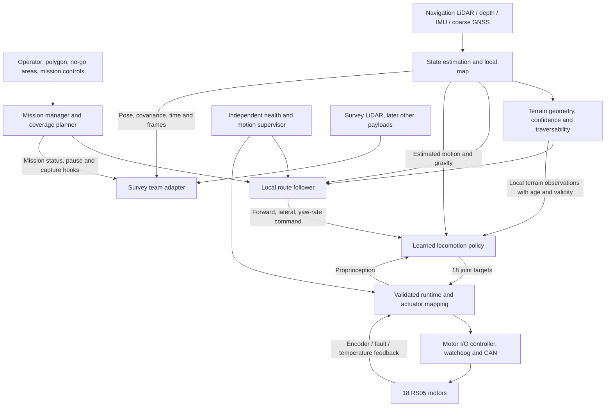
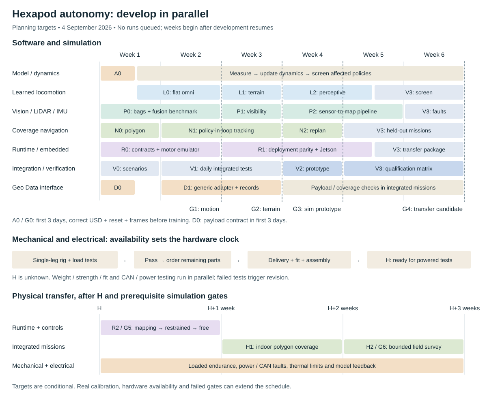

# Hexapod autonomy: development plan

> **9 September 2026 update:** the user prioritizes the selected C-study Stage 2 controller, requiring smooth walking/pathing in every direction and quiet standing, with terrain/perception implementation in parallel. [STATUS](../STATUS.md) is current; [the C-study contract](../experiments/c_length_study/README.md) separates its pinned runtime and 1.6 N·m study cap from the physical four-bar program. Earlier pause, plan and actuator statements below apply to their dated physical lineage. Commit/push each verified step with relevant Markdown and preserve other work on main.

Accelerated simulation-first execution plan, 4 September 2026. **Target: integrated simulation demonstration in four weeks; candidate ready to begin hardware transfer in six weeks.** The CAD is complete, single-leg testing is upcoming, and remaining parts will be ordered after that test. A physical field demonstration therefore has a separate target: approximately **2–3 weeks after the complete robot is ready**, provided the simulation and hardware gates pass. This is a conditional estimate, not a promised procurement date. Codex leads implementation/experiment work using the available Spark; human teams supply physical testing. Existing project documents are evidence, not binding rules. Hard deadline, team ownership, field site and final survey tolerances still need confirmation.

**Execution update, 7 September 2026: paused by the user pending a revised single-leg URDF.** The physical four-bar candidate has 31 rigid bodies, 30 articulation coordinates and 18 named actuators. Its last 1,600 Hz nominal test completed the motion sequence but failed the support gate; corrected physical-model PPO has not started or completed. The campaign, one-shot capture follower and checkpoint-continuation coordinator have exited. No new solver candidate is launched or queued. Resume with the new leg audit, then decide subsequent full-body qualification. See [current status](../STATUS.md) and [the current training contract](MKII_FOURBAR_TRAINING.md); original serial-model instructions remain historical.

**Parallel mechanical work:** the [Onshape/CAD engineer handoff](CAD_ENGINEER_HANDOFF.md) defines the one-leg structured-export proof, six-leg ownership/closure graph, loaded mass ledger, measured workspace, structural cases, contact geometry, sensor/payload interfaces and leg-stand deliverables. The four-bar does not require redesign merely to satisfy URDF's tree restriction. The simulation team must implement a versioned adapter for the improved export.

This is the living plan. Confirmed user direction, measured findings, proposed targets and unresolved inputs have different status; section 9 records that distinction and how new context changes the plan. [The dated audit bundle](../artifacts/project_review_2026-09-04/README.md) preserves the evidence behind this revision.

## 1. The result we are building

An operator draws a bounded region, places the robot near it, and starts a mission. The robot registers that region to its local map, enters by a verified corridor, follows a zigzag coverage route, handles traversable irregular ground, avoids excluded areas, and reports completed, missed and unreachable coverage. It carries a stable, timestamped survey platform. Terrestrial LiDAR is the first survey payload; the survey team owns its sensing and data products.

The autonomy team owns **accurate route execution on a qualified range of terrain**, using an omnidirectional learned locomotion policy. Navigation sensing is independent of survey sensing. There is no operational RTK base station. The existing Jetson Orin Nano is the deployment target. The existing 18-actuator CAD design is the mechanical starting point, with parallel weight, strength, fit and endurance verification.

“Any terrain” is a research direction, not a release criterion. A robust system also knows when an obstacle, slope, uncertainty or fault exceeds its validated capability. We will qualify increasingly difficult terrain and make those limits enforceable by navigation and the runtime. No learned controller can make mechanical torque, clearance, visibility or traction limits disappear.

## 2. Architecture decisions

### Navigation and localization

Use a conventional, testable coverage planner and local controller above the learned gait. RL initially learns body velocity tracking and terrain traversal; it does not also need to discover polygon coverage, GNSS fusion and mission logic.

Adopt a **vision + LiDAR + IMU navigation architecture**, with leg kinematics/contact estimates assisting where validated. Standard GNSS is optional for coarse global anchoring and georeferencing; local autonomous motion must work without it. Magnetometer data is optional after motor-current interference testing, not the primary heading solution. Keep a continuous `odom` frame for control and a separately corrected global/map transform. A GNSS or loop-closure correction must not teleport a moving target in the controller.

**No RTK does not remove map registration.** Accurate relative zigzags and accurate placement on a satellite map are different requirements. A metres-uncertain global polygon cannot safely define a centimetre-precise fence. For the first mission, let the operator confirm the boundary in the robot's local map, using recognizable features or locally established corners. Satellite-map execution is enabled only when its registration uncertainty fits the boundary margin. This is a user-visible ConOps decision, not an implementation detail to hide.

Evaluate a pinned ROS 2-compatible LIO implementation on the Jetson using real bags before selecting it. [FAST-LIO](https://github.com/hku-mars/FAST_LIO) is a useful reference, but its upstream integration is not automatically a drop-in ROS 2 deployment. Verify the chosen port, sensor timestamps, extrinsics, dependency versions and compute load. Use [opennav_coverage](https://github.com/open-navigation/opennav_coverage)/Fields2Cover as a candidate planning component, not an assumption that complete coverage is already present in the repo or in every Nav2 install.

### What to take from HKU's SUPER work

The likely reference is HKU MaRS's **SUPER: Safety-assured High-speed Navigation for MAVs** (Science Robotics, 2025). Its planning framework maintains a trajectory in known free space alongside one that can consider unknown space. Its released stack includes local mapping and corridor tools; it is a flight-navigation system, not a hexapod gait controller. [HKU paper summary](https://mech.hku.hk/safety-assured-high-speed-navigation-for-mavs-a-paper-in-science-robotics/), [authors' code](https://github.com/hku-mars/SUPER).

My recommendation is to adapt the principle: maintain a conservative, executable stopping/retreat option inside recently verified traversable ground while replanning toward the next survey segment. For this robot, collision-free space must also have ground support, feasible slope/step height, foot and body clearance, traction margin, and a reachable stable terminal stance. A drone's free-space corridor can pass over a hole; a ground robot's route cannot. Any claimed safety property must be re-established with measured gait latency/stopping and map uncertainty.

Evaluate SUPER's mapping ideas separately from its flight optimizer. Its repository currently identifies ROS 1 as the primary supported platform and warns that its ROS 2 port may be unstable; it also documents a world-frame point-cloud assumption. Put a tested frame adapter around any reused component. Do not make porting an entire aerial stack a prerequisite for the first zigzag demo. [SUPER integration notes](https://github.com/hku-mars/SUPER).

For the requested visual/LiDAR fusion, **FAST-LIVO2** from the same research group is the more direct estimator candidate: it fuses images, LiDAR and IMU. Its paper emphasizes calibrated sensor transforms and synchronization. The upstream repository uses a ROS 1/catkin build, so select and validate a maintained ROS 2 integration explicitly. [FAST-LIVO2 paper](https://arxiv.org/html/2408.14035v2), [implementation](https://github.com/hku-mars/FAST-LIVO2). Their [resource-constrained follow-up](https://arxiv.org/abs/2501.13876) is relevant to the Orin Nano budget, but its reported hardware results are not our Jetson benchmark.

In P0, compare LiDAR-inertial localization against camera/LiDAR/IMU fusion on the **same** real bags and Jetson. Include open flat ground with weak geometric features, repetitive vegetation, shadows/glare, low texture, body vibration, obscured lenses and partial sensor dropout. Select by independent trajectory error, uncertainty/degeneracy detection and full-system CPU/memory/latency. Cameras can add texture and close-range terrain information; they do not guarantee depth everywhere or rescue every degenerate scene. Initial vision does not require a large vision-language model.

### Learned locomotion

Train a new, correctly versioned CAD-asset policy from scratch after the physical-model and actuator G0 checks pass. Preserve previous experiments for comparison. Do not require alternating tripod phases, a gait clock, predetermined footfall timing or scripted swing trajectories in the new policy.

Progress through standing, smooth command transitions, forward/reverse/lateral/yaw and combined commands, then slopes and irregular contact geometry. A privileged teacher can use simulator terrain/contact truth; a deployed student must use only estimated states and sensor observations that really exist on the robot. Compare a proprioceptive baseline with terrain-aware and recurrent policies. Keep the best validated simpler controller until added perception demonstrates a benefit under realistic errors. The [perceptive locomotion research by Miki et al.](https://arxiv.org/abs/2201.08117) motivates this training structure; it does not establish performance for this hexapod.

Reward body velocity/yaw tracking, efficient and bounded actuation, controlled body motion, sensible clearance, reduced slip and avoidance of harmful contacts. Penalize action discontinuities and limit violations. Measure each component so standing still, shuffling, excessive knee loading, or slow failure cannot earn an apparently good score. Terrain-relative clearance and slope-aware body objectives must allow feasible motion; rigidly forcing a flat deck on every slope can defeat traversal. Payload stability requirements enter as a measured envelope, not arbitrary escalating reward weights.

Train and evaluate with measured or bounded actuator dynamics, latency/jitter, encoder/IMU errors, friction, restitution, pushes, motor strength, voltage/thermal derating, payload mass/COM, dropped/stale terrain observations and occlusion. Randomization ranges must match plausible hardware and field conditions. Include direction changes and stopping, not just long straight runs. Test unseen terrains and seeds; do not tune on the release suite.

The [RS05 specification review](RS05_SPEC_REVIEW.md) identified an inherited 1.6 N·m clipping model that lacked qualified speed/overload behavior. The current physical task replaces it with a versioned provisional motor contract bound to the source identity: 5.5 N·m peak, 1.2 N·m continuous stall, speed-dependent delivery and finite overload/recovery bookkeeping. The 1.6 and 1.8 N·m rotating ratings use different cooling plates and do not establish static support capacity. Short simulation checks do not validate thermal endurance; actual battery voltage, cooling, torque/current calibration, braking and regeneration remain unmeasured. Hardware CAN/current/temperature protection remains to implement. [Current actuator contract](MKII_FOURBAR_TRAINING.md#rs05-v2).

### Terrain sensing

Run four sensor experiments early: ideal terrain observations as an upper bound, Mid-360 alone, near-ground depth views, and a fused local map. Keep timing/noise/occlusion comparable and score traversal, mapping error, coverage of the reachable foot workspace, and Jetson cost. Downselect on evidence rather than buying every candidate.

Maintain local 3D obstacle geometry alongside a ground-support/elevation representation; an obstacle-free voxel is not proof of safe foothold support. Test negative obstacles, overhangs and vegetation separately. Camera-based terrain semantics can flag ambiguous vegetation/materials, but a classifier must not override missing geometric support. Start with a calibrated wide-view navigation camera and evaluate the additional near-ground depth views the actual mount requires; a single forward camera cannot justify blind reverse or lateral stepping.

The Mid-360 mount study already in the repo is useful preliminary work, but it uses the old mock and does not prove near-foot visibility. [Its specified vertical field of view](https://www.livoxtech.com/mid-360/specs) is -7° to +52°. A high upright mount can see distant ground while missing the next foothold. Test the actual CAD, full moving-leg sweep, forward/lateral/reverse travel, body tilt, payload occlusion and outdoor depth failures. A remembered local map may bridge a blind spot only while registration and age remain acceptable.

**Unknown terrain stays unknown.** Each terrain sample carries age and validity/confidence. When coverage or localization becomes inadequate, reduce speed, observe again, replan or stop according to a tested state machine. Do not replace missing terrain with a flat plane and continue across rough ground.

### Onboard control and electrical seam

Keep the initial policy-rate target at 50 Hz and measure the complete observation-to-motor deadline. The motor's own servo loop may run faster; sending a 50 Hz setpoint is not equivalent to a 50 Hz internal torque controller. A deployable release must match the mode, gains, zero/sign calibration, slew and torque behavior used in training.

Use a verified adapter/reference board for one-leg and all-motor bench work. Select the final CAN topology after measuring actual RS05 command/feedback traffic and fault behavior. Prefer an I/O controller with independent watchdogs and deterministic motor handling for the field system. A USB link to the Jetson is compatible with this arrangement. A custom PCB is justified by measured needs, not required before software testing starts.

XT30 2+2 wiring does not settle the bus design. Each CAN segment needs the correct controller/transceiver, termination and wiring; passive branching is not equivalent to independent leg buses. GPIO cannot directly replace a CAN transceiver. See [NVIDIA's CAN integration guidance](https://docs.nvidia.com/jetson/archives/r38.2.1/DeveloperGuide/HR/ControllerAreaNetworkCan.html), [TI's CAN reference design](https://www.ti.com/tool/TIDA-01238), and [RobStride's protocol sample](https://github.com/RobStride/Python_Sample). Confirm the exact carrier, motor revision, connector pinout, bitrate and protocol on the bench.

Illustrative capacity check only: at an assumed 1 Mbit/s, allowing 160 on-wire bits for each extended 8-byte frame, one command plus one feedback frame for each of 18 motors consumes about 29% at 50 Hz, 58% at 100 Hz and 115% at 200 Hz. Real protocol behavior may differ. This makes all-leg timing/load testing an early electrical/CS dependency. Independent segments can improve capacity and fault isolation; the selected topology must pass measured worst-case deadlines and bus recovery tests.

Power distribution, motor isolation/emergency stop, brownout handling, regulators, and USB/Ethernet resets belong in the integrated test plan. Mechanical support loss after torque removal must be considered in the stop strategy. Board functionality alone does not prove the robot can stop predictably.

### Payload independence

Define a generic payload profile: mass/COM/inertia envelope, dimensions and swept clearance, power, physical mounting, time synchronization, pose/extrinsic frames, stability/speed constraints, and status/pause/capture hooks. Survey-team acquisition and processing stay behind that adapter. A future payload can change spacing or speed through the profile without rewriting gait or navigation code, provided it stays within the validated envelope.

The platform cannot be independent of payload physics or measurement footprint. An out-of-envelope payload triggers new dynamics and stability tests. A surveying sensor failure must not silently remove required navigation capability. Sharing a sensor in the future is an explicit dependency change with a failure-mode review.

## 3. Staff workstreams, not disconnected features

With dozens of participants, appoint one accountable lead and one deputy/reviewer per stream. Additional contributors own bounded deliverables with a contract and a test. Do not let all members independently modify the same environment or shared message schema.

| Stream | Suggested active contributors | Accountable deliverable |
|---|---:|---|
| Systems integration and verification | 2–3, including a technical integration lead | End-to-end release, evidence, interfaces, regression scenarios, deployment reproducibility |
| Simulation and RL | 4–5 | Correct asset, actuator model, curriculum, policy, held-out evaluation |
| Perception and localization | 3–4 | Calibrated sensors, continuous pose with uncertainty, local terrain/map outputs |
| Navigation and mission software | 3–4 | Validated polygon, zigzags, local path following, replanning, coverage ledger and operator workflow |
| Embedded/runtime | 3–4, paired with electrical | Jetson inference, actuator mapping, CAN timing, watchdogs and fault handling |
| Mechanical | Existing team in parallel | Weight/COM bounds, measured stops/linkage, strength/fit, payload mount and endurance evidence |
| Electrical | Existing team in parallel | Power/CAN design, prototype and loaded/fault-tested boards and harness |
| Geo Data/payload interface | 1–2 liaisons plus their sensor team | Survey requirements/profile, reference measurements and data-quality acceptance |

These are staffing recommendations, not assignments of named people or confirmed Cornell team boundaries. Someone must explicitly own integration as their main contribution. James's contracts and test infrastructure are a useful starting point; ownership does not follow automatically from past commits.

Codex can perform the bulk of implementation, refactoring, test/scenario generation, simulator setup, experiment configuration and results analysis. Human owners supply physical measurements, calibrations, hardware assembly, powered testing, field operation and acceptance of demonstrated results. The suggested contributor counts are a pool, not a reason to divide every feature into many independent designs; use small pairs for physical work and a clear reviewer for each software stream.

Working rhythm: a daily integrated build and evidence review, short daily cross-stream blocker check, and a physical demo whenever a gate becomes ready. Every contract change is reviewed with its consumer. Keep one protected integration branch with reproducible CI and a separate experiment namespace. Every run records code, asset, observation/action schema, sensor calibration, resolved config, seed, checkpoint and evaluation hashes. Never overwrite another team's active Spark mirror or queue; use isolated run directories and a scheduler that checks unrelated GPU work. Unrestricted Spark access removes scheduling scarcity, not finite device memory or the need for correct experiments.

Use compute in this order: short correctness/sanity runs; batched environment throughput profiling; broad but bounded candidate screening; early termination of failed candidates; multi-seed confirmation of finalists; then held-out qualification. Overlap CPU bag replay, software tests and analysis with GPU training where memory/load permit. Do not launch multiple oversized jobs that each expect the whole Spark. Profile feasible concurrency rather than inventing a runs-per-day promise. Avoid spending thousands of iterations optimizing an invalid imported asset or retuning rewards without a falsifiable hypothesis.

The latest instruction is to **use the full available Spark compute now**, until another agent requests sharing through `/home/orionh/SPARK_COMPUTE_COORDINATION.md`. Read that shared file before each new launch and at checkpoint boundaries during future long runs. [The coordination note](SPARK_COMPUTE_COORDINATION.md) records the handoff and profiling procedure. The former **60% hexapod / 40% other work** split remains a starting preference if sharing is requested. No quota is enabled; current short validation already uses exclusive admission and full available compute. A shared training launcher or MPS allocation would still need implementation and profiling before concurrency.

## 4. Timeline: simulate now, transfer when hardware arrives

**Software week 1 is the resumed development campaign, now underway. H is the date the assembled robot is ready for powered integration.** H is unknown: single-leg validation precedes the remaining parts order. Do not place H on a calendar until the mechanical/electrical teams establish delivery and assembly dates. Pre-H work continues independently. If hardware becomes available early, begin transfer as soon as its prerequisites pass rather than waiting for week six.

The four-week milestone is an integrated simulation prototype, not field readiness. The six-week milestone is a screened simulation candidate and deployment package, not proof of sim-to-real success. These are aggressive targets enabled by AI-led implementation and available compute. Physics/learning failures can still require iteration; the gates stay mandatory.

### Software and simulation during the resumed campaign

| ID | Window | Owner | Deliverable and dependencies |
|---|---|---|---|
| A0 | First 3 days | Simulation + integration | Correct inertia, reset and command-frame defects; verified CAD task/runtime manifest; short Isaac validation. Blocks training. |
| L0 | After G0–end W2 | RL | Learned flat-ground omnidirectional controller; parallel candidate screening and multi-seed checks. |
| L1 | W3 | RL | Terrain curriculum and teacher/baselines; measured single-leg dynamics folded in as available. |
| L2 | W4–mid W5 | RL + perception | Deployable perceptive/recurrent student, noisy/delayed terrain, payload and actuator robustness. |
| P0 | W1–2 | Perception | Camera/LiDAR/IMU driver and bag workflow; LIO vs LIVO benchmark. Use public/recorded bags and virtual sensors until the relevant real sensors are available. |
| P1 | W3 | Perception + RL | Actual-CAD moving-leg occlusion, near-ground sensor experiments, terrain map/unknown/age contract. |
| P2 | W4–5 | Perception | Full sensor-to-map pipeline on simulated missions and available real bags; Jetson replay/timing as hardware permits. |
| N0 | W1 | Navigation | Polygon/holes/headlands, zigzags, coverage ledger and minimal UI against a motion stub. |
| N1 | W2–3 | Navigation + RL | Policy-in-loop tracking, lag, saturation, stopping and heading transitions. |
| N2 | W4 | Navigation + perception | Terrain replanning, verified stopping option, fence, entry/exit, pause/resume and missed-pass repair. |
| R0 | W1–2 | Embedded/runtime | Asset-specific observation/action/inference path; motor protocol emulator, mapping, expiry and watchdog interfaces. |
| R1 | W3–mid W5 | Embedded + integration | Exact deployment pipeline against simulation/replay; Jetson execution and one-leg feedback when available. No claim that emulation proves physical CAN timing. |
| V0 | W1 | Verification | Automated metrics, reference scenarios and first synthetic end-to-end mission. |
| V1 | W2–3 | Verification + all CS | Daily integrated build; simulator/replay faults and contract regression. |
| V2 | W4 | Integration | Integrated simulation prototype: locally drawn polygon to learned walking and recorded coverage. Label every idealized sensor/state input. |
| V3 | W5–6 | Verification + all CS | Realistic sensor/actuator errors, held-out missions, payload/direction matrix, export and transfer package. |
| D0 | First 3 days | Geo Data liaison | Generic payload profile, spacing/footprint, pose/time and stability interface. |
| D1 | W2–3 | Survey liaison + navigation | Generic adapter and synthetic survey records; real sensor adapter can follow independently. |

Real sensor calibration is a hardware-transfer prerequisite even if software passes with public bags. As single-leg data arrives, regenerate affected dynamics and rerun the same evaluation matrix. Do not defer an obvious physical-model mismatch until the assembled robot arrives.

The confirmed single-leg stand uses a vertically translating hip/body carriage. Build that exact four-DOF fixture in simulation and identify loaded actuator/contact behavior before ordering the rest of the robot. The instrumentation and held-out test sequence are in [the single-leg test plan](../artifacts/project_review_2026-09-04/LEG_TEST_STAND.md). This is the earliest useful physical feedback loop for the simulation-first program.

### Mechanical/electrical track and event-driven hardware transfer

| ID | Trigger / target duration | Owner | Deliverable |
|---|---|---|---|
| M0/E0 | As soon as single-leg rig is ready; target 3–5 working days per test cycle | Mechanical + electrical + embedded | Load/deflection, motor zero/sign/linkage, torque-speed response, limits, current/temperature and one-leg protocol timing. A failed leg triggers revision and retest. |
| Procurement | Immediately after the single-leg design passes | Mechanical + electrical | Order remaining parts; track actual delivery dates, spare parts and assembly plan. Lead time remains unknown. |
| M1/E1 | Delivery → H; duration set by those teams | Mechanical + electrical | Assemble six legs, boards/harness and payload mounts; verify fit, power, CAN identity and full mass/COM. H means ready for powered integration, not merely boxes delivered. |
| R2 | H to H+1 week | Embedded + RL + electrical | All-motor mapping/timing, calibrated sensors, restrained parity, watchdog/stop tests, then free joystick walking if admitted. |
| M2 | H onward, parallel | Mechanical | Repeated-load and assembled-robot endurance; feed wear/deflection/mass changes back to the model. |
| H1 | Approximately H+1 to H+2 weeks | Integration | Physical indoor polygon coverage, ground-truth tracking, full Jetson load, map/fault/stop/resume checks. |
| H2 | Approximately H+2 to H+3 weeks | Integration + Geo Data | Packed-path field survey, then bounded uneven course only after physical qualification; repeat missions and validate survey adapter. |

The H+2–3-week field target assumes the simulation candidate is ready and hardware behaves within its modeled bounds. A failed linkage, overheated motor, sensor blind spot or large transfer gap extends that estimate. Publication/research-grade forest reliability is outside this initial milestone.

Main dependency chain: **correct model → learned omnidirectional control → sensor-based terrain control → integrated simulation mission → calibrated physical transfer → field coverage**. Procurement is a parallel dependency with an unknown date. Mass uncertainty can be randomized within measured bounds; arbitrary geometry changes cannot be absorbed by a promise of domain randomization.

## 5. Acceptance gates

Calendar dates do not close gates. A gate closes only when its owner and integration reviewer accept an evidence bundle. Failed gates retain their original target; changing a target requires a recorded requirement decision before re-evaluation. Existing mock scores are useful comparisons, not automatically the correct mission thresholds.

| Gate | Target | Evidence required |
|---|---|---|
| G0: trustworthy simulation baseline | First 3 days | All-link tensor/geometry/units audit; physical 31-body four-bar with 30 tree coordinates, six closure joints and 18 active motor mapping; no passive drives/mimics; closure/branch/solver-convergence checks; nonpenetrating reset; per-collider contacts and substep torque; driven joint/directional tests; versioned actuator parameters and resolved configuration identity; qualified torque-speed/thermal, burst/recovery and current-limit behavior; explicit runtime contract and pinned tests. Serial standing alone is insufficient. Unmeasured hardware dynamics remain provisional. |
| G1: learned motion foundation | End W2 | Flat omnidirectional policy, transitions and stopping pass the declared simulation suite; localization bag workflow, coverage stub and deployment contracts run. No physical-readiness claim. |
| G2: terrain foundation | End W3 | Held-out terrain baseline; map age/unknown/confidence interface; policy-in-loop navigation and motor-emulator fault tests. |
| G3: integrated simulation prototype | End W4 | Drawn polygon → local navigation → learned gait → coverage report, including obstacles, fence, pause/resume. Explicitly identify idealized observations still being replaced. |
| G4: candidate for hardware transfer | End W6 | Actor uses only deployable observations; realistic sensor/actuator error matrix and held-out missions pass; artifact/config/calibration requirements exported; target Jetson test completed if available, otherwise explicitly outstanding. |
| G5: physical motion | About H+1 week | Actual joint mapping, motor/CAN behavior, sensor calibration, power/watchdog faults, measured model update, restrained parity and supervised free motion pass. |
| G6: field demonstrator | About H+2–3 weeks, after G4/G5 | Indoor mission first, then repeated no-RTK field coverage with independent ground truth, qualified terrain/payload, no falls/fence violations, and reported unreachable areas. |

### Proposed quantitative starting points

These are design proposals for the lead and Geo Data team to confirm or replace, **not existing achieved performance**. Freeze them and their measurement methods before qualification. A specific survey footprint may require tighter values.

- First course: approximately 10 m × 10 m, consistent with the existing mission record; start with packed ground. Test concave boundaries, a no-go island, and the entry corridor as well as a rectangle.
- Straight-pass local cross-track error: p95 ≤ 0.10 m and maximum ≤ 0.25 m; heading error p95 ≤ 5°. Score turn/transition errors separately and include them in fence/completion checks. Report both estimator-relative control error and independent physical ground-truth error.
- Cover ≥95% of the agreed traversable target using the **actual swept survey footprint**, with remaining gaps explicitly reported/revisited. Also report whole-polygon coverage, duplicate travel and exclusions; do not improve the score by quietly shrinking the denominator.
- Choose pass spacing from useful sensor footprint minus required overlap and measured error budget. Nominal 1 m spacing may be used in software tests, but it is not a survey specification. Survey quality, platform coverage and localization accuracy are separate acceptance measures.
- Terrain qualification begins with measured slopes up to 5° and irregularities up to 20 mm, then considers 10° slopes, 5° cross slopes and 50 mm roots/steps. These are **candidate test bounds**, subject to measured clearance, torque and leg loading; reduce them if physically infeasible. Loose soil, deep vegetation, mud, water, snow, cliffs and steep forest trails are outside the initial release.
- Policy pipeline: 50 Hz/20 ms target. Record worst-case and p99 sensor age, inference time, transport delay and motor feedback age during a sustained ≥30-minute full-load test. Define the permissible miss burst and independent watchdog timeout from measured stopping behavior; p99 alone cannot certify worst-case control.
- Qualification includes nominal/minimum/maximum allowed payload and COM, both yaw directions, forward/reverse/lateral/diagonal travel, startup, deceleration, stopping, GNSS degradation and sensor/CAN faults. Use at least 10 complete repeat field missions on each admitted course/configuration as an initial demo screen, while publishing every failure. This sample does not prove universal reliability.
- Absolute geolocation, survey payload steadiness, mission duration and minimum useful speed remain explicit requirements to finalize. Record them during every trial even before thresholds are set. Do not transplant the paper's RTK accuracy or the mock's speed floor into this release.

Independent ground truth can use surveyed local markers, calibrated external cameras, motion capture indoors, or a total station during evaluation. It is **test instrumentation**, not a navigation base station required for deployment. Comparing a trajectory only against the estimator that generated it cannot reveal estimator drift.

Fence margins include the robot's full moving-leg footprint, localization/registration uncertainty and stopping distance. Derive the latter from worst-case delay and measured terrain braking; a centre-point polygon test is insufficient. Unknown terrain, an unregistered boundary or insufficient stopping margin prevents autonomous entry.

## 6. Interfaces to define in the first three days and exercise in week one

| Contract | Producer → consumer | Must specify |
|---|---|---|
| Mission | UI → mission manager | Polygon frame/datum, holes/no-go, revision, approved entry region, requested spacing/overlap, payload profile and start/stop/resume semantics |
| Pose | Estimation → navigation/runtime/payload | Frames, timestamps/timebase, covariance/health, velocity convention, map/odom correction behavior and maximum age |
| Terrain | Perception → RL/navigation | Extent, resolution, origin, heights/obstacles, unknown mask, confidence, sample age, transform alignment and degraded behavior |
| Motion command | Navigation → runtime/policy | Anatomical forward/left/yaw axes, units, supported envelope, acceleration limits, timestamp/expiry and stop meaning |
| Observations/actions | Runtime ↔ policy | Schema version, joint-name order, normalized fields, recurrent state/reset rules, available estimated states, clipping/scales/soft limits, measured actuator mode and timing |
| Motor transport | Runtime ↔ I/O board | Motor identity, zero/sign/mapping, feedback schedule, command sequence/deadline, faults, watchdog, recovery and emergency-stop ownership |
| Payload | Platform ↔ survey team | Mount/extrinsics, physical/dynamic envelope, power, synchronized pose/time, data-valid state, capture/pause hooks and coverage footprint |
| Release record | All streams → verification | Hardware/model/software/calibration/checkpoint hashes, configuration, test scenario, outcome and reproducibility instructions |

Use stubs and recorded messages at every seam. Contract tests must include wrong frames, wrong asset/checkpoint, stale/out-of-order data, partial sensor availability and process restart. A single command whose physical direction is wrong can invalidate months of otherwise successful training.

## 7. First ten working days

1. **Days 1–2 — integration lead:** select the source baseline; preserve archived mock runs; identify responsible leads/reviewers; write interface ownership and a release manifest. Spark validation is now authorized; G0 must pass before training. Preserve the stopped historical queues.
2. **Days 1–3 — simulation/RL:** reproduce and correct the inertia conversion, regenerate the asset, fix reset/frame/runtime discrepancies, run short G0 checks and freeze the omnidirectional evaluation suite. Start training once G0 passes.
3. **Days 1–3 — electrical/embedded/mechanical:** prepare and, as soon as the rig is ready, instrument one real leg. Measure motor mapping/stops and command/feedback timing; establish weight/COM bounds. Order remaining parts after the leg passes; all-motor tests wait for assembly. Record what each missing measurement blocks.
4. **Days 1–5 — perception:** establish Jetson/JetPack/ROS/sensor versions and record calibrated camera/LiDAR/IMU bags if the sensors are available; otherwise start with public/recorded data and virtual sensors. Benchmark LIO and LIVO on the same data; physical calibration remains outstanding until measured.
5. **Days 1–5 — navigation:** implement polygon-to-zigzag against a deterministic motion stub, including holes, entry and actual coverage accounting. Exercise the generic survey adapter without waiting for its sensor.
6. **Days 3–10 — runtime/verification:** replay observations through deployment code; implement CAN/sensor faults and CI scenarios. Integrate the first flat policy as soon as admitted and begin restrained physical parity when hardware gates permit.
7. **Days 8–10 — all leads:** close G1 evidence or publish the exact blocker; adopt measured motor/sensor choices and feed the next terrain campaign. Confirm calendar dates from hardware availability and the hard deadline. Avoid a second week of architecture-only discussion.

## 8. After the first demonstrator

After G6, start a separate extension program for forest terrain, denser vegetation, larger areas and longer endurance. Re-estimate it from the measured performance frontier rather than assigning an unsupported universal-all-terrain date. Add terrain families one at a time with real bags, measured contact/visibility limits, updated training and release tests. Extend payload classes through the profile and requalify dynamics when needed. Autonomous recovery, self-righting, degraded operation after an actuator failure, and unattended long-duration missions are separate capabilities, not hidden assumptions in the first gait policy.

The [supplied field-phenotyping paper](https://arxiv.org/html/2404.04404v1) supports separating platform control, navigation and survey acquisition. It used a wheeled Husky, RTK-based localization and stationary scan acquisition; its serpentine mean path error was about 3.7 cm. That result does not establish the accuracy of this legged, no-RTK, continuously moving platform. Reuse its discipline of measuring path/heading and survey outcomes separately, then establish our own evidence.

The largest near-term risks are incorrect imported dynamics, an uncalibrated motor action path, insufficient near-foot visibility, poor local-map registration, and unreliable onboard timing. The timeline puts those risks early and keeps repeated end-to-end testing staffed throughout the project.

## 9. New context and decision record

This plan is expected to evolve throughout the Cornell Physical AI / Cornell Geo Data collaboration. New user context steers the active objective; earlier prose and James's implementation choices do not override it. Preserve useful code and evidence, but revise architecture when the mission or measurements warrant it. Do not make participants re-confirm decisions already supplied.

Use these evidence states consistently:

- **Confirmed direction:** explicitly supplied by the project lead in this review.
- **Measured finding:** supported by a dated test or inspection with traceable inputs.
- **Proposed target:** a planning choice to test or settle before qualification; not a fact about achieved performance.
- **Historical context:** a prior document or experiment, retained for reference without treating it as a current requirement.
- **Open input:** a missing measurement, resource, owner or requirement that blocks a named decision.

| Decision / input | State on 2026-09-04 | Consequence |
|---|---|---|
| D01: bounded-area zigzag survey with learned omnidirectional locomotion | Confirmed | Separate coverage/navigation from gait; no required tripod clock or scripted footfall schedule. |
| D02: navigation independent of survey payload; terrestrial LiDAR first | Confirmed | Geo Data owns survey acquisition/processing; platform supplies pose/time, motion and generic payload interface. |
| D03: no RTK deployment base station; prefer camera/LiDAR/IMU navigation | Confirmed | Qualify local localization and boundary registration; optional ordinary GNSS cannot promise centimetre global accuracy. |
| D04: Jetson Orin Nano and 18 RS05 actuators | Confirmed architecture | Measure complete onboard timing and actual motor behavior; CAN segmentation/adapter and nav sensor selection remain open. |
| D05: CAD complete; vertical-carriage single-leg test before remaining parts order | Confirmed | Start with simulation and one-leg identification; keep full-robot date H explicitly unknown. |
| D06: substantial compute and AI implementation support; teams work concurrently | Confirmed | Shorten software iteration; preserve physics, hardware and integration gates. No assumption of infinite simultaneous GPU memory. |
| D07: execute step 1, animated inspection, then use Spark | Confirmed; later Spark permission supersedes the earlier offline restriction | Implement and publish versioned repairs, then bounded live validation. No long training has started; model acceptance remains required. |
| D08: four-week sim prototype / six-week transfer candidate / H+2–3-week field target | Proposed | Conditional planning targets, not a hard deadline or proof of feasibility. |
| D09: numeric tracking, terrain, coverage and endurance gates | Proposed | Freeze methods and thresholds before qualification, informed by the survey footprint and hardware measurements. |
| D10: share Spark approximately evenly, with a modest hexapod preference | Earlier preference; 60/40 is a starting point if sharing is requested | Coordinate and profile concurrent workloads when requested. No quota is installed; environment count does not enforce a GPU share. |
| D11: use full available Spark compute until another agent requests sharing | Confirmed; supersedes the earlier sharing target | Read `/home/orionh/SPARK_COMPUTE_COORDINATION.md` before each launch and at checkpoints during future long runs. Current exclusive validation already uses full available compute; do not change unrelated jobs. |
| D12: reconcile RS05 specifications and inherited actuator behavior | Verified specification/code mismatch; [review](RS05_SPEC_REVIEW.md) | Preserve the 1.6 N·m capped serial baseline; 5.5 N·m is published peak. Before physical-task training, version and qualify the motor contract, resolved configuration identity, torque-speed/thermal, burst/recovery and phase-current limits. A scalar cap is not universally conservative. |
| F01: original imported USD fails all-link inertia round trip | Measured; serial-v2 repair passes CPU and Kit-native USD checks | Original evidence stays archived. Standing results and their exact limits are in the live bundle; prior scratch CAD runs cannot certify this asset. |
| F02: serial model freezes the pushrod; old cut references are stale | Current CAD pins establish a 30 / 77.5 mm planar parallelogram; transverse pin discrepancies below 0.00073 mm | Animated mimic inspection is restored. Use recovered pin frames to build a physical loop and a separate 30-coordinate / 18-actuator adapter; qualify solver dynamics before claiming 1:1 behavior. |
| O01: team leads/deputies, hard deadline, field site and procurement dates | Open | Assign owners and calendar dates; continue independent software work now. |
| O02: survey footprint/overlap, absolute geolocation, payload stability and physical envelope | Open | Finalize with the Geo Data team; do not claim universal payload independence. |
| O03: terrain envelope, motor limits/thermal duty, time synchronization and stopping behavior | Open measurements | Use explicit provisional bounds for early simulation; replace them from the leg stand and whole robot. |

Prior records describe an approximately 10 m square first area, packed-path starting terrain, a tentative 1–2 kg payload, long-range telemetry and a $6,000 budget. These are historical planning inputs, not all re-confirmed in this conversation. Keep them visible for reconciliation; do not infer that payload mass is unconstrained or that the already-owned Jetson still needs purchasing. The current no-RTK preference is a deployment choice, not merely a budget restriction.

When context arrives: identify the affected requirement and its source/date; update the relevant section and this record; name affected interfaces, model/calibration/checkpoint versions and tests; preserve the old evidence; rerun only the checks needed to establish the revised claim. A mass update inside a validated randomization range may need screening and fine-tuning. A changed joint topology, action meaning, observation schema or geometry can require a new asset/task and retraining. Never silently relabel old results as evidence for the new system.

Revision 2026-09-04 (5 September UTC for later runs): replaced the Stage2C-centered program with the simulation-first, no-RTK area-survey program; archived the prior plan/requirements/status under `docs/archive/`; kept mock checkpoints, gates and task IDs intact. Subsequent authorization produced the offline repairs, animated inspection and bounded live standing validator. Physical four-bar qualification and driven tests remain prerequisites for the new training lineage.

### 9 September: current C-study priority

The user selected C (72.5 mm femur, 126 mm tibia, fixed coxa) for continued full-body study. Stage 2 remains open until every translation bearing, both turns, combined arcs, paths and starts/stops match the accepted forward animation’s smoothness while passing tracking, stability and motor gates. Zero command must reach quiet static standing. Body-twist commands preserve the navigation seam needed for later terrain and perception work.

The 100-update quiet-reward pilot was rejected; short controlled diagnostics precede further PPO allocation. Original terrain fixtures now pass 30/30 Isaac import/contact/ray checks. The 48 milder derivatives and their 1,536 reset poses have CPU/OpenUSD evidence only; full-C terrain standing and locomotion remain pending. Mid-360 and D455 ownership is confirmed, and alternative purchases are allowed. Camera coverage screens and timestamped map replay are software preparation, not mount or real-sensor qualification.

Preserve the separate physical four-bar work and immutable Benchmark 1. Use the isolated C-study runtime for study commands. Each meaningful verified step includes code/evidence, relevant Markdown updates, a commit/push and a verified remote SHA. See [STATUS](../STATUS.md) for the current run and [the study contract](../experiments/c_length_study/README.md) for source binding.

### Paired controller repair decision, 10 September UTC / 9 September Eastern

The matched two-branch, 50-update experiment did not suppress standing oscillation enough to earn continuation. Preserve its [negative result and per-direction evidence](../artifacts/omni_diagnostics_2026-09-09/repair_003/README.md); do not extend either branch merely because its tracking median improved.

The next architecture investigation is a continuous body-twist foot reference with a bounded learned residual, retaining the navigation command interface and a path to terrain-aware foothold/clearance inputs. This is a candidate to test, not an adopted replacement: extrapolating the forward reference may violate workspace, target-rate or stop/turn continuity limits. Require all-bearing inverse-kinematics coverage, rate/acceleration bounds, quiet zero-command settling and transparent command tracking before an actual-physics pilot. Do not hide infeasibility by clipping individual joints or claiming a filtered request as the original navigation command.

Full-C terrain standing may be checked independently with the original admitted fixture catalog and a fresh matching flat admission. Fixture import, full-robot standing, walking, and learned perception remain separate evidence states. Production four-bar and hardware qualification remain separate from this C-study controller investigation.

### Reference/action feasibility decision, 10 September UTC

The [first continuous-reference study and independent review](../artifacts/omni_diagnostics_2026-09-09/reference_feasibility_001/README.md) reject both a direct forward-waveform extension and global slowing as finished omnidirectional controllers. A reachable constant-cycle trajectory can still demand infeasible target changes or move planted feet during a turn/stop. Benchmark 1 bypasses the inherited target limiter when authoring its reference; its visual success does not establish a common-limiter comparison. Preserve its original evidence.

Proceed with two bounded candidates before choosing the next PPO budget: (1) latched stance anchors, endpoint-continuous swings and explicit support-aware stopping; (2) integrated joint-target velocity with bounded acceleration and observable executable target state. Both retain body-twist commands and a terrain extension path. New action meaning or observation state requires a new controller/checkpoint contract; do not silently resume the old actor. Keep policy feedback available at zero command.

The recent 0.03 rad/20 ms setting is a diagnostic intervention, not measured loaded motor capability. Check it separately from the archived formal 0.04 rad/20 ms comparison. Preserve all existing torque, stability and tracking thresholds, and report requested versus admitted speed when a reference governor reduces it. The next physics allocation begins with zero-action/reference-only standing, representative motion and stopping checks, then a short PPO pilot only for a candidate that earns it. Terrain entry and perception preparation continue independently of controller qualification.

### Target-velocity admission contract, 10 September UTC

Test the integrated target-velocity candidate as a new 495/498 actor/critic lineage, with observable executable state and explicit source/plan/asset/profile checkpoint binding. The initial experimental profile is 0.04 rad/20 ms with 8 rad/s² target acceleration, zero actor mean and 0.05 exploration standard deviation. These are software choices, not measured RS05 capability. Retain body-twist commands, policy feedback at zero command, existing PD semantics and 1.6 N·m applied cap. Never resume the old 315/318 checkpoint into this contract.

Full 32 × 1,000 standing precedes per-replica zero-mean/exploration motor/contact checks and two stand-only PPO updates with strict checkpoint reload. Only accepted calibration and runner evidence can authorize a separate 50-update scratch all-bearing pilot; compare its initial/final policies under the same source and profile. Quiet standing, all directions/paths, actual video and existing quantitative gates remain mandatory for promotion. The [frozen prototype and admission](../artifacts/omni_diagnostics_2026-09-09/velocity_candidate_001/README.md) record the first bounded experiment; STATUS owns live execution.

### Complete contact evidence and trustworthy heading, 10 September UTC

Before terrain standing or a teacher/traversal pilot, require fresh exact-plan flat admission, original-fixture full-C standing and a completed-log audit with no reported incomplete contact/friction data. Increase measurement capacity rather than changing collision geometry or loosening contact bounds. The original 30 fixture admissions do not qualify the full robot, derived curriculum or sensors. Admit derived mild fixtures and start footprints separately before terrain-relative support/clearance, teacher inputs and held-out courses.

Shared quiet-heading capture now explicitly converts confirmed SDK XYZW to the scorer's WXYZ convention and retains both orders. Historical heading verdicts require separately versioned reanalysis from frozen traces before they guide continuation or release. Preserve existing gates and the body-twist navigation interface. The target-velocity exploration follow-up reduces initial standard deviation to 0.005 and samples a full 20-second episode before any short scratch walking allocation; a reduced noise setting alone is not proof of useful gait exploration.

### Decision speed and alternative routes, 10 September

The user explicitly prioritizes acceleration: investigate any major slowdown with the smallest decisive check, then switch approaches when further investment lacks evidence. Keep candidate PPO allocation at a short 50-update pilot until per-direction tracking and motor/quiet results earn continuation. Distinguish infrastructure failure, failed configuration and an unproven architecture; one failed pilot cannot establish general infeasibility. Prepare the recording path and support-aware reference in parallel so either a promising checkpoint or a rejected controller leads directly to the next useful action. Preserve every acceptance gate and frozen result.

### Bounded reference residual after pilot003, 10 September

The 50-update target-velocity pilot produced essentially no useful translation or yaw, while persistent small actor biases accumulated position-target error and requested torque saturation. Do not extend that unchanged branch. Prepare a new bounded position residual around an explicit stance/swing/quiet reference; preserve the body forward/left/yaw-rate command contract and planned terrain surface/clearance inputs. A desired trajectory may generate joint targets, but actual motion and contact must be measured independently and the simulated base must remain unconstrained. No old actor tensors are silently resumed into a different contract.

First test the zero-residual reference on the full C robot for standing and one low-speed forward stance/swing cycle under the existing torque and common slew bounds. Reject invalid IK, missing support, target windup, falls and misleading command derating before allocating learning. This is a decisive feasibility screen, not a reduced Stage2 acceptance gate. Retain failed branches and recordings as evidence, then allocate the next short experiment according to measured movement, stability, contact and torque results.

### Overnight objective through Stage3, 10 September

The user extends autonomous execution through completed Stage3 terrain locomotion and explicitly requests overnight continuation. Keep Stage2 quality as a prerequisite and prepare later sensing/navigation interfaces in parallel. For this C-study stage sequence, qualification means reproducible held-out terrain/direction traversal, preserved flat behavior, motor/contact constraints and the terrain map validity/age/uncertainty contract; it does not silently absorb or claim completion of separately numbered physical-program G3 or hardware deployment. Freeze the terrain envelope, exact matrix and proposed numeric methods before the final qualification test. Continue bounded experiments and switch when measured evidence stops supporting a branch. A schedule, successful process exit, entry hold or attractive clip cannot close the stage.

The [reviewable Stage3 qualification draft](../artifacts/terrain_readiness_2026-09-09/qualification_plan_001/QUALIFICATION_PLAN.md) makes the remaining acceptance decisions explicit. It separates original fixture import, mild derivative admission, full-robot traversal, privileged terrain inputs and actual sensor qualification; preserves untouched final layout seeds and all existing flat gates; and requires per-direction/family results with measurement coverage. Its proposed episode matrix, speed/terrain envelopes and additional fault thresholds must be resolved and frozen before final evaluation. Preparing this contract does not promote the current controller.

The [perception integration review](../artifacts/perception_readiness_2026-09-09/stage3_review_001/REVIEW.md) adds three concrete prerequisites: distinguish observed terrain from eligible support, test time-dependent required-footprint coverage, and freeze the map/controller schema before actor integration. An accurately observed pit floor remains ineligible support. Instantaneous sensor visibility does not establish accumulated usable coverage, and old observations require explicit age and registration-uncertainty handling. The supervisor must select a physically executable supported stop; it cannot freeze robot state or replace missing observations with simulator truth.

### Support evidence throughout motion, 10 September

The [synthetic support-envelope prototype](../artifacts/perception_readiness_2026-09-09/support_supervisor_001/README.md) turns the perception review into an executable interface test. Keep observed, currently usable, usable at the required future time, and geometrically eligible cells distinct. Check the swept support region through translation and rotation; safe start and end footprints cannot certify the intervening path. Missing observations remain unknown, and privileged teacher geometry cannot fill a sensor-mode map.

Before actor integration, replace the supplied synthetic footprint path with validated stance/swing/stopping trajectories, add full foot/shaft/body clearance, and qualify the map age/registration uncertainty contract against actual stopping duration. The existing 250 ms lease rejects a 500 ms supplied envelope. Resolve that mismatch with measured persistence, reacquisition and uncertainty handling; do not merely lengthen a timeout to pass a test. A supervisor's zero-twist request must feed a physically admitted supported stop, not a state freeze.

### Batch the reference before large PPO allocation, 10 September

The [reference CPU profile](../artifacts/omni_diagnostics_2026-09-09/reference_cpu_preparation_001/profiling/README.md) measures serial geometry and recursive observation processing as an avoidable scaling bottleneck. Preserve the scalar controller as a parity oracle, then split batched contact/landing transitions, desired-point generation, geometry and validated state commit. Use explicit source/config bindings and typed arrays; source checks can occur at initialization, while dynamic finite, contact, timing, joint-margin and reset-isolation checks remain in the control path. Benchmark full integrated throughput before increasing environment count. Local CPU extrapolation is not a Spark training ETA.

The separate 740/743-value observation contract explicitly includes the original swing and landing trajectories, confirmation counters, stop state, executable residual position/velocity and history validity. A controller/configuration successor requires explicit rebinding and parity tests. Simulator truth, synthetic fixtures and future unqualified estimators are labeled separately; a source label cannot qualify hardware or perception.

### Faster gait candidates retain a physical load-transfer gate, 10 September

The [fixed-stance support study](../artifacts/omni_diagnostics_2026-09-09/static_support_patterns_001/README.md) gives no static basis to rule out alternating tripod motion on sufficiently grippy ground, while balanced four-foot support has more ideal torque reserve. These are optimized force allocations with exact nominal C link gravity, not forces already realized by the position controller. Keep the slow single-leg reference as a feasibility screen rather than a project speed ceiling. A separate proposed diagnostic can unload LM and RM while retaining the four corner feet, then return to quiet support; it must measure real load transfer, slip, body deflection, all-substep torque and continuity before a faster gait is selected. Preserve existing wave and Stage 2 gates and label any new diagnostic criteria separately.

### Distinguish planted contact from new optical support, 10 September

The [sequential synthetic acquisition replay](../artifacts/perception_readiness_2026-09-09/sequential_sensor_replay_001/README.md) shows why ever-observed map coverage cannot substitute for currently usable foothold evidence. Included body and leg occlusion leaves gaps even with six hypothetical views; planted feet naturally hide some ground. Keep measured planted-support evidence separate from the optical validity needed for a new foothold, and require an explicit trajectory-aware reacquisition/uncertainty contract. Preserve the existing250ms age bound until a separately justified contract is validated. This replay uses flat recorded C motion and does not validate production mounting, sensors or traversal.

### Preserve measurement fidelity beyond a standing pass, 10 September

The [reference007 comparison](../artifacts/omni_diagnostics_2026-09-09/reference_physics_007/README.md) passes existing standing and quiet checks with TGS16/1 and external-force timing enabled, yet a joint's reported velocity still integrates far from its measured angle change. Use those settings only in the separately identified next bounded C trial; no production default or large-PPO admission follows. Retain raw SDK velocity and unchanged gates alongside independent pose/angle comparisons. Do not substitute finite-difference measurements merely to obtain a pass. Fresh standing admission precedes each changed-source stepping screen, and contact, progress, torque and measured stop remain required.

### Complete reference is a stepping milestone, not policy admission, 10 September

The [full009 reference screen](../artifacts/omni_diagnostics_2026-09-09/reference_physics_009/README.md) establishes a bounded slow six-leg stepping and eventual quiet-stop sequence. Its5.54-second stopping latency does not satisfy future terrain map leases or establish project-speed behavior. Preserve it as a diagnostic and visible progress reference while testing faster support transfers separately.

Before scaling PPO, resolve or explicitly bound the reported-velocity bias using matched cold initial states at several world positions, with actual400Hz angle/pose and rawSDK velocity retained together. The original50Hz progress check and independent400Hz comparison disagree about the existing5mm bound; neither is silently replaced. A diagnostic quiet failure stays a failed verdict even when other matched cases continue to measure position dependence. Physical safety, reset or incomplete-contact failures still abort. No world-coordinate effect or native solver cause is assumed in advance.

### Bound measurement uncertainty and change support timing, 10 September

The five matched cold-position cases retain the same joint-rate bias despite exact repeated-origin traces. Translation alone is not a repair. Preserve raw SDK rates, explicit angle-increment observations and unchanged evaluation scoring; do not let further unbounded solver/position investigation postpone the small, separately identified residual PPO integration. Its actual device, checkpoint and retained-quiet tests must precede any larger allocation. This does not qualify native velocity fidelity or waive a failed gate.

The [faster single-leg timing study](../artifacts/omni_diagnostics_2026-09-09/reference_speed_feasibility_001/README.md) rejects all twelve tested settings on existing reference velocity/acceleration bounds. Their first rejected knots have ample joint and Jacobian margin. Change the support sequence rather than merely shortening the same swing: first measure opposing-middle-leg load transfer with four corner supports, then develop a new explicitly versioned gait only if actual contacts and torques support it. This result concerns one exact swing template, not a mechanical impossibility or a reason to alter the selected geometry.

### Actual interface and paired-support evidence, 10 September

The [device bridge](../artifacts/omni_diagnostics_2026-09-09/reference_device_smoke_001/README.md) establishes the new observation/history and actual-sensor timestamp seam on1 and32robots. Use it to finish the narrow finite-position-residual PPO integration, with a fresh actor/optimizer, explicit command-to-next-observation pairing, bounded exploration, exact checkpoint reload and retained quiet/forward-stop screens. Its short hold does not replace sustained policy evaluation.

The [paired load-transfer result](../artifacts/omni_diagnostics_2026-09-09/pair_load_transfer_001/README.md) establishes actual simultaneous middle-foot unloading and a quiet return with four corner supports and substep torque margin. Preserve this support result while testing other movement bearings and developing continuous support sequences. The asymmetric forces and nominal friction mean ideal static allocations still cannot be treated as controller performance. No faster gait or terrain capability follows from one paired lift.

### Match reward semantics to the admitted reference envelope, 10 September

The [frozen reward-scope audit](../artifacts/omni_diagnostics_2026-09-09/reference_reward_scope_review_001/README.md) shows that the inherited 0.03 m/s and 0.05 rad/s thresholds label all present low-speed reference commands as standing and suppress progress terms. This does not prove that the total reward prefers stillness: the audit isolates terms and preserves its command-slew and reported-rate limitations. Keep the zero-command learner smoke unchanged, then bind a new moving-policy reward contract to requested motion, finite supported stopping and settled quiet state. Include airtime, posture and quiet penalties in this semantic review; log raw components and retain all existing acceptance gates.

The [opposing-pair target study](../artifacts/omni_diagnostics_2026-09-09/reference_opposing_pair_feasibility_001/README.md) proposes 0.01 m/s using the existing two-second swing and three pair groups. Its scheduled endpoint model does not establish contact-aware performance or prove pairing alone resolves the earlier full-FSM failures. Test the two unmeasured diagonal support transfers first, then a separately versioned two-foot landing controller and observation contract before moving-policy adoption. Preserve the current scalar-wave 846/849 contract and old checkpoint identities.

### Move from learner integration to recoverable motion, 10 September

The [PPO integration evidence](../artifacts/omni_diagnostics_2026-09-09/reference_residual_ppo_002/README.md) supports proceeding to a separately versioned moving-policy consumer. Stand-only updates and retained forward behavior do not establish learning improvement. The new consumer must record per-environment failures before recovery, isolate reset histories and normalization, distinguish ordinary learning termination from campaign-integrity faults, and use the final pre-reset critic state for time-limit bootstrapping. Start with bounded 256-control rollouts and immutable10/25-update checkpoints, then compare complete movement and quiet-stop cases under unchanged evaluation rules. Do not substitute a short optimization budget for a full six-leg gait cycle or a full evaluation window.

Requested nonzero motion remains the reward goal even if the contact governor pauses its filtered reference. Use requested-goal tracking/progress for motion and explicit finite-stop/quiet semantics after a zero request; review governor-pause counterfactuals before freezing the contract. Preserve the raw SDK velocity channel and independent interval angle-rate channel as distinct inputs and evidence.

Use measured stance-load failures to select small contact-control experiments. A large support polygon does not guarantee adequate force on each foot. Preserve the1 N/five-support rejection and torque cap while testing the observed loss of vertical preload; a case-specific correction is a diagnostic, not a general terrain controller. Test the two diagonal support transfers separately to determine whether the proposed paired sequence warrants a new multi-foot reference contract.

### Learn from finite task failures without weakening qualification, 10 September

The current user priority remains a fully successful omnidirectional Stage2 PPO, with useful walking speed and quiet standing; the0.005 m/s scalar-reference diagnostic is not that deliverable. Fixed residual offsets cannot substantially increase a fixed reference's cycle frequency, so measured paired support and later observable timing/foothold actions remain parallel work rather than an assumed reward-only speed fix.

A no-event timing profile and a recoverable learner answer different questions. Preserve the failed moving001 profile as rejected, including its actual retained-foot loss and separate reset API exception. A new explicitly named learning-infrastructure admission may permit classified finite task failures only after actual bounded recovery, sensor/history isolation and final-critic/bootstrap evidence are demonstrated. Require fresh standing/calibration and a human-readable root review of per-row failures, progress, timing and valid learning before allocating ten updates. The admission job exits and releases compute before that decision; it cannot silently allocate training or count recovered failures as successful motion. Original physical and cold-policy acceptance thresholds remain unchanged.

The paired-motion branch uses a new explicit four-support contract, complete independent qualification for each moving foot and raw poststep/400 Hz replay. It leaves the scalar five-support gate and846/849 checkpoint contract intact. Prove actual moving contact/torque and retained quiet before adopting this state/action lineage into a policy. No success in a CPU timing matrix establishes project speed or terrain feasibility.

### Preserve the omnidirectional baseline while replacing the controller, 10 September

The user reaffirmed that yesterday's PPO already demonstrated multidirectional movement, with slow/jittery gait and continuing motion at zero command. Preserve that checkpoint as the capability baseline. The subsequent fine-tuning trials did not solve quiet standing, motivating the separately versioned reference/residual architecture; that branch has not yet regained or surpassed the old policy's full movement capability. Report component-level improvements separately from overall policy improvement. The replacement must demonstrate all original directions/paths together with quiet standing and benchmark smoothness under the relevant common evaluation contract. Do not present a reference-only forward clip as its successor PPO.

The full paired-motion experiment supplies useful physical support and poststartup torque evidence while failing the original position/rate consistency gate. The bounded raw review demonstrates no native solver fix; do not let repeated frame/lag searches delay the repaired learning allocation. Faster target candidates remain proposals with explicitly unmeasured contacts/torques.

### Breadth-first literature comparison and capability recovery, 10 September

The [32-work primary-source review](../artifacts/project_review_2026-09-10/legged_policy_literature_001/REPORT.md) motivates a controlled comparison rather than further commitment to a fixed slow gait. Prioritize a fresh formal 0.04 cold evaluation of the preserved 315/318 omnidirectional checkpoint, followed by stand/stop-balanced curriculum and a separate policy-mapping smoothness ablation. Keep its original physics explicit; historical 0.03 diagnostic results and reference009 solver/external-force settings cannot be silently pooled. Earlier repair failures reject their tested interventions, not all direct-position PPO.

Prepare learnable phase/foot-placement control as the independent architecture candidate. PMTG and hexapod adaptation studies expose meaningful generator authority; they do not justify assuming a tiny fixed-clock residual will discover another gait. Preserve 1.6 N·m, common formal playback, all direction/path/quiet gates and the accepted visual benchmark. Manufacturer rated-torque disagreement requires exact hardware and thermal identification before any physical operating expansion.

Treat persistent loaded-equilibrium failure after reset as a bounded reliability question. Compare the recorded randomized joint pose against an explicitly declared canonical reset distribution, keeping root state, 200-control recovery, gains and original requested-demand checks. A diagnostic reset correction is not a learned walking improvement. Preserve intermediate policy snapshots as unqualified evidence where feasible; decide continuation from matched cold behavior.

Develop blind mild-terrain control, privileged terrain teaching and causal sensor replay in parallel. Use identical terrain cases with blind/ideal/noisy observations to locate the limiting subsystem. Keep body twist for continuous walking and arcs; later obstacle skills may need local position/heading/time goals. Sensor acquisition, registration, map age and support eligibility remain explicit. The 250 ms lease and measured multi-second stop require a real operating-envelope solution, not a relaxed timeout. The production four-bar runtime and hardware calibration remain separately qualified.

### Reuse the direct runtime's demonstrated capacity, 10 September

For the direct-PPO curriculum/smoothness comparison, keep one immutable behavioral source with explicit allocation and branch selectors. Use a tiny 32-environment, 24-control, two-update integration smoke first, including real checkpoint reload and the new moving-to-zero evaluator. A subsequent bounded comparison uses independently initialized curriculum and curriculum-plus-regularization branches at 1,024 environments ×24 controls ×50 updates, matching the older direct pilot's experience budget and covering 24 simulated seconds per uninterrupted replica. Preserve exactly matched initial/final constant-command and stop/quiet measurements. The earlier 128×256 overlay proposal remains historical preparation; small reference-controller capacity is not a constraint on the direct runtime. Measured throughput and failure evidence still govern continuation.

### Terrain observation seams without selecting an actor, 10 September

Use the [CPU course and observation adapters](../artifacts/terrain_readiness_2026-09-09/observation_comparison_cpu_001/README.md) as the shared terrain query/map seam. Keep the selected actor, source and physics explicit unresolved inputs until the flat controller comparison decides them. Blind, ideal-height and causally delivered map channels share course placements and map conventions; support eligibility stays separate from visible geometry. The first implementation consumes pretransformed, masked, uncertainty-labelled points. Native scene synchronization, sensor acquisition, controller packaging and full-body traversal remain distinct integration work. Preserve the existing 250 ms lease and reset isolation.

### Claude Code architecture partnership and implementation capacity, 10 September

The user requests Fable 5.1 through Claude Code with maximum reasoning (`--effort max`) as a recurring architecture partner, with substantial parallel work using the available Max plan. Major controller, learning, terrain/perception and experiment-design calls receive an independent review where access permits. Assign concrete code reviews, proposed regressions and implementation plans in isolated work areas. Root retains Spark ownership, checks the actual model identity, reviews disagreements and validates proposed changes before integration. Record failed consultations separately and never invent a model response or silently substitute a model. This adds review capacity without making routine repairs wait for architectural decisions. Current executions and results remain in STATUS.

### 2026-09-10 — major checkpoints, matched direct pilots and foot proposal

The poster’s primary architecture is the research progression: first walking benchmark; smooth omnidirectional translation/yaw/arcs and quiet stopping; terrain/perception; then no-RTK bounded-area surveying on calibrated hardware. Geometry and subsystem diagrams support that progression. Use the mandatory `docs/PROJECT_SITE.md` framework, a restrained scientific-poster layout and a new central record for every repository change.

The matched direct-PPO comparison now has actual completed50-update evidence. Both branches fail every quiet trial, so CAPS is only the chosen progress-video candidate. A complete actual recording coexists with a failed post-close finalizer receipt; neither is promoted. Select a changed or longer bounded learning experiment from verified action/learning diagnostics; do not infer a stuck optimizer, missing curriculum reset or architecture impossibility from the short result. Keep all original quality gates and the common limiter.

The rigid-toe drawing is a provisional engineering decision for the user’s CAD work: rotationally symmetric spherical contact, editable30mm diameter/15mm radius, smooth neck above the loaded contact envelope. Axial knee-to-sphere-center111mm plus radius15mm preserves the C-study126mm distal pole only if the new CAD uses that declared axis. It does not preserve a fixed ground contact while tilted and does not specify a production four-bar foot frame. Existing assets and inertia/checkpoint contracts stay unchanged until an exact new part is adopted under a versioned physical validation. See `artifacts/foot_design_2026-09-10/rigid_toe_proposal_001/README.md` for the sketch, raw old-mesh bounds and primary round-foot paper.

### 2026-09-10 — checked partner findings and next quiet-priority ablation

The [partner synthesis](../artifacts/project_review_2026-09-10/claude_partner_review_001/README.md) keeps source-backed counterexamples distinct from architecture suggestions. Full-pilot replay rejects the stuck-LR and missing-redraw hypotheses. Quiet action chatter is measured directly; quiet pairs already comprise about68.34% of valid CAPS pairs, so stronger quiet weighting is an objective-priority experiment, not a missing-mask fix. Prepare a fresh native successor with quiet temporal coefficient1.0, moving temporal0.1 and spatial0.1, all-valid denominator and all existing physics/observation/action/gate contracts preserved. Add mode-specific scalar losses and sparse actor-gradient/minibatch KL/rate evidence; instrumentation must not alter optimizer/RNG behavior. A new same-source integration smoke precedes the matched1024×24×50 pilot. Keep an unchanged longer-budget experiment as a valid alternative; short pilots do not prove infeasibility.

Terrain work proceeds through narrowly versioned sensor-transport fixes for out-of-order acquisition, inference/reset persistence and finite monotonic clocks. Nominal output/cadence and latest-frame semantics remain unchanged where applicable. Delayed-frame drainage and scene/map/actor integration require separate contracts. The current recording’s missing post-close receipt receives a separate fail-closed successor; never rewrite its failed campaign as successful.

### 2026-09-10 — all weather activity yields to PPO; rigid-foot refinement

The user explicitly authorizes overriding all weather activity for HEXAPOD training priority. Identify weather owners before deferral, preserve their existing outputs, and retain the hardened per-allocation locks, exact cleanup and bounded recovery. This does not authorize interfering with non-weather workloads. A ready HEXAPOD experiment need not wait for a weather job to finish; any choice to let one finish should exploit otherwise necessary preparation time. Change pinned shared-coordination bytes only between owned allocations. Execution receipts belong in STATUS and immutable artifacts.

The quiet-priority successor uses exactly the objective and diagnostic contract selected above. Native CPU checks must show observation/normalizer/optimizer/RNG equivalence with diagnostic collection disabled. A successful same-source small integration run admits only the separately bounded pilot; neither can substitute for all-direction and quiet quality gates. See the [verified preparation](../artifacts/omni_diagnostics_2026-09-09/direct_omni_quiet_priority_preparation_001/README.md).

The user's foot screenshot appears to show a rectangular terminal face with filleted edges; its ground-contact orientation and dimensions are not established by that view. The design recommendation is to retain the substantial main section and blend a continuously convex contact surface in both lateral and fore-aft directions. The earlier spherical-cap sketch's narrow attachment is illustrative, not required; its Ø30/R15 size remains provisional. This is a CAD review suggestion, not an asset edit or evidence that this foot causes the observed PPO jitter.

### 2026-09-10 — fixed-budget normal-CAPS continuation experiment

The [quiet-priority result](../artifacts/omni_diagnostics_2026-09-09/direct_omni_quiet_priority_pilot_001/README.md) does not earn promotion: conditional training loss decreased without solving standing, and overall direction/yaw quality did not improve. Keep normal CAPS50 as the comparison baseline. Select one fresh-original1024×24×500 normal-CAPS allocation with unchanged objective, physics and gates to test the training-budget hypothesis. Fifty updates do not establish convergence or architectural impossibility; a longer budget is not a guarantee. This explicitly replaces the immediate stronger-quiet50 proposal above after its measured result.

Preserve old smoke/pilot behavior in a new native version and require successful same-source32×24×2 integration before dispatch. Retain decision1/10/25/50/100/250/500, sparse gradient observations at those updates, and all ordinary autosaves on Spark with a complete hash inventory. Use the verified versioned supervisor adapter for1800-second training and600-second other phases; preserve90-second startup, exact ownership, locks and cleanup. There is no automatic continuation or gate relaxation.

The [actual checkpoint and partner audit](../artifacts/project_review_2026-09-10/quiet_priority_interpretation_001/README.md) shows model/normalizer/Adam state but missing rollout, simulator and global/private RNG state. Do not call a restart from these files exact trajectory resume. Fresh original initialization avoids an undocumented partial resume and keeps the comparison explicit. Treat sparse pre-Adam gradient norms/dot products as diagnostics, not actual Adam displacement. Keep reset-contaminated stop excursions clearly labeled and leave every reset failure in admission.

### 2026-09-10 — host compilation context and causal sensor transport

The [preserved pre-simulator launch failure](../artifacts/omni_diagnostics_2026-09-09/direct_omni_extended_caps_failure_001/README.md) establishes a host-only compatibility bug, not a500-update policy result. Compile the complete verified supervisor module without executing it before extracting the comparison CodeType; isolated function compilation can differ under Python3.12's module context. Keep complete code/default/closure/global checks and the exact three deadline substitutions. Exercise the actual installed host setup on Spark during read-only preflight before retry. The [versioned repair and separate retry](../artifacts/omni_diagnostics_2026-09-09/direct_omni_extended_caps_retry_002/README.md) preserve source004/native005 and reuse their already successful integration evidence; no new physical claim follows.

Adopt the reviewed [sensor transport correction](../artifacts/perception_readiness_2026-09-09/sensor_transport_002/README.md) for Stage3 preparation. Delivery order does not determine capture freshness: accept only newer valid per-environment capture/sequence pairs. Persistent sensor state must remain writable after inference rollouts; clock rejection occurs before mutation. Full reset starts a clock epoch, while per-environment reset preserves stream time and peer state. Nominal401-read output parity and existing sensor contracts remain checked. Keep the250ms map lease and all noise/latency/dropout settings. This latest-frame transport does not replace the separately needed causal map/actor integration contract.

Large training audit traces stay intact on Spark with complete SHA/size inventories. Analyze full raw data there on the verified CPU Python/NumPy runtime when local capacity or single-file publication limits prevent a complete local copy. Publish selected checkpoints, full evaluation evidence, reports and explicit omitted-input maps; do not label a subset as a complete local replay.
